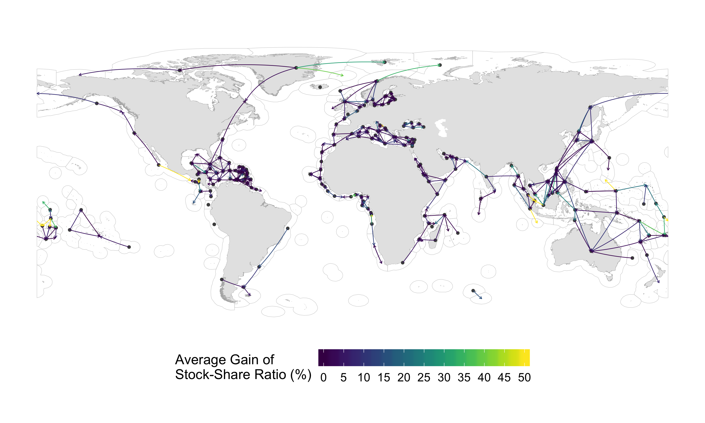

<!-- # Instructions  -->

<!-- Research articles should present a major advance and can be short or long (maximum 15,000 words) format. Submissions must include an abstract (up to 150 words), an introduction, and sections with brief informative subheadings. You may include up to ten figures and/or tables and about 60 references. Supplementary materials should be limited to information that is not essential for the general understanding of the research presented in the main text and can include data sets, figures, tables, videos, or audio files.  You may include up to a total of ten figures and/or tables (combined) throughout the supplemental text.  -->

```{r setup, eval = T, echo = F, warning = F, message = F, results = 'hide'}

library(MyFunctions)

#### Project's Library
packages <- c(
  "tidyverse" ,
  "png",
  "grid"
  # "here", # for dbem_import `here()`
  # "data.table", #dbem_import `fread()`
  # "readxl", # for reading excell files
  # "janitor", # for clearing names
  # "geosphere", # estimate distances between points `distm()`
  # "ggrepel",
  # "zoo", # for average mean
  # "parallel", # for mclapply,
  # "sf", # for mapping
  # "st", # for mapping
  # "rgdal", #Spatial analysis
  # "tools", #Spatial analysis 
  # "zeallot", # for Juanito's map
  # "gmt", # for estimating distances between points
  # "viridis"
)

my_lib(packages)

```

<!-- * corresponding author: j.palacios@oceans.ubc.ca -->

# Abstract (150  words)

<!-- An opening sentence that states the question/problem addressed by the research AND Enough background content to give context to the study AND A brief statement of primary results AND A short concluding sentence. -->

Climate change shifts in marine species distributions is affecting the current frameworks emplaced to manage species shared fisheries. Here, we rely on a modeling framework with multiple ensemble members to identify the time frame by which shared stocks distribution will change from historical ranges, and the change in the proportion of the distrirbution that each EEZ has under climate change. Our results suggest that 60% of shared species have emerged since 2006 in 87% of the world EEZs. By 2075 all EEZs will have an emerging species and by 2097 and all species will have emerged in at least one EEZ. Average changes in the ratio of species-share between neighboring EEZs will fluctuate between 1 and 10% with some exceeding 25% by 2030 relative to today’s ratio. Our results suggest that most changes will happen before 2030 urging policy to be re-formulated to account for the possible implications of these changes. 

# Introduction

Over the last century human activities have fundamentally changed the physicochemical composition of the ocean, warming the waters, decreasing the pH and reducing the oxygen concentration [@IPCC:2019to]. As a consequence, many marine species have changed their distribution [@Poloczanska:2016kk] and will continue to do so in the search of the appropriate environmental conditions needed for their subsistence [@Cheung:2010dt]. Climate change is expected to impact fisheries production worldwide compromising our capacity to reach international sustainability goals such as the SDG 14 - life below water [@UnitedNations2018; @Cheung:2010dt; @Barange:2014kr]. Such impacts can be partly offset with the proper reform of current fisheries management [@Gaines:2018sg; @Cheung:2018dh]. However, these reforms will require comprehensive plans and institutions to manage species that cross international borders, also known as shared stocks [@Gaines:2018sg; @Pinsky:2018cb].

In the early 1980’s the United Nations officialized the concept of Exclusive Economic Zone (EEZs) through the Law of the Sea (UCLOS) [@UnitedNations:1986tl], partitioning the distribution of several species, thus, creating what we know today as shared stocks. As defined by the Food and Agriculture Organization, shared stocks can be classified in three non-exclusive categories. (*i*) Transboundary, those that cross neighboring EEZs; (*ii*) straddling, that, in addition to neighboring EEZs, also visit the adjacent high seas; and (*iii*) highly migratory, mainly tunas and bill-fishes that cover vast oceanic regions [@Munro:2004th]. While countries are responsible for the management of stocks within their EEZs, UNCLOS encourages actions to cooperate when stocks are shared [Article 63, @UnitedNations:1986tl]. Today, an estimate of 633 transboundary fish species are found in different continents and across multiple habitats averaging 48.5 million tones and representing USD 78 billion in fishing revenue between 2005 and 2010 (Chapter 1).

The management, and thus sustainability, of fisheries that target shared species is jeopardized as marine species shift their known distribution to cope with a changing world [@Pinsky:2018cb]. Frequently, the rules placed to manage these species are set to historical trends [@Baudron:2020dj] and do not necessarily consider the biogeography of species [@Alexa], nor the effects of climate change [@FishForVisa]. Misalignment between policies and distributional shifts have previously resulted in unsustainable harvest and international conflict [@Miller:2013iv; @Song:2017va; @Spijkers:2017ij] and are expected to continue towards the end of the $21^{st}$ century. Thus, there is a need to understand the time when climate change will affect the sharing distribution of these species as well as the intensity in order to prepare ocean governance to species on the move [@Pinsky:2018cb; @FishForVisa; @Link:2010ei].

Here we endeavor to address this gap by estimating the Time of Emergence (ToE) [@Hawkins] and Stock Share Ratio (SSR) [@OCPalacios] of 633 transboundary species worldwide. We define ToE as the time when a change  of a particular variable exceeds the historical natural internal variability [@IPCC:2019to], a concept previously used to investigate the emergence of multiple oceanic physical and biogeochemical variables [@Roggers:2015jq; @Keller:2014jv; @Frolicher:2016dg; @Cheung:2020ja]. Moreover, SSR is adopted from Game Theory as a proxy of thread point - the minimum payoff a player is willing to receive in order to cooperate with others [@OCSumaila; @Sumaila:2013].  We rely on a species distribution model driven by output from an Earth system model with ten ensemble members to project the distribution of the 663 selected shared species [@FishForVisa] by 280 EEZs of 198 coastal countries under a high greenhouse gas emission scenario RCP8.5 (See methods). We treated each species in an EEZ as a single stock due to a lack of more detailed spatial data [@FishForVisa] and only considered shared species between neighboring EEZs, rather than the species’ extended distribution (e.g. we did not include the high seas). Our results suggest that many shared species have already emerged and shifted their SSR in most neighboring EEZs posing a threat to the sustainability of shared stocks and the resilience of international treaties. 


# Materials and methods

## Databases and species selection

We included in this analysis 633 marine exploited transboundary species representing 80% of the catch taken from the world's EEZs between 2005 and 2014 [@FishForVisa]. Each species within an EEZ was considered a single stock unit due to a lack of more detailed spatial information [@Teh:2015gd; @FishForVisa]. We defined the boundaries of the world EEZs (e.g., Mexico Pacific EEZ and Mexico Atlantic EEZ) using the *Sea Around Us* shapefile (updated 1 July 2015, available from http://www.seaaroundus.org) noting that it subdivides the EEZs of 198 coastal states into 280 regions (e.g., Mexico's EEZ is divided in Mexico Pacific and Mexico Atlantic; Fig. S1) including islands territories, and determined the intersections between polygons using the R package *sf* [@PackagesfSimpleF:2018vp]. Each EEZ was attributed to a geopolitical region according to the UN and biome [@Reygondeau:2019uh], and species were attributed a habitat preference [@FishBase]. For each species and EEZ we used the *Sea Around Us* data to estimate the catch and fishing revenue from fishing activities within the global EEZs. We report both catch and revenue the average from the last decade (2005-2014) of available spatial data [@Zeller2016; @Tai2017; @Sumaila:2015uc]. The monthly average US Consumer Price Index (CPI) according to the U.S. Bureau of Labor Statistic (https://www.bls.gov/cpi/) was used to convert the original 2010 real USD value to 2019 real USD.

## Projecting species distributions under climate change

We projected the distribution of marine species using a dynamic bioclimatic envelope model (hereafter called DBEM). The DBEM algorithm includes species physiology, habitat suitability, depth and latitudinal ranges, and spatial population dynamics as well as preferences to sea temperature, salinity, oxygen content, sea ice extent (for polar species) and bathymetry. For pelagic species, the model uses environmental variables at the surface (e.g. sea surface temperature) whereas demersal species distribution are driven by ocean-bottom variables (e.g. bottom temperature). This way, the model estimates species abundance and maximum catch potential (a proxy of maximum sustainable yield) over a $0.5^{\circ}$ x $0.5^{\circ}$ grid of the world (See Cheung *et al.* [-@Cheung:2010dt; -@Cheung:2016jd] for model details).

We coupled the DBEM with the Geophysical Fluid Dynamics Laboratory Earth system model (GFDL-ESM2M) to project species distribution from 1951 to 2100 under climate change [@Dunne:2012bo; @Dunne:2013db]. We run the DBEM simulating biomass and MCP from 1950 to 2100 under a “worst-case” climate change scenario according to the Representative Concentration Pathway 8.5 (RCP 8.5) used by the Intergovernmental Panel on Climate Change (IPCC) [@IPCC:2014bz; Riahi:2011dk]. According to the GFDL-ESM2M, under the RCP 8.5 scenario atmospheric temperature will increase by $3.2^{\circ}C$ by 2081-2100, relative to preindustrial levels. Because the main approach of this paper relies on understanding the spatial and temporal variation of a species distribution, we have to understand both the historical as well as the future climate-driven distribution variability, in order to infer the differences. We do this by following an ensemble member approach where each member constitutes a different initial Earth system condition [@Rodggers:2015jq; @Frolicher:2009ge]. Thus, for our experiment, in each of the ten GFDL-ESM2M-ensembles the Earth system initial condition is infinitesimally different resulting in a unique atmosphere and ocean state at each point in time. This results in a different state of internal variability for each ensemble representing a plausible future under RCP 8.5 [@Rodggers:2015jq]. Following this approach allows us to estimate a secular trend for the natural variability (e.g. background noise) and isolate the climate signal of a stock’s distribution by averaging the secular trend over all ensemble members.

## Estimating the Time of Emergence of transboundary species

Knowing the time (e.g., year) in which a shared stock is going to diverge from a historical variability is key for preparing to shifting species [@Link:2010ei; @FishForVisa]. Here, we coupled the DBEM with the ten GFDL ensemble members described above, and developed an index of transboundary range shift, fisheries and climate change (*TI*). The index is based on the variation of a species distribution centroid in relation to the centroid of the neighboring EEZs it occupies. Each species centroid was determined by the average latitude and longitude of the grid cells containing the top 10% abundance percentile of each year derived from the DBEM. The EEZ centroid was estimated using the *st* package of *R* statistical software (**Supplements Fig 1 (SuppM)**). For each ensemble member, neighboring EEZ and species, we computed the distance between centroids assuming a perfect sphere and ignoring elevation differences using the *geosphere* package of *R* statistical software;

$$D_{ens} = acos(sin(lat_{eez})*sin(lat_{spp}) + cos(lat_{eez})*cos(lat_{spp})*cos(lon_{eez}-lon_{spp}))$$
where $lat_{eez}$ and $lat_{spp}$ are the latitudes of the EEZ and specie centroid, respectively and $lon_{eez}$ and $lon_{spp}$ are the respective longitudes.

Then, for each year we calculated the transboundary index as follows:

$$TI =(\frac{D_{A,t}}{sd(D_{A,th})} - \frac{D_{B,t}}{sd(D_{B,th)}})^2$$

where $D_A$ and $D_B$ represent the distance between EEZ and distribution centroids of a species in EEZs A and B, respectively for each future time step from 2006 to 2100 (*t*); *sd* is the standard deviation of the historical (*th*, 1951 - 2005) centroid distribution for $D_A$ and $D_B$. The index was then smoothed to a 10 years average.  Finally, we determined the time of emergence setting an arbitrary threshold following Rodggers (2015):

$$ToE = TREND/NOISE$$

where *TREND* is the yearly mean *TI* ($\mu$) of all ten ensemble members and *NOISE* is the standard deviation of the TREND ($\sigma$) between 1951 and 2005. 
<!-- Note that in some cases not all ensemble members show the presence of a species in a certain EEZ throughout the study's time frame. We presented the results only for those cases where all 10 ensemble members had results for each year between 1951 and 2100 (n = 150). -->
We estimated the mean and one standar deviation ($\mu \pm \sigma$ for a confidence interval of 68%) to show the first year when the "signal" of the transboundary index overpasses the historic "noise". Since this was an arbitrary decision, we have included a more conservative estimation ($\mu \pm 2*\sigma$ for a 95% confidence interval). The SNR for both bottom and surface sea temperature was also estimated for statistical analysis following the SNR method.

### Vulnerability index

We created a vulnerability index of fisheries management to shifts in transboundary species. The index is based on two factors; the ToE and the importance of the shifting species to a country's total catch and revenue from transboundary species;

$$ index' = (P_c + P_v)/ToE $$
where *P_c* and *P_v* are the proportion that the shifting species' will have in the total catch and value generated from transboundary fisheries within a county's EEZs, respectively. Here, total catch and value are represented as the average of 2005 to 2014 within the global EEZs according to the *Sea Around Us*. The index was then normalized to a 0 to 1 scale going from less vulnerable to more vulnerable:

$$ index = \frac{(index' - N_{min})}{N_{max}-N_{min}} $$

## Changes in transboundary Species Share Ratio

We adopted the concept of threat point as the minimum proportion of the species’ joint distribution between neighboring EEZs that each country will accept if they were to cooperate in the management of the stock [@OCPalacios]. For each species and time step (1951-2100) we first aggregate the number of $0.5^{\circ}$ x $0.5^{\circ}$ grid cells where the species was present within neighboring EEZs, and then calculated the proportion that each EEZ had [@FishForVisa]. We then average the results in three time periods in order to reduce climate variability within the projections. The first time period ($t_h$) comprises (1951 - 2005) and is assumed as the historic share distribution of each species, thus, representing each neighboring nation's threat point. This time frame matches the historic climate data that the GFDL uses to project climate change [@Dunne:2012bo; @Dunne:2013db]. We then selected two future periods; early $21^{st}$ century as the average of 2021 to 2040 ($t_e$), and mid $21^{st}$ century as the average of 2041 to 2060 ($t_m$). We choose these time periods to match the challenges of achieving fisheries-related UN-SDGs [@UnitedNations2018] such as SDG 14.4 (end overfishing) and SDG 1.2 (poverty reduction), aimed to be achieved by 2020 and 2030, respectively [@Singh:2017ds]. The analysis was replicated for each of the ten ensemble members capturing the variation by averaging results among ensemble members ($\mu \pm \sigma$). We then estimate the percentage change in the SSR ($\Delta{SSR}$) of each future time period ($SSR_{f}$) relative to the historic time period ($SSR_h$) as follows,

$$ \Delta{SSR_{e,m}} = \frac{(SSR_{f}-SSR_{th})}{SSR_{th}}* 100 $$
To address the natural spatial variability of the stock we only considered $\Delta{SSR_{e,m}}$ to be true when $SSR_f \geq (SSR_f + \sigma)$ or $SSR_f \leq (SSR_f - \sigma)$.


## Statistical analysis

We tested the results for normality (e.g. skewness, kurtosis) and performed a couple of non-parametric Kruskal–Wallis test by ranks [@Hollander:2013wz] to investigate geopolitical and ecological differences in the ToE of transboundary species. 
<!-- Moreover, we implemented a multiple linear regression analysis to a series to explain the ToE of each species in each EEZ. Specifically, we looked at habitat preferences, catch trends, geopolitical and biome location and ToE of both bottom and sea surface temperature (See *Databases and species selection*). We hypothesize that all of these factors would have significant influence in the ToE of transboundary species. -->
All analyses were run using the statistical software *R version 3.5.2 (2018-12-20; Eggshell Igloo)* with the packages *data.table* [@Packagedatatable:2019uh], *janitor* [@PackagejanitorSim:2018ur], *rfishbase* [@PackagerfishbaseR:2019th], *sf* [@PackagesfSimpleF:2018vp], *sp* [@PackagespClasses:2019tn], *tidiverse* [@PackagetidyverseE:2017vq], *tidytext* [@PackagetidytextTe:2019vk], *gmt* [@gmt] and *zoo* [@PackagezooSInfr:2019tm], *readxl* [@REF], *ggrepel* [@REF], *zeallot* [@REF], *viridis* [@REF], *cowplot* [@REF], *moments* [@REF] and *pgirmess* [@REF]. All code is available at https://github.com/jepa/TransEmergence

# Results

```{r Load_Results, eval = TRUE,  echo = FALSE, include = FALSE}

prop_r <- read_csv("/Volumes/HALL2000/Data/TransEmergence/Results/proportion_change_2005.csv") %>% 
  gather("time_step","change",per_early,per_mid)

```

## Time of Emergence of transbounudary species

We estimated the ToE between neighboring EEZs for 633 transboundary species, that is, the year where the future stock's distribution (2006-2100) overpasses the historical variation (1951-2005). Since 2006, 87% of the world EEZs have already seen at least one emerging stock and 60% of the transboundary species analyzed have emerged in at least a set of neighboring EEZ (e.g. *Engraulis ringens* shared by Chile and Peru emerged in 2010). species will continue to emerge steadily towards 2097 when all 633 species will have emerged in at least one neighboring EEZ (Fig. 1). The number of EEZs with emerging species will increase steeply until 2020 when it seems to flatten approaching 2081 when all of the EEZs analyzed here will have at least one emerging stock (Fig. 1).

```{r Figure1, eval = T,  echo = F, fig.width = 5, fig.height=5, fig.cap =  "Cumulative increase in time of emergence by Exclusive Economic Zone and transboundary species in absolute numbers and percentage."}

img <- readPNG("../Figures/Fig1.png")
grid.raster(img)

```

<!--  -->

Most of the world EEZ’s will see an average ToE across transboundary species before 2040 (Fig. 2). In a few EEZs species will have a relative late average ToE (e.g. Honduras average ToE is 2071) while 54 of the 280 EEZs (19%) have already seen their species emerged (e.g. average ToE across all species <= 2020). A higher number of emerging species will happen between latitudes 0$^o$ and 50$^o$N corresponding to regions of relatively small EEZs with multiple borders (e.g. The Caribbean and the Mediterranean) (Fig.2). In most cases, the current participation of the emerging species in a country's total fishing revenue is less than 50% (Fig. 2 - Polygons). However, in some cases emerging species represent 85% of current transboundary fishing revenue (e.g. Peru) or more (e.g. Marshall Islands, 92%). Only in very few cases like Brazil and Alaska's polar EEZ, no specie will emerge between 2006 and 2100. 

```{r Figure2, eval = T,  echo = F, fig.width  = 12, fig.height =10, fig.cap =  "Average time of emergence of transboundary specie. Land polygon shows the vulnerability index. Exclusive Economic Zone polygon represents the average time of emergence across all species. Density plot on the right shows the latitudinal number of emerging species across EEZ centroids (10^o running mean)."}

img <- readPNG("../Figures/Fig2.png")
grid.raster(img)

```

<!--  -->

Twelve of the 47 countries responsible for 75% of the yearly revenue generated from transboundary species between 2005 and 2010 will see an average ToE before 2030 (Fig. 3). This includes the United States who occupies the $4^{th}$ place in revenue generated from transboundary fisheries. These 47 countries are also among those with the largest number of emerging taxa. Regionally speaking, most of African, Asian and European EEZs will see a latter ToE, while the Americas and Oceania will see an early ToE (Fig. 3). From the top ten countries with more revenue from transboundary species, nine of them share a border. Most of these countries (e.g. China) will also have a large number of emerging species, while others like Peru and Norway will have a small number of emerging taxa but representing high revenue fisheries.

```{r Figure3, eval = T,  echo = F, fig.width=5, fig.height=6, fig.cap =  "Average time of emergence of transboundary species per fishing entity. Fishing revenue in logarithmic scale. Showing names for the top 75th percentile. Countries marked with an asterisk have at least one neighboring border in the group."}

img <- readPNG("../Figures/Fig3.png")
grid.raster(img)

```

<!--  -->

We compared species ToE within EEZs by geographic region and by species habitat preference (Fig. 4). The median ToE of transboundary species varied significantly according to the geographic region of the neighboring EEZs (Kruskal-Wallis, $X^2$ = 287.23, *DF* = 93, *p* < 0.001). Post-hoc tests revealed regional patterns. EEZs in Easter Asia which have the latest average ToE across all habitat types (2041), and Latin America and the Caribbean and Polynesia who have the earliest average ToE across all habitats (2021 and 2018, respectively), significantly differ from (almost) all other regions. Other regions also significantly differ from each other but in a less frequent manner (See Table S1 for full statistics). When looking specifically at habitat association, we found significant differences in ToE by habitat preference (Kruskal-Wallis, $X^2$ = 286.48, *DF* = 93, *p* < 0.001). Specifically, the ToE of species with preferences for pelagic-oceanic and reef habitats was significantly different than other habitat preferences (See Table S2 for full statistics).

```{r Figure4, eval = T,  echo = F, fig.width=14, fig.height=14, fig.cap =  " Regional time of emergence per habitat preference. Regions according to the United Nations and habitat preference to FishBase. Whiskers represent 1.5* interquartile range. Box represents interquartile range as distance between first and third quartiles. Line represents median, and black points represent outliers (outside of 1.5*IQR."}

img <- readPNG("../Figures/Fig4.png")
grid.raster(img)

```

<!--  -->

<!-- We hypothesized that species environmental preferences (e.g. presence in certain biomes and habitats), climate change effects on water temperature (e.g. ToE of SST), human drivers (e.g. catch rate), and latitudinal gradient would have significant influence in the ToE of transboundary species (Table \ref{tab:TableS3}). Results from the multiple linear regression analysis show a significant relation between ToE of transboundary species and latitudinal gradient (*p* > 0.001), tropical (*p* = 0.013) and temperate (*p* = 0.002) biomes, EEZs in the Americas (*p* > 0.001), Asia (*p* > 0.001) and Oceania (*p* = 0.002), and some habitats (*p* > 0.001) (Table \ref{tab:Table1}). -->

```{r Table1, eval = F,  echo = F, message = F, warning  = F}

read_csv("../Tables/mlr_result.csv") %>% 
  knitr::kable(
    "latex",
    booktabs = T,
    captio= "Multiple regression results for time of emergence of transboundary species. Only showing significant variables. The model significantly predicts time of emergence (F[18,6155] = 20.68, p < 0.001, R2 = 0.05)"
  )

```

## Changes in specie Share Ratio (SSR)

```{r analysis_results, eval = T,  echo = FALSE, include = FALSE}

# Early century
n_eez <- prop_r %>%
  filter(variable == "mean_eez" & 
           !is.na(change),
         time_step == "per_early"
         ) %>% 
  pull(eez_name) %>% 
  unique() %>% 
  length()

n_eez_per <- round(n_eez/275*100,2)


### Max values early
max_values <- prop_r %>% 
  filter(variable == "max_eez" & 
           !is.na(change),
         # time_step == "per_early"
         )

max_values$per_early

### Average
average_mid <- prop_r %>% 
  filter(variable == "mean_eez" & 
           !is.na(change)
         )
```

We estimated the change in SSR (with a 63% of confidence) of transboundary species shared by neighboring EEZs by the early (2020-2040) and the mid $21^{st}$ century (2040-2060), relative to present (1951-2005) under a high emission climate change scenario. Our results suggest that `r n_eez_per`% (n = `r n_eez`) of the world EEZs will see a change in SSR by 2030 (Fig. 5A). Most EEZs will average a change lower than 25% which is expected to slightly increase in intensity towards the  mid $21^{st}$ century (**Supplements Fig 5 (histogram)**). However, this result masks larger changes in SSR for specific species. For example, Guatemala's SSR of *Panulirus gracilis* shared with Mexico is projected to go from 12% to 26%. By early $21^{st}$ century, the percentage of transboundary species per EEZ that will see a change in SSR $\pm$ 1 s.d. of historical distribution will be relatively large (global mean of 69% of species in an EEZ). For 17 EEZs, 100% of their analyzed transboundary species will shift, while only six EEZs will have less than 25% shifting species (Fig. 5A-Polygons). Regions where EEZs are relatively small and have multiple borders (e.g. The Caribbean) will see a complex dynamic of changes in SSR with no clear patterns (Fig. 5B). Towards the mid $21^{st}$ century, changes in SSR per EEZ will not be substantial (Fig. S1) relative to the early $21^{st}$ century but are expected to increase in intensity (Fig. S2).


```{r Figure1, eval = T,  echo = F, fig.width=9, fig.height=12, fig.cap =  "Changes in Specie Share Ratio by 2030 (2021-2040) relative to 1951-2005. Lines represent the average gain of transboundary specie share ratio with arrows going from the losing EEZ (point) to the winner (arrowhead). Polygons represent the percentage of initial species that will see a shift. Panel B zooms in to specific areas shown in grey boxes of A."}

img <- readPNG("../Figures/Fig1.png")
grid.raster(img)

```

<!--  -->

# Discussion

In this paper we endeavor to look at the timing and intensity of changes in the sharing of transboundary species. Our findings here are noteworthy in several ways. First, we show that the current distribution of most transboundary species have already emerged from the historical record and that virtually all EEZs have seen at least one emerging species since 2006 (Fig. 5). Second, we identify regional patterns of complex changes in SSR and levels of vulnerability of transboundary fisheries management to climate change (Fig. 3). Third, we identified that the historical share proportion of transboundary species will change by as soon as 2030 in most neighboring EEZs (Fig. 5). 

### Emergence characteristics of transboundary species

We set out to evaluate the emergence characteristics of transboundary species across the global EEZs. Our results suggest that most of the EEZs of the world and more than half of the transboundary species already emerged since the early 2000s (Fig. 2). This is in alignment with previous research showing changes in the composition of marine catches since the 1970's as evidence of climate change [@Cheung:2013gk]. Indeed, an expansion in the distribution of multiple marine species has been documented in several regions of the world [@Poloczanska:2016kk]. For example, in the early 2000s Humboldt squid (*Dosidicus gigas*) substantially expanded its geographic range reaching Washington waters where a new fishery rapidly developed [@Pinsky:2014by; @Zeidberg:2007gs]. In the North East Atlantic, the emergence of Atlantic mackerel (*Scomber scombrus*) in Icelandic waters in 2010, led to years of unsettled international conflict between multiple fishing nations [@Spijkers:2017ij]. The large amount of transboundary species emerging since early 2000s identified in this study can be partially attributed to the time of emergence of several environmental variables (e.g. temperature, oxygen, $CO_2$) that influence the distribution of marine species [@Roggers:2015jq; @Keller:2014jv; @Frolicher:2016dg; @Mahlstein:2011fy]. It has been estimated that since the early 2000s, SST and oxygen ($O_2$) have emerged in 79% and 22.6% of the global ocean, respectively, and by 2080 SST will have emerged in 90% of the global ocean while $O_2$ will have doubled [@Rodggers:2015j].  

Regional differences in ToE are likely the result of environmental factors, species vulnerability, and the characteristics of political boundaries. For example, the high number of species emerging early in the tropics suggest that tropical species are already on the move. The tropics are among the most species-rich biome [@Reygondeau:2019no] and have potentially experienced some of the largest declines in $O_2$ and greatest levels of warming since 2006 [@IPCC:2019tn; @Roemmich:2015id]. Here, marine species live close to the thermal tolerance making them highly vulnerable to warming waters [@IPCC:2014bz] consequently having to move towards deeper or sub-tropical waters [@Poloczanska:2016kk]. The premise of a shift already happening is supported by observational evidence of tropical species appearing in sub-tropical biomes [@Fogarty:2017eo] and catch-data analysis showing a reduction in sub-tropical species catches in tropical waters between 1970 and 2006 [@Cheung:2013gk]. In addition to species natural traits and the environmental pressure from climate change, the tropics comprise areas with relatively small EEZs and many borders that match peaks of emerging species. Specifically, it seems like South East Asia, The Caribbean, and the Mediterranean are responsible for substantial increases in emerging species (Fig. 3).

## Some fisheries will be more vulnerable to emerging species

The premise of our index is that, from a management perspective, countries whose shifting transboundary species provide larger societal benefits and have an early ToE will be more vulnerable to shifts in SSR than their counterpart. Similarly, the index is capable to capture different sources of societal benefits (e.g. food security trough catch or livelihood trough value). We assume that the management of fisheries that provide large societal benefits will have more pressure from stakeholders while earlier times of emergence will result in less time to act, thus resulting in higher vulnerability. Thus, an early ToE and large fisheries benefits could indicate high vulnerability of transboundary fisheries management to climate change (Fig. 3). For example, Polynesia and Micronesia are the only regions where the average ToE across species and EEZs already happened; 2019 and 2021, respectively (Fig. 5). Countries in these regions are highly dependent of pelagic-oceanic (e.g. tunas) and reef-associated transboundary species (e.g. *Speceies*) for both food security [@REF] and profits [@REF]. For example, in the Marshall Islands 16 transboundary species responsible for 92% and 94% of the transboundary fisheries revenue and catch, respectively, have, in averaged, emerged since 2018 resulting in high vulnerability index (Fig. 5). In this cases policy has to work against the clock and under potentially high societal pressure to address an issue that could be impacting important fisheries. However, a low vulnerability index does not necessarily translate to no-risk of international conflict or threat to species sustainability. While it gives countries more time to prepare for substantial changes, species with relatively small overall participation can still be a source of conflict as portrayed by the Atlantic mackerel case [@FishForVisa; @Spijkers:2017ij]. 


## Changes in specie-share ratio will be everywhere 

By 2030, changes in SSR will be seen across the globe, but with no clear pattern in the direction of change (Fig. 1). Poleward shifts in SSR will be seen in regions of the world with relatively large EEZs and few boundaries like the North East Pacific. However, despite a general recognition that climate change is shifting species distributions poleward [@Cheung:2010dt; @Poloczanska:2016kk; @IPCC:2019tn], the Eastern Tropical Pacific will see an equatorial shift with EEZs from Mexico to Ecuador losing SSR to their southern neighbors. This shift is consistent with regional modeling studies suggesting that by mid $21^{st}$ century marine species will displace between 50 and 100 km southward of Mexico's EEZ towards Peru under a high emission climate change scenario [@TayClarkeChp2]. Moreover, regions with presence of multiple frontiers like the Caribbean and the North East Atlantic will see a complex network of changes in SSR with no marked direction (Fig. 1B). These regions are known for being highly connected by both fish adult migration [@REF] and larvae dispersal [@Ramesh:2019va] leading to joint management plans [@Baudron:2020dj] and the call for new implemented shared policies [@Levin:2018in]. However, game theory suggests that the ggreater number of parties negotiating, the harder it is for parties to reach an agreement [@Sumaila:2013], thus, making it particularly challenging for countries in these regions to coordinate the management of shifting shared species.

# Caveats and uncertainties

We have identified three main sources of uncertainty in our analysis and point out ways to move forward in order to produce more reliable results to inform policy dealing with international fisheries under climate change. First, in this analysis we relay in one Earth System Model (GFDL-ESM2M) and climate change scenario (RCP 8.5). While the use of multiple ESMs would allow to capture the structural uncertainty of the models [@Frolicher:2016dg], using the GFDL-ESM2M results in conservative estimates as its projections are overall less extreme than similar models [@Bopp:2013fg]. Addressing the uncertainty in future projections is key to advance marine governance for species on the move [@Pinsky:2018cb], thus, future efforts should look at the ensemble members of multiple ESM to capture the uncertainty embedded in the models. Secondly, we set an arbitrary threshold of $\pm$ 1 s.d. (67% confidence) to determine when a ToE and SSR would happen (see methods). We tested the sensitivity of our results to a larger threshold (e.g. $\pm$ 2 s.d for a 95% confidence). While the selected threshold is more relaxed than a 2 s.d., the distribution of results do not dramatically change between thresholds with a difference in ToE of about 4 years suggesting that this is a robust threshold (Fig. S4). Thirdly, in here we present the result based on 633 species that were previously identified as shared by multiple neighboring nations [@FishForVisa]. Thus, our analysis is carried at the species level, rather than a more detailed organizational level (e.g. fish stock) due to limited spatial-specific data on species sub populations (species). Reproducing our analysis with spatially-explicit stock data would allow to produce more certain results in changes in both SSR and ToE of transboundary species, and potentially identity different types of shared stock shifts [@Link:2010ei]. However, many regions of the world lack these detailed data. Moreover, in many EEZs of the world fisheries are often managed at the species level [@FishForVisa].

# Conclusion

Preparing policy to species on the move is key to achieve sustainable development goals and proper governance of the world fisheries [@Pinsky:2018cb]. Here, we have addressed two fundamental steps to achieve sustainable international fisheries under a changing world [@Link:2010ei]; the degree of change that share species will have and the year in witch species will shift. Such results have direct implications for ocean governance. By identifying the degree location and time by which transboundary species will change from historical normal we provide critical information for regional management bodies and countries to anticipate the potential complications that climate change will bring to international fisheries management. While our results are not free of uncertainty and would benefit from more detailed analysis at localize levels, it represents a crucial step towards preparing ocean governance for species on the move. To address the issues raised in this paper, international fisheries management will require coordination between nations to generate adaptive, collaborative and equitable management strategies to address the uncertainties of a changing world.

# Supplements


```{r FigureS1, eval = T,  echo = F, fig.width=9, fig.height=6, fig.cap =  "World Exclusive Economic Zones used in this study as devided by the Sea Around Us and their centroids (points)."}

img <- readPNG("../Figures/Supp1.png")
grid.raster(img)

```


<!--  -->

```{r FigureS2, eval = T,  echo = F, fig.width=4, fig.height=4, fig.cap =  "Distribution of Stock Share Ratio percentage change by the early (2021-2040) and middle (2040-2060) 21st centurury relative to today (1951-2005)"}

img <- readPNG("../Figures/Supp2.png")
grid.raster(img)

```

<!--  -->


```{r FigureS3, eval = T,  echo = F, fig.width=9, fig.height=12, fig.cap =  "Changes in Stock Share Ration by 2050 (2041-2060) relative to 1951-2005. Lines represent the average gain of transboundary stock share ratio with srrows going from the losing EEZ (point) to the winner (arrowhead). Polygons represent the percentage of initial species that will see a shift. Panel B zooms in to specific areas shown in grey boxes of A."}

img <- readPNG("../Figures/Supp3.png")
grid.raster(img)

```

```{r FigureS4, eval = T,  echo = F, fig.width=4, fig.height=4, fig.cap =  "Average Time  of Emergence and standar dviation for a 64% confidence treshold  (purple) and a 98 confidenc teshold (yellow"}

img <- readPNG("../Figures/Supp4.png")
grid.raster(img)

```

<!-- # Recycled  text -->
<!-- All of these results have direct implications for managing shared fisheries under climate change that can be partially addressed by the early implementation of joint-management international policies. -->

<!-- The time and number of emerging species decreases as we move away from the equator and into temperate biomes where species live further away from their temperature tolerance and thus hare less vulnerable to warming [@IPCC] with a smaller peak aligned with the EEZ of the Baltic and North seas. -->


<!-- Changes in stock share ratio has contribute to past conflicts between nations with long history of collaboration including Canada and the United States over Pacific salmon and Norway and Iceland over spring spawning herring [@Miller:2013iv]. In both cases, rules were emplaced and agreed by all parties, however, treaties were not prepared to address shifts in species distributions [@Miller:2013iv; @Song:2017va] and when the benefits felt below the desired level (e.g. threat point) the affected country broke off relationships. In the case of Canada and the US, the agreement was re-stated when a conservation fund was implemented [@Miller:2013iv].  -->


<!-- In cases where the species is distributed in more than 2 neighboring EEZs (e.g. *xxx*), the index is as follows: -->

<!-- $$I =(\frac{D_{A,y}}{sd(D_{A,h})} - \frac{D_{B,y}}{sd(D_{B,h})}) |  \\  +(\frac{D_{A,y}}{sd(D_{A,h})} - \frac{D_{C,y}}{sd(D_{B,h})}) | \\  +(\frac{D_{A,y}}{sd(D_{A,h})} - \frac{D_{Cy}}{sd(D_{B,h})})/N$$ -->


<!-- In other words, for two neighboring EEZs sharing a stock, if the centroid shifts towards EEZ A ($D_A$ decreases) but away from EEZ A B ($D_B$ increases), EEZ A may catch a bigger share over B and the risk of dispute increases (see *TI* equation). Consequently, if the centroid shifts are within historical variability (*SNR* < 1), risk of dispute between EEZ A and B is lower, finally, if the centroid shifts are beyond historical variability (*SNR* > 1), the risk of dispute is higher. Thus, risk is positively related to the frequency of centroid shifts beyond historical variability. -->
