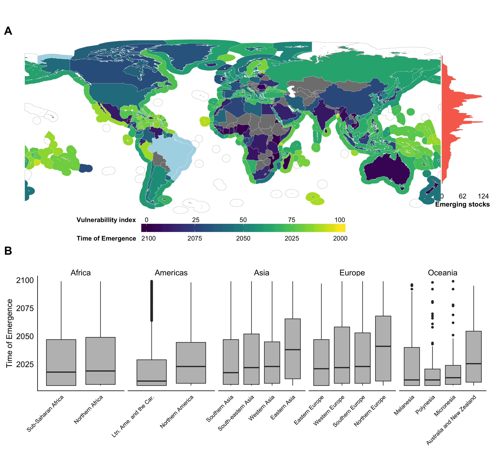
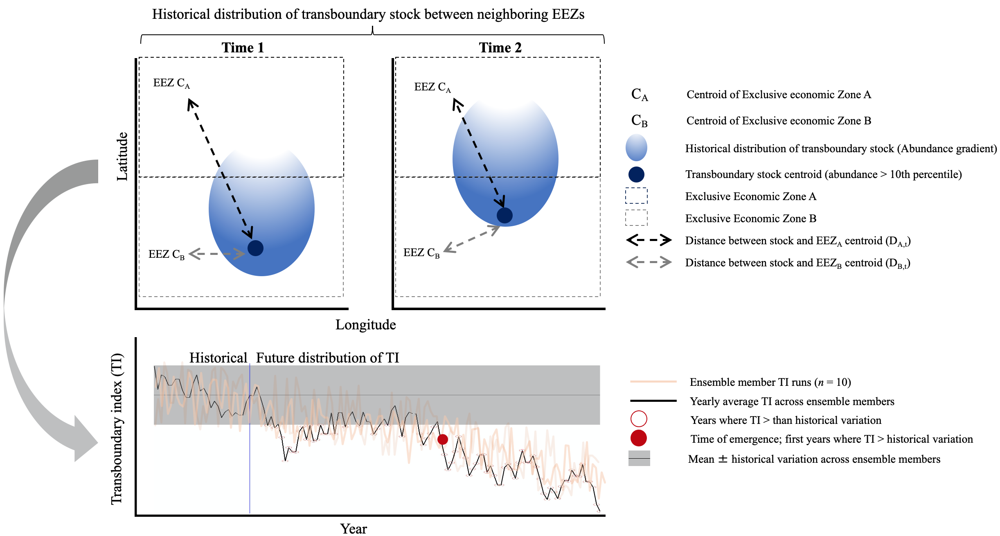

<!-- # Instructions  -->

<!-- Research articles should present a major advance and can be short or long (maximum 15,000 words) format. Submissions must include an abstract (up to 150 words), an introduction, and sections with brief informative subheadings. You may include up to ten figures and/or tables and about 60 references. Supplementary materials should be limited to information that is not essential for the general understanding of the research presented in the main text and can include data sets, figures, tables, videos, or audio files.  You may include up to a total of ten figures and/or tables (combined) throughout the supplemental text.  -->

```{r setup, eval = T, echo = F, warning = F, message = F, results = 'hide'}

library(MyFunctions)

#### Project's Library
packages <- c(
  "tidyverse" ,
  "png",
  "grid",
  "knitr",
 "kableExtra"
  # "here", # for dbem_import `here()`
  # "data.table", #dbem_import `fread()`
  # "readxl", # for reading excell files
  # "janitor", # for clearing names
  # "geosphere", # estimate distances between points `distm()`
  # "ggrepel",
  # "zoo", # for average mean
  # "parallel", # for mclapply,
  # "sf", # for mapping
  # "st", # for mapping
  # "rgdal", #Spatial analysis
  # "tools", #Spatial analysis 
  # "zeallot", # for Juanito's map
  # "gmt", # for estimating distances between points
  # "viridis"
)

my_lib(packages)

```

<!-- * corresponding author: j.palacios@oceans.ubc.ca -->

<!-- # Abstract (150  words) -->

<!-- An opening sentence that states the question/problem addressed by the research AND Enough background content to give context to the study AND A brief statement of primary results AND A short concluding sentence. -->

Climate change shifts in marine species distributions is affecting the current frameworks emplaced to manage species shared fisheries. Here, we rely on a modeling framework with multiple ensemble members to identify the time frame by which shared stocks distribution will change from historical ranges, and the change in the proportion of the distrirbution that each EEZ has under climate change. Our results suggest that 60% of shared species have emerged since 2006 in 87% of the world EEZs. By 2075 all EEZs will have an emerging species and by 2097 and all species will have emerged in at least one EEZ. Average changes in the ratio of species-share between neighboring EEZs will fluctuate between 1 and 10% with some exceeding 25% by 2030 relative to today’s ratio. Our results suggest that most changes will happen before 2030 urging policy to be re-formulated to account for the possible implications of these changes.

## Introduction

Over the last century, human activities have altered the physical and biogeochemical conditions of the ocean, including warming, acidification and reducing oxygen content [@IPCC:2019tn]. Distributions of marine species are closely related to the environment and the species’ preferences to environmental conditions (e.g., temperature, oxygen, salinity) [@Hutchinson:1957nt; @Nelson:2016kk]. As a result of climate change, many marine species have changed their distributions towards higher latitude, deeper water or following local temperature gradients [@Poloczanska:2016kk]. Biogeography of marine species is projected to continue to shift as ocean conditions are changing in the $21^{st}$ century under climate change [@Cheung:2010dt], impacting fisheries production and compromising our capacity to reach international sustainability goals such as Sustainable Development Goal 14 - life below water [@UnitedNations2018; @Barange:2014kr; @Singh:2017ds]. The projected risks of impacts can be reduced through improving the effectiveness of current fisheries managemen [@Gaines:2018sg; @Cheung:2018dh], including the fisheries management of species that cross international borders, i.e., shared stocks [@Gaines:2018sg; @Pinsky:2018cb].

The concept of shared stocks was developed following the ratification of the United Nations Convention on the Law of the Sea (UNCLOS) and the claiming of Exclusive Economic Zones (EEZs) by States [@UnitedNations:1986tl]. As defined by the United Nations’ Food and Agriculture Organization (FAO), shared stocks can be classified into four non-exclusive categories: (*i*) transboundary stocks, those that cross neighboring EEZs; (*ii*) straddling stocks, that, in addition to neighboring EEZs, also visit the adjacent high seas; (*iii*) highly migratory stocks, mainly tunas and bill-fishes, that migrate across vast oceanic regions including both the high seas and EEZs; and finally (*iV*) discrete stocks that are only present in the high seas [@Munro:2004th]. This study focuses on transboundary stocks exploited by fisheries operating within EEZs. While countries are responsible for the management of stocks within their EEZs, under UNCLOS, States are encouraged to cooperate when stocks are shared [@UnitedNations:1986tl]. A recent study estimates that, globally, there are 633 transboundary fish species representing 67% or the identified fished taxa, and yielding an annual average of 48.5 million tonnes of catch and USD 78 billion in fishing revenue between 2005 and 2010 [@PalaciosAbrantes:2020tv]. 

The effectiveness of fisheries management for transboundary stocks is challenged by the shifts in marine stocks distribution under climate change [@Pinsky:2018cb; @Pinsky:2014by]. In many cases, catch or fishing effort quotas for transboundary stocks are based on historical records [@Baudron:2020dj] and do not necessarily consider the biogeography of the species [@FredstonHermann:2018kp], nor the effects of climate change on the fish stocks and fisheries [@PalaciosAbrantes:2020tv; @Sumby:2021gw]. Misalignment between fisheries resources allocation and species’ distributional shifts have previously resulted in unsustainable harvest and international disputes [@Miller:2013iv; @Song:2017va; @Spijkers:2017ij], patterns that are expected to be exacerbated by intensifying climate change [@Pinsky:2018cb]. With future shifts in species distributions under climate change, the challenges for the fisheries management of transboundary stocks will continue to increase during the $21^{st}$ century. In order to prepare ocean governance to meet the resource management challenges arising from shifting transboundary stocks, it is important to constrain when climate change will affect the dynamics of transboundary stocks and the intensity of the resulting impacts [@Pinsky:2018cb; @PalaciosAbrantes:2020tv; @Link:2010ei].

The timing and intensity of climate impacts on managing transboundary fish stocks can be quantitatively examined through the concepts of ‘time of emergence’ (ToE) and ‘threat point’ (TP). Time of emergence is defined as the moment in time when a signal (e.g., future anthropogenic trend) emerges from the background noise of natural variability (e.g., historical natural variation) [@Hawkins:2012hc] and has been applied to multiple oceanic physical and biogeochemical variables [@Rodgers:2015jq; @Keller:2014jv; @Frolicher:2016dg; @Cheung:2020ja; @Schlunegger:2020gz; @Schlunegger:2019el; @Henson:2017ev]. The premise behind the time of emergence is that we can only be confident that a significant change has been detected when the signal of anthropogenic climate change is larger than the background noise of natural climate variability [@Hawkins:2012hc]. The concept of threat point comes from game theory and is defined as the minimum payoff a player is willing to receive to cooperate in a game theoretic model [@Nash:1953vr]. Game theory has been widely used to investigate and manage transboundary stocks [@Sumaila:2013hv], including the impacts of climate change on the economics of transboundary species between Canada and the United States [@Sumaila:2020tp].

Here, we estimate the time of emergence and threat point of the share distribution of transboundary stocks worldwide. We employ a species distribution model driven by output from a comprehensive Earth System Model with ten ensemble members to project the distribution of 663 transboundary species [@PalaciosAbrantes:2020tv] across 280 EEZs of 198 coastal countries under a high greenhouse gas emissions scenario RCP8.5 (see Methods). We treated each species in an EEZ as a single stock due to the lack of more spatially resolved data to delineate the boundary of a population [@PalaciosAbrantes:2020tv] and only considered shared stocks between neighboring EEZs (i.e., transboundary stocks that exclude the high seas). We find that many transboundary stocks have already ‘emerged’ from historical natural variability and exceeded their share threat point in most neighboring EEZs, posing a threat to their sustainability and the resilience of international treaties.


## Materials and methods

### Databases and species selection

This analysis includes 633 exploited marine transboundary species previously identified to account for 80% of the catch taken from the world’s EEZs between 2005 and 2014 [@PalaciosAbrantes:2020tv]. Each time a species was shared by a pair of neighbouring EEZs it was considered a transboundary stock [@PalaciosAbrantes:2020tv]; @Teh:2015gd], resulting in a total of 9,132 transboundary stocks in this analysis. Using the transboundary species Atlantic cod (*Gadus morhua*) as an example, and based on the definition of transboundary stock in this study, the United States and Canada share a stock of Atlantic cod, and Canada and Greenland share another stock of Atlantic cod, but the United States and Greenland do not share a stock of this transboundary species. We defined the boundaries of the world’s EEZs using the Sea Around Us spatial division (updated 1 July 2015, available from http://www.seaaroundus.org), noting that it subdivides the EEZs of 198 coastal states into 280 regions (Figure \@ref(fig:toeFigureS1)) including island territories. We determined the intersections between polygons using the R-statistical software package sf [@PackagesfSimpleF:2018vp]. Each EEZ was categorized by geopolitical region according to the United Nations (https://population.un.org/wpp/DefinitionOfRegions/) and biome [@Reygondeau:2019uh]. The habitat association of each species was determined following the classification in FishBase for fish species (http://www.fishbase.org) and SeaLifeBase for invertebrates (http://www.fishbase.org). For each stock and EEZ, we used the Sea Around Us data to estimate catch and fishing revenue from fishing activities within global EEZs. We report both average catch and revenue for the last decade (2005-2014) [@Zeller2016; @Tai2017; @Sumaila:2015uc]. The monthly average US Consumer Price Index (CPI) according to the U.S. Bureau of Labor Statistic (https://www.bls.gov/cpi/) was used to standardize all monetary values to 2019 real USD.

### Projecting species distributions under climate change

We projected the distribution of marine species using a dynamic bioclimatic envelope model (hereafter called DBEM) [@Cheung:2010dt; @Cheung:2016jd]. The DBEM represents species’ physiology, habitat suitability, depth and latitudinal ranges, and spatial population dynamics as well as preferences for sea temperature, salinity, oxygen content, sea ice extent (for polar species) and bathymetry. For pelagic species, the model uses environmental variables at the surface whereas demersal species distribution is driven by ocean bottom variables . DBEM then estimates species abundance and maximum catch potential (a proxy of maximum sustainable yield) over a $0.5^{\circ}$ x $0.5^{\circ}$ grid (see Cheung et al. 2010 and 2016 for model details). Importantly, DBEM is able to project catches for the world’s large marine ecosystems and changes in catches by Exclusive Economic Zones that are consistent with observational-based estimates of catch from 1950 to 2016 [@Cheung:2016jd], Cheung et al. *in revision*].

We forced the DBEM with simulated ocean conditions from a ten-ensemble member simulation of the Geophysical Fluid Dynamics Laboratory Earth system model (GFDL-ESM2M) to project the distributions of the 633 species from 1951 to 2100 [@Dunne:2012bo; @Dunne:2013db; @Rodgers:2015jq]. The GFDL-ESM2M is run under historical forcing until 2005 and follows the high greenhouse gas emissions scenario, the Representative Concentration Pathway 8.5 (RCP 8.5) over the 2006-2100 period [@Riahi:2011dk]. Because the main approach of this paper relies on understanding the spatial and temporal variation of a stocks’ distribution, we have to understand distribution variability during both the historical and the future periods, to infer differences between time frames. We do this by following an ensemble member approach where each member constitutes a different realization of the Earth system variability condition [@Rodgers:2015jq; @Frolicher:2009ge]. Thus, for our experiment, each of the ten GFDL-ESM2M ensembles were started from infinitesimally small differences in Earth system initial conditions in year 1950 resulting in a unique atmosphere and ocean state at each point in time after about three years for surface waters and eight years for subsurface waters [@Frolicher:2020cc]. By design, variations among ensemble members are then solely due to natural variability. This approach allows us to estimate the natural internal variability (e.g., background noise) and isolate the forced anthropogenic climate signal of a stock’s distribution by averaging the secular trend over all ten ensemble members.

### Calculating an index of transboundary range shift


I developed an index to evaluate range shifts in transboundary stocks under climate change (TI). This index is based on the shifts in the distribution centroid of a transboundary stock relative to the centroid of the neighboring EEZs that share this stock (Figure \@ref(fig:toeFigureS2)). The centroid of a transboundary stock was determined by the average (µ) latitude ($lat_{ts}$) and longitude ($lon_{ts}$) across the grid cells with the highest abundance within the neighboring EEZs sharing the stock e.g., sockeye salmon (*Oncorhynchus nerka*) that is transboundary between the United States and Canada. Therefore,


<!-- $lat_{ts} = \mu (lat_{per})$ -->

<!-- $lon_{ts} = \mu (lon_{per})$ -->

\begin{equation}
\begin{split}
\label{eq:one}
lat_{ts} = \mu (lat_{per}) \\
lon_{ts} = \mu (lon_{per})
\end{split}
\end{equation}

where $lat_{per}$ and $lon_{per}$ are the latitudes and longitudes of the grid cells holding the $per^{th}$ percentile of the projected transboundary stock abundance. To focus on areas where transboundary stocks are more abundant and fishing activities are more likely to take place, we included grid cells where the projected stock abundance within the neighbouring EEZs sharing the stock was above the  95th percentile (e.g., per = 95%). We ran a sensitivity analysis using a subset of species (n = 34) for all EEZs (per = 20th, 50th and $90^{th}$ percentile) and examined the effects of different thresholds on the calculated index value (Figure \@ref(fig:toeFigureS3)). The centroid of each EEZ was estimated using the st package in R (Figure \@ref(fig:toeFigureS1)). For each ensemble member, neighboring EEZs and transboundary stock, the distance between centroids was computed assuming the Earth is a perfect sphere and ignoring geographic barriers using the geosphere package in R;


<!-- $$D_{ens} = acos(sin(lat_{eez})*sin(lat_{ts}) + cos(lat_{eez})*cos(lat_{ts})*cos(lon_{eez}-lon_{ts}))$$ -->

\begin{equation}
\label{eq:two}
D_{ens} = acos(sin(lat_{eez})*sin(lat_{ts}) + cos(lat_{eez})*cos(lat_{ts})*cos(lon_{eez}-lon_{ts}))
\end{equation}

where $lat_{eez}$ and $lat_{ts}$ are the latitudes of the EEZ and transboundary stock centroids, respectively and $lon_{eez}$ and $lon_{ts}$ are the respective longitudes. Then, for each year we calculated the transboundary index (TI) as follows:

<!-- $$TI =(\frac{D_{A,t}}{sd(D_{A,th})} - \frac{D_{B,t}}{sd(D_{B,th)}})^2$$ -->

\begin{equation}
\label{eq:three}
TI =(\frac{D_{A,t}}{sd(D_{A,th})} - \frac{D_{B,t}}{sd(D_{B,th)}})^2
\end{equation}


where $D_A$ and $D_B$ represent the distance between the distribution centroids of a species and the centroid of the pair of neighbouring EEZs (A and B) sharing the species for each time step from 2006 to 2100 (*t*); and *sd* is the standard deviation of the historical (*th*, 1951 - 2005) centroid distribution for $D_A$ and $D_B$. Thus, a higher TI means that a shared stock becomes more or less abundant relative to its neighbouring EEZs that is beyond what the fisheries experienced historically. From the perspective of a state’s fisheries, higher TI indicates an increase in the challenges to effective management and sustainability of the shared stock’ fisheries. In contrast, a smaller TI suggests that the sharing of the stocks between neighbouring EEZs is becoming relatively more stable; a condition that favors effective management and sustainability of the shared stocks’ fisheries. The index was smoothed to a 10-year average to reduce interannual variability.

#### Calculating the time of emergence of the transboundary index


Knowing the point in time (e.g., year) at which the distribution of a shared stock will diverge from its natural internal variability is important in informing the lead-time to which climate adaptation needs to be implemented [@Link:2010ei]. Here, we define time of emergence of the tranboundary index (ETI) as the time when the stock shared between neighbouring EEZs will exceed the historical natural internal variability as follows:


<!-- $EmergenceTIndex = \frac{\mu_{TI[t]}}{SD_{TI_{th}}}$ -->
<!-- $ToE = t when Emergence index[t] > 1$ -->

\begin{equation}
\begin{split}
\label{eq:four}
ETI = \frac{\mu_{TI[t]}}{SD_{TI_{th}}} \\
ToE = t when Emergence index[t] > 1 s.d.
\end{split}
\end{equation}

where $\mu_{TI}$ is the yearly mean TI across all ten ensemble members in year *yr* and $SD_{TI}$ is the standard deviation of the smoothed (10-year moving average) TI across the ensemble members for the historical reference period (1951 - 2005). We set a threshold of TI above which it was consider a shared stock to have emerged from the historical internal variability of the TI. The threshold was set as one standard deviation of the variability ($SD_{TI}$) (i.e., Equation \@ref(eq:four), representing a probability of 68% that the transboundary index has emerged from historical variability). We tested the sensitivity of the calculated emergence index to  a higher emergence threshold of two times the standard deviation (i.e., representing a probability of 95% that the index has emerged).


<!-- #### Computing a transboundary fisheries vulnerability index (VI) -->

<!-- We created a country-specific vulnerability index (VI) to examine the risk of impacts of species’ range shifts on transboundary fisheries management. The VI reflects both the rate of change of shared stocks’ distribution (indicated by the time-of-emergence of the transboundary index) and the importance of the shifting species to a country’s total catch and revenue from the species. The VI is calculated from: -->

<!-- $$ index' = (P_c + P_v)/ToE $$ -->

<!-- \begin{equation} -->
<!-- \label{eq:five} -->
<!-- VI' = \frac{(P_c + P_v)}{ToE} -->
<!-- \end{equation} -->

<!-- where $P_c$ and $P_v$ indicate the proportion accounted for by shared species in total catch and value generated from transboundary fisheries within a country’s EEZ, respectively. Here, the proportion of total catch and value are represented as the average of 2005 to 2014 within individual EEZs according to the Sea Around Us. The VI was then normalized to a 0 (less vulnerable) to 100 (more vulnerable) scale. -->

Estimating the threat point of transboundary stock share 

In game theory, cooperation over a transboundary resource will more likely result in a better overall outcome for the sharing parties than those operating on a non-cooperative basis [@Munro:1979dg]. However, the benefits that each player gets from a cooperative strategy must be above a minimum payoff i.e., “threat point” [@Sumaila:2013hv]. Here, we define the threat point as the minimum required proportion of a transboundary stock present within an EEZ for a country to engage in cooperative management with their sharing neighbor [@PalaciosAbrantes:2020vt; @Sumaila:2020tp]. Any proportion below the defined threat point of a country would result in a deflection from the joint management of the transboundary stock.

First we estimated the stock share ratio (SSR) of each transboundary stock shared by neighbouring nations between 1951 and 2100. We did this by aggregating the number of $0.5^{\circ}$ x $0.5^{\circ}$ grid cells in which the stock is present across neighboring EEZs, and then calculated the proportion of the stock held within each EEZ [@PalaciosAbrantes:2020tv]. Second, we average the calculated proportion of stock within an EEZ held into three time periods to reduce the effects of inter-annual climate variability. The first time period ($SSR_{th}$) spans from 1951 to 2005 and matches the historical period in the GFDLESM-2M simulations, over which the model was forced with observation-based greenhouse gas, aerosol and natural external forcing [@Dunne:2012bo; @Dunne:2013db]. It is assumed as the historic baseline of shared distributions for each stock. We then selected two future periods; the early $21^{st}$ century as the average of 2021 to 2040 ($SR{te}$), and the mid $21^{st}$ century as the average of 2041 to 2060 ($SSR{tm}$). We chose these time periods to match the challenges of achieving fisheries-related UN-SDGs (6) such as SDG 14.4 (end overfishing), SDG 2.4 (ensure sustainable food production systems) or SDG 1.2 (poverty reduction), to be achieved by 2030 [@Singh:2017ds]. The analysis was replicated for projected stocks distributions from each of the ten ensemble members and results were averaged across ensemble members. Third, we defined a threat point for each EEZ’s stock as $SSR_{th} \pm \sigma$, where $\sigma$ is the standard deviation of $SSR_{th}$. This way, a change of SSR beyond an EEZ’s threat point happens when the future SSR exceeds one standard deviation of the historical variations of the SSR i.e when $SSR_{et} \geqq (SSR_{th} + \sigma)$ or $SSR_{e,m} \leqq (SSR_{th} - \sigma)$. Finally, we estimated the percentage change in the SSR ($\Delta{SSR}$) of each future time period ($SSR_f$) relative to the historic time period ($SSR_{th}$) for each stock whose share ratio overpassed the threat point following Palacios-Abrantes et al. (*in press*),


<!-- $$ \Delta{SSR_{e,m}} = \frac{(SSR_{f}-SSR_{th})}{SSR_{th}}* 100 $$ -->

\begin{equation}
\label{eq:five}
\Delta{SSR_{e,s}} = \frac{(SSR_{f}-SSR_{th})}{SSR_{th}}* 100
\end{equation}

### Statistical analysis

The time of emergence results were tested for normality (e.g. skewness = 1.02, kurtosis = 2.83) and performed a couple of non-parametric Kruskal–Wallis test by ranks [@Hollander:2013wz] to investigate geopolitical and ecological differences in the ToE of transboundary species. Specifically, we tested if the habitat association of transboundary species and the geographic location of EEZs would have any effect on the time of emergence of the transboundary index of transboundary stocks. For both cases, our null hypothesis was that there were no significant differences in the time of emergence across habitat association nor EEZs.
<!-- Moreover, we implemented a multiple linear regression analysis to a series to explain the ToE of each species in each EEZ. Specifically, we looked at habitat associations, catch trends, geopolitical and biome location and ToE of both bottom and sea surface temperature (See *Databases and species selection*). We hypothesize that all of these factors would have significant influence in the ToE of transboundary species. -->
All analyses were run using the statistical software R version 3.5.2 (2018-12-20; Eggshell Igloo) with the packages data.table [@Packagedatatable:2019uh], janitor [@PackagejanitorSim:2018ur], rfishbase [@PackagerfishbaseR:2019th], sf [@PackagesfSimpleF:2018vp], sp [@PackagespClasses:2019tn], tidiverse [@PackagetidyverseE:2017vq], tidytext [@PackagetidytextTe:2019vk], gmt [@PackagegmtInterfa:2017vh] and zoo [@PackagezooSInfr:2019tm], ggrepel [@PackageggrepelAut:2020to], zeallot [@PackagezeallotMul:2018wy], viridis [@PackageviridisDef:2018us], cowplot [@CowplotStreamlined:2019wt], moments [@PackagemomensMome:2015uh] and pgirmess [@PackagepgirmessSp:2018um]. All code is available at https://github.com/jepa/TransEmergence

## Results

```{r Load_Results, eval = TRUE,  echo = FALSE, include = FALSE}

prop_r <- read_csv("/Volumes/HALL2000/Data/TransEmergence/Results/proportion_change_2005.csv") %>% 
  gather("time_step","change",per_early,per_mid)

```

Time of emergence of transboundary stocks

The average time of emergence of the transboundary index across the emerging stocks in all EEZs analyzed is projected to be 2029 $\pm$ 26 years (Figure \@ref(fig:toeFigure1)). In total, the projected transboundary index of 5,745 stocks (63% of the studied stocks) will emerge from their historical variability between 2006 and 2100. Fish stocks with transboundary index that first emerged from their historical variability in each EEZ was projected to be as early as 2006 and the last one in 2100. About 55% (n = 3,154) of those emerging stocks are projected to have their transboundary index emerged between 2006 and 2020 (e.g. Peruvean anchoveta - *Engraulis ringens* - shared by Chile and Peru emerged in 2010). The number of EEZs with emerging stocks is projected to increase steeply from 87% in 2006 to 96% in 2020. After the mid-2020s, the rate of increase in the number EEZs slow down to an average of 0.7% per year. By 2081, all of the EEZs analyzed here will have at least one emerging stock (Figure \@ref(fig:toeFigure1)). Moreover, 96% of the world’s EEZs saw at least one stock having their distribution shifts between 2006 and 2020 and around one fifth (19%) of the EEZs have an average time of emergence of the transboundary index across stocks prior to 2020. Shifts in stocks’ distributions will continue to exceed historical limits steadily towards the end of the $21^{st}$ century (Figure \@ref(fig:toeFigure1)). We based our transboundary index on a transboundary stock’s centroid defined as the average grid cells that present the higher stock’s abundance (see Methods - Calculating an index of transboundary range shift). Results from the sensitivity analysis suggest that our method of estimating the time of emergence of the transboundary index is robust to the abundance level (e.g. the top 90%) of the stock (Figure \@ref(fig:toeFigureS3)).


```{r toeFigure1, eval = T,  echo = F, fig.width = 9, fig.height=4, fig.pos= "H", fig.cap =  "Time of emergence by Exclusive Economic Zone (EEZ) and transboundary stock."}

img <- readPNG("../Figures/Fig1.png")
grid.raster(img)

```

<!--  -->

The median time of emergence of the transboundary index of stocks varies significantly according to the geographic region of the neighboring EEZs (Kruskal-Wallis, $X^2$ = 287.23, DF = 93, p < 0.001; Figure \@ref(fig:toeFigure2)A). Overall, most tropical EEZs will see an earlier time of emergence with the EEZs of Latin America and the Caribbean and Polynesia having significantly earlier times of emergence (p < 0.05; see Table \@ref(tab:toeTableS1)) for test statistics) than almost all other regions e.g., Ecuador (ToE = 2013) and Papa New Guinea (ToE = 2018) (Figure \@ref(fig:toeFigure2)B). In contrast, EEZs located in template regions like northern Europe and eastern Asia will have a significantly later time of emergence (p < 0.05; see Table \@ref(tab:toeTableS1 for test statistics) than the rest of the world, e.g., Ireland (ToE = 2067) and North Korea (ToE = 2058). However, notable exceptions of tropical EEZs with a later average time of emergence across stocks include Pacific EEZ of Honduras (ToE = 2071) and Panama (ToE = 2070). Moreover, despite being outside the tropics, Belgium (ToE = 2015) and Norway (ToE = 2019) will have relatively early average time of emergence (Figure \@ref(fig:toeFigure2)A). Only in a few cases, the transboundary index of a stock will not emerge between 2006 and 2100. In the Arctic EEZs of Canada and the US, the present study included three stocks: capelin (*Mallotus villosus*), saffron cod (*Eleginus gracilis*), and Pacific herring (*Clupea pallasii*). In the case of Brazil, there were four transboundary stocks included, all shared with Uruguay [@PalaciosAbrantes:2020tv]: Argentine menhaden (*Brevoortia pectinata*), Argentine shortfin squid (*Illex argentinus*), Argentine shrimp (*Pleoticus muelleri*), and pink shrimp (*Penaeus paulensis*). In all cases, our study suggest that the transboundary index of these stocks will not emerge before 2100 relative to the historic (1951-2005) distribution (Figure \@ref(fig:toeFigure2)A)

```{r toeFigure2, eval = T,  echo = F, fig.width  = 13,fig.pos= "H", fig.height =11, fig.cap =  "Average time of emergence of stocks’ transboundary index. A) Land polygon shows the participation of the emerging stocks in the country’s total fishing revenue from transboundary stocks. Exclusive Economic Zone polygon represents the average time of emergence of the transboundary index across all stocks. Aqua color represents EEZs with no time of emergence between 2006 and 2100. B) Time of emergence of the transboundary index according to the United Nations sub-regions. Whiskers represent 1.5* interquartile range. Box represents interquartile range as distance between first and third quartiles. Line represents median, and black points represent outliers with values exceeding of 1.5 times the interquartile range."}

img <- readPNG("../Figures/Fig2.png")
grid.raster(img)

```

<!-- ![toeFigure 2. Average time of emergence of stocks’ transboundary index. A) Land polygon shows the participation of the emerging stocks in the country’s total fishing revenue from transboundary stocks. Exclusive Economic Zone polygon represents the average time of emergence of the transboundary index across all stocks. Aqua color represents EEZs with no time of emergence between 2006 and 2100. B) Time of emergence of the transboundary index according to the United Nations sub-regions. Whiskers represent 1.5* interquartile range. Box represents interquartile range as distance between first and third quartiles. Line represents median, and black points represent points outside of 1.5*IQR.](../Figures/Fig3.png) -->

Our analysis suggests that most (n = 47) countries responsible for 75% of the yearly revenue generated from transboundary stocks between 2005 and 2010 will see their distribution range shifts beyond historical variabilities between 2025 and 2040 (Figure \@ref(fig:toeFigure3)). In some cases, like Indonesia (ranked $8^{th}$ in terms of revenue from transboundary stocks), Thailand (ranked $7^{th}$ in terms of revenue from transboundary stocks) and the United States (ranked $4^{th}$ in terms of fishing revenue from transboundary stocks), stocks’ range shifts swill emerge by around 2030. The 47 countries that make up the bulk of the global fisheries revenues also have more stocks with range shifts emerging from historical variabilities, being Spain (n = 122), France (n = 85), China and Portugal (both n = 73) and Senegal (n = 66) the top 5 leading countries in number of emerging stocks. 

On average, stocks that will see their transboundary index emerge by 2100 represent 27% $\pm$ 23% of their EEZ’s revenue produced by fisheries targeting transboundary species between 2004 and 2010. However, large variation exists in the proportion that stocks with emerging transboundary index have in the current revenue participation across EEZs. In some cases e.g., El Salvador and New Zealand, stock’s with emerging transboundary index represent less than 1% of the revenue generated from transboundary fisheries  in their respective EEZs between 2004 and 2014. On the contrary, stocks with emerging transboundary index from the Marshal Islands and Tokelau represent over 90% of the revenue generated from fisheries targeting transboundary stocks within their respective EEZs during the same time period (Figure \@ref(fig:toeFigure2)A). In addition, some EEZs are projectede to have a few emerging stocks that represent large proportion of revenue from transboundary stocks e.g., in Peru and Finland (with 10 and 5 emerging stocks representing 86% and 78% of average fishing revenue between 2004 to 2010, respectively). Morocco and Malaysia are the only two countries amongst the top 10 countries with the larger number of stocks with emerging transboundary index (n = 56 and 53, respectively) where the contribution of such stocks on fishing revenue is less than 20%. 


```{r toeFigure3, eval = T,  echo = F, fig.width=7, fig.height=8,fig.pos= "H", fig.cap =  "Average time of emergence of stocks’ transboundary index per fishing entity, aggregated by colour and shape according to region. Fishing revenue on a logarithmic scale. Showing country names for the top 90th percentile of annual fishing revenue."}

img <- readPNG("../Figures/Fig3.png")
grid.raster(img)

```

I set an arbitrary threshold of 1 s.d. (67% confidence) to determine the time of emergence of the transboundary index and the change in stock share ratio below the threat point (see Methods). We tested the sensitivity of our methods by considering a larger threshold for the time of emergence (e.g., 2 s.d for a 95% confidence). The global average time of emergence of the transboundary index considering a 2 s.d threshold was 2036 $\pm$ 28, a difference of about 7 years relative to the 1 s.d. threshold (Figure \@ref(fig:toeFigureS2)). In total, 4,119 transboundary stocks would emerge between 2006 and 2100 considering a more conservative metric, that is, 40% (n = 1626) fewer emerging stocks than using a 1.s.d threshold. 


I compared species time of emergence within EEZs by species’ habitat association (Figure \@ref(fig:toeFigure4)). Each species is assigned to be associated to one of the seven habitat types based on information available from FishBase and SeaLifeBase for fish and invertebrates, respectively (see Methods). We found significant differences in the time of emergence of stocks range shifts, indicated by the transbounudary index, by their specie's habitat association (Kruskal-Wallis, $X^2$ = 286.48, DF = 93, p < 0.001). Specifically, time of emergence of range shifts of species that are associated with pelagic-oceanic and reef habitats were significantly different than other habitat preferences (See Table \@ref(tab:toeTableS2)). On average, species associated with pelagic oceanic habitats e,g, tunas (*Thunnus sp.*), bathy-pelagic habitats e.g., blue whiting (*Micromesistius poutassou*) and corals (e.g., Bigeye snapper *Lutjanus lutjanus*) are projected to have an earliest time of emergence (toeFigure \@ref(fig:toeFigure4)). Species associated with bathydemersal habitats such as Alaska plaice (*Pleuronectes quadrituberculatus*) generally have an average time of emergence of range shifts that is later than 2025 (Figure \@ref(fig:toeFigure4)).

```{r toeFigure4, eval = T,  echo = F, fig.width=12, fig.height=7,fig.pos= "H", fig.cap =  "Comparison of regional time of emergence of shared stocks’ range shifts by species’ habitat association. Classification is based on the habitat preference information obtained from FishBase and SeaLifeBase (see Methods). The number of species included in this analysis for each habitat type is noted in parenthesis. Whiskers represent 1.5* interquartile range. Box represents interquartile range as distance between first and third quartiles. Line represents median, and black points represent outliers with values exceeding of 1.5 times the interquartile range."}

img <- readPNG("../Figures/Fig4.png")
grid.raster(img)

```

<!--  -->

<!-- We hypothesized that species environmental preferences (e.g. presence in certain biomes and habitats), climate change effects on water temperature (e.g. ToE of SST), human drivers (e.g. catch rate), and latitudinal gradient would have significant influence in the ToE of transboundary species (Table \ref(tab:toeTableS3)). Results from the multiple linear regression analysis show a significant relation between ToE of transboundary species and latitudinal gradient (*p* > 0.001), tropical (*p* = 0.013) and temperate (*p* = 0.002) biomes, EEZs in the Americas (*p* > 0.001), Asia (*p* > 0.001) and Oceania (*p* = 0.002), and some habitats (*p* > 0.001) (Table \ref(tab:toeTable1)). -->

```{r Table1, eval = F,  echo = F, message = F, warning  = F}

read_csv("../Tables/mlr_result.csv") %>% 
  knitr::kable(
    "latex",
    booktabs = T,
    captio= "Multiple regression results for time of emergence of transboundary species. Only showing significant variables. The model significantly predicts time of emergence (F[18,6155] = 20.68, p < 0.001, R2 = 0.05)"
  )

```

### Changes in the stock share ratio of transboundary stocks

I have identified the stocks that are projected to have changes in stock share ratio beyond an EEZ’s threat point and estimated the changes in the stock share ratio by the early (2020-2040) and the mid $21^{st}$ century (2040-2060), relative to the recent past (1951-2005) (see methods - equation \@ref(eq:five)). By the early $21^{st}$ century, the global average proportion of transboundary stocks that are projected to change their stock share ratio beyond the EEZ’s threat point is 18% $\pm$ 15% (Figure \@ref(fig:toeFigure5)A). The changes in stock share ratio are expected to increase slightly towards the mid $21^{st}$ century (Figures \@ref(fig:toeFigureS4); \@ref(fig:toeFigureS5)). However, changes in stock share ratio for specific stocks and in some EEZs are projected to be exceptionally high. For example, Guatemala shares Panulirus gracilis stock with Mexico, and Guatemala’s share is projected to increase by >50%, that is from 12% to 26% by the early $21^{st}$ century. Towards the mid $21^{st}$ century, changes in stock share ratio per EEZ will not be substantial (Figure \@ref(fig:toeFigureS5)) relative to the early $21^{st}$ century but are expected to increase in intensity (Figure \@ref(fig:toeFigureS4)). Our results suggest that 87% (n = 238) of the world EEZs will experience changes in stock share ratio beyond a country’s threat point by the early $21^{st}$ century (Figure \@ref(fig:toeFigure5)A). These EEZs will see one third (33% $\pm$ 21%) of their transboundary stocks changing the stock share ratio beyond the threat point (Figure \@ref(fig:toeFigure5)A). Particularly, Brazil, French Guiana, Guam, Kergelen and Pitcairin will see changes in all of the transboundary stocks analyzed while Venezuela (6%), Bonaire (9%), China (10%) and Vietnam (10%) will be the only countries with less than 10% of stocks changing beyond the threat point. 


```{r toeFigure5, eval = T,  echo = F, fig.width=12, fig.height=10,fig.pos= "H", fig.cap =  "Changes in stock share ratio below each country’s threat point by 2030 (2021-2040) relative to 1951-2005. Lines represent the average gain of transboundary stock share ratio with arrows going from EEZ with decreasing stock share (point) to those that are gaining shares (arrowhead). Land polygons represent the percentage of stocks that are projected to change their stock share ratio beyond the identified threat point. Panel B zooms in to specific areas shown within the grey dashed line boundaries in A."}

img <- readPNG("../Figures/Fig5.png")
grid.raster(img)

```

<!--  -->

Changes of stock share ratio are largely related to regional changes in biogeography and the geometry of the EEZs (Figure \@ref(fig:toeFigure5)). In some cases, like the Atlantic and Pacific coasts of Northern and Southern America and the Atlantic coast of Southern Africa stock share ratio is expected to follow the projected poleward shift of transboundary species under climate change. However, central America Pacific and West African coasts are expected to follow an equatorial direction as range shifts of the transboundary species are following local oceanographic gradients with relatively lower temperature waters in lower latitude [@Clarke:2020ep]. Moreover, some regions where EEZs are relatively small and have multiple borders are expected to have a particularly complex exchange of stock share ratio with no stablished pattern, this is the case of the Caribbean, Mediterranean and northwestern Europe (Figure \@ref(fig:toeFigure5)B).

## Discussion

In this paper, we investigate the timing and intensity associated with changes in the share distribution of transboundary stocks between countries. Our findings highlight an early distributional shift from historical variations for most transboundary stocks in the world. Such early shifts point to the urgency of addressing the challenges that climate change presents for international fisheries management. Moreover, we identify regional patterns of high climate risk to important fish stocks and associated fisheries that would benefit from immediate policy responses to support sustainability into the future. Finally, we show that for many countries changes in the distribution of transboundary stocks are likely to undermine joint resource management between countries [@Bailey:2010ga; @Munro:1979dg; @PalaciosAbrantes:2020vt; @Bailey:2016eh]. Thus, our findings emphasize recent calls for the urgent adoption of adaptation measures in support of more adaptive, flexible fisheries management and governance to support resilient fisheries and durable management systems [@Pinsky:2018cb; @Pinsky:2020jx; @CisnerosMata:2019ks; @Oremus:2020id; @Free:2019jq].


#### High present-day climate risk of on transboundary fisheries management

Our projections in the emergence of distribution shifts of transboundary stocks in the early $21^{st}$ century corroborate with previous studies that have detected and attributed changes in marine catch composition [@Cheung:2013gk]. For example, in the early 2000s, Humboldt squid (Dosidicus gigas) substantially expanded its geographic range poleward, reaching the coast of Washington state (US). A new fishery targeting Humboldt squid was developed quickly following its range expansion [@Pinsky:2014by; @Zeidberg:2007gs]. In the northeast Atlantic, the Atlantic mackerel (Scomber scombrus) fisheries are multi-laterally managed by the EU, Norway, Iceland, Russia, and Denmark (on behalf of the Faroe Islands and Greenland) through the North-East Atlantic Fisheries Commission (NEAFC). However, a range expansion of Atlantic mackerel (Scomber scombrus) into Icelandic waters in 2007 resulted in Iceland capturing 6% of the total fishery catch and a further 18% capture in 2008 without consultation with NEAFC and threatening the sustainability of the stock [@Spijkers:2017ij]. Such changes in quota resulted in disputes between Iceland and Faroes Islands, and the NEAFC member states [@Spijkers:2017ij]. As transboundary stocks continue to emerge in the incoming years, mal-adapted fisheries management and international disputes like that of Atlantic mackerel are likely to increase in frequency [@Pinsky:2018cb] 

The projected range shifts of large number of transboundary stocks emerging since the early 2000s can be partially attributed to the time of emergence of several environmental variables (e.g., temperature, oxygen) that influence the distribution of marine species [@Rodgers:2015jq; @Keller:2014jv; @Frolicher:2016dg; @Mahlstein:2011fy]. Marine organisms have a thermal tolerance that limits the temperature range they could live in [@IPCC:2019tn]. This thermal tolerance explains the sensitivity of the animal to warming and is a main driver of species’ distributional change [@IPCC:2019tn]. Oxygen plays a similar role to that of temperature [@Clarke:2020ep], especially on tuna species that require large amounts of dissolve oxygen for their metabolism [@IPCC:2014bz]. It has been estimated that since the early 2000s, increase in sea surface temperature (SST) and decrease in oxygen content have emerged in 79% and 23% of the global ocean, respectively, and by 2080, SST is projected to emerge in 90% of the global ocean while O2 will have doubled under a high greenhouse gas emissions scenario (RCP 8.5) [@Rodgers:2015jq]. Moreover, before 2100, surface acidification, nitrate content and net primary production, also important variables for species distributions, will have emerged from the historical variability of 1861-1900 in 30% and 60% of the ocean under a low (RCP 2.6) and strong (RCP 8.5) climate change scenario, respectively [@IPCC:2019tn]. These oceanographic changes are important drivers of change in species distributions as represented in the DBEM [@Cheung:2016jd; @Cheung:0ur].


Regional differences in time of emergence are attributed to the variations in environmental conditions, species’ climate vulnerability, and the characteristics of political boundaries. Specifically, our findings are consistent with results from previous studies that show tropical species are already shifting their distributions in the last few decades [@Poloczanska:2016kk]. The tropics are among the most species-rich biome [@Reygondeau:2019uh] and have potentially experienced some of the highest levels of warming relative to natural internal variability [@IPCC:2019tn; @Roemmich:2015id]. In the tropics, marine species live close to their thermal tolerance, making them highly vulnerable to warming waters [@IPCC:2014bz]. Consequently, as a result of climate change, species have to move towards deeper or sub-tropical waters [@Poloczanska:2016kk] although recent studies suggest that in some regions species are shifting towards the equator and to shallow waters to follow local temperature gradients [@Clarke:2020ep. Moreover, tropical species are expanding their range in sub-tropical biomes [@Fogarty:2017eo] and catch-data analysis shows a reduction in sub-tropical species catches in tropical waters between 1970 and 2006 [@Cheung:2013gk]. In addition to species natural traits and the environmental pressure from climate change, the tropics comprise areas with relatively small EEZs that border with multiple countries (e.g., The Caribbean). These tropical areas are projected to have the highest number of transboundary stocks’ distribution shifts emerging in the incoming years. 

### Hotspot of climate risk on transboundary fisheries management

Our results underscore regional ‘hotspots’ of climate risk for transboundary fisheries management that will require prompt adaptation of management plans (Figure \@ref(fig:toeFigure2)). For example, Polynesia and Micronesia are the only regions where the average time of emergence of the distribution of where all transboundary stocks across all EEZs emerged before 2022 (Figure \@ref(fig:toeFigure5)). Moreover, countries in these hotspot regions are highly dependent on pelagic-oceanic (e.g., tunas and bill fishes; [@Johnson:2017ev]) and reef-associated transboundary stocks [@Cabral:2018hc] for both food security and profits [@CisnerosMontemayor:2016gq; @Hanich:2018dh]. On the other hand, “coldspots” of climate risk for transboundary fisheries like the Northeast Atlantic and Northwest Pacific where stocks are expected to emerge later in the 21st century. Assuming that these countries already have adequate transboundary management to deal with historical and current variations in fish stocks’ distribution e.g., the Pacific Salmon Treaties [@Miller:2004fpa], management agencies are likely to have more time to prepare for emerging stock shifts. In cases where stocks are emerging or have already emerged, adaptation policies are urgently needed to address an issue that could be impacting important fisheries [@Burden:2019ij]. Currently, fisheries targeting tunas shared stocks in the South Pacific Islands region operate under the Vessel Day Scheme - which takes into account shifts in stocks and catches making it a good example where a management system has been set up that is somewhat anticipatory [@Aqorau:2018bh]. However, even strategies that take into consideration the shift of the species within the Party’s area will likely require to deal with the newcomer issue that NEAFC is currently facing over Atlantic mackerel [@Spijkers:2017ij; @Pinsky:2018cb]. As species have been emerging from their historical distribution since 2006, regional management bodies require to revise their management actions as today most of them are not equipped with strategies to cope with shifting species distributions [@Oremus:2020id; @Sumby:2021gw]. This is of specific concern for those management bodies located in the emerging “hotspots” here identified.


The presentce of EEZs lacking stocks with emerging transboundary index is a combination of EEZ shape, climate projections, and a reduced number of transbounudary stocks. For example, there are 59 commercial fish stocks fished the Arctic with the vast majority focused on the Barents, Bering and Norwegian seas with limited knowledge about the species biology [@Christiansen:2014gg]. However, the Arctic has been warming faster than many other regions resulting in a reduction in sea-ice [@Douglas:2010Mb] that could potentially be occupied by species previously not present [@IPCC:2019tn]. As a result, the biomass of Arctic marine animals [@BryndumBuchholz:2019kh] and catch and revenue of associated fisheries [@Tai:2019cq; @Lam:2014fq] are expected to increase in the incoming years, although substantial uncertainty exists on the magnitude of change [@BryndumBuchholz:2019kh]. Moreover, projections suggest a larger increment on transboundary stocks in the incoming years in the Arctic [@Pinsky:2018cb] as climate change pushes sub-polar species further North [@Morley:2018fn; @Frainer:2017ji]. In the Case of Brazil, in addition to having few transbounudary stocks (only 4 shared with Uruguay in this study), the large diffrence in the EEZs lenghts could also be influencing the results. 

<!-- For Brazil and Uruguay, the current and future distribution of the transboundary stocks in combination with the particular characteristics of these EEZs could be influencing the results. First, both Argentine menhaden and Argentine shortfin squid have distributions with larger biomass concentration further south, with Brazil serving as the northern limit of the distributional range [@AquaMaps:2019ui; @AquaMaps:2019wt]. Second, Brazil’s EEZ is substantially larger than Uruguay’s resulting in a long distance between Brazil’s and the stocks’ centroids. Third, both stocks are expected to shift further south in the incoming years [@AquaMaps:2019ui; @AquaMaps:2019w]. Thus, the further southern shift of Argentine menhaden and shortfin squid in combination with the reduced latitudinal gradient of Uruguay’s EEZ results in a small effect in the already long latitudinal distance between Brazil’s EEZ and the stocks’ centroids. In the case of the two shrimp species, their destitution range spams along the cost of Brazil and is not expected to have a strong shift in the incoming years, also resulting in a stable transboundary index [@AquaMaps:2019wn; @AquaMaps:2019wj]. -->

### Changes in stock share ratio will be ubiquitous

Changes in stock share ratio beyond a country’s threat point will be seen across the world, suggesting that climate change impacts on transboundary stock management is a global problem (Figure \@ref(fig:toeFigure5)). Poleward shifts in stock share ratio are expected in regions of the world with relatively long EEZs and few boundaries, like the northeast Pacific and the southeast Atlantic. However, despite observations and modelling work indicating that, generally, climate change is shifting species distributions poleward [@Cheung:2010dt; @Poloczanska:2016kk; @IPCC:2019tn; @Fogarty:2017eo], some regions like the eastern tropical Pacific and eastern tropical Atlantic Oceans will experience a shift in distribution towards the equator. Specifically, in the eastern tropical Pacific, the direction of shift is expected to be from Mexico to Ecuador with EEZs losing stock share ratio to their southern neighbors. Such range shifts towards the equator reflect movements to cooler habitats characteristic of equatorial upwelling systems [@Clarke:2020ep]. They are consistent with regional modeling studies suggesting that by mid 21st century, marine species will move between 50 and 100 km southward of Mexico’s EEZ towards Peru under a high emission climate change scenario [@Clarke:2020ep]. Moreover, regions characterized by multiple political boundaries, like the Caribbean and the northeast Atlantic, will see a complex network of changes in SSR with no clear pattern (\@ref(fig:toeFigure5)B). These regions are known for being highly connected by both fish adult migration [@Levin:2018in] and larvae dispersal [@Ramesh:2019va] supporting the implementation of joint management plans [@Burden:2019ij] and the call for new implemented shared policies [@Levin:2018in]. However, game theory predicts that the greater the number of negotiating parties, the harder it is for parties to reach an agreement [@Sumaila:2013hv], thus, making it particularly challenging for countries in these regions to coordinate the management of shifting shared stocks.

Changes in stock share ratio beyond the threat point of countries sharing a common resource could instigate international conflict and hinder bi-lateral agreements (@Miller:2013iv; @Sumaila:2020tp). Lessons learned from historic distributional shifts of shared stocks suggest that treaties that are not prepare to respond to such shifts will be less resilient to changes in transboundary fish stocks share ratio due to climate change [@Miller:2013iv; @Sumaila:2020tp]. For example, disputes over Pacific salmon between Canada and the USA arose in the 1990s when a climate-related shift in stock abundance favoured Alaska’s salmon fisheries over Canada’s [@Miller:2013iv; @Munro:2002uf; @Song:2017va]. The conflict lasted over ten years until Canada and the USA agreed on a mutual conservation fund where the US would contribute the larger proportion to support scientific research, habitat restoration and enhancement of wild stock production in transboundary rivers [@Munro:2002uf]. Identified strategies to cope with changes in the share proportion of transboundary stocks include the incorporation of side payments [@Tunca:2019if], increased international cooperation [@Miller:2013iv] and dynamic ocean management [@Pinsky:2018cd]. Side payments are mechanisms that provide a solution to the inequality produced by shifts in the stock’s distribution [@Tunca:2019if; @Miller:2004fpa]. These can be monetary (e.g., the stock-“winning” State compensates the stock-“loosing” state for the proportional shift) or other methods like the Pacific salmon case (e.g., a conservation fund payed mainly by one Party) [@Miller:2004fpa; @Miller:2013iv].  Strengthening current international cooperation will be required as stock distribution will move to neighboring jurisdictions, requiring combine efforts to generate information and set proper management rules [@Miller:2013iv]. Finally, flexible management rules might be better fitted to capture the stock’s distributional shift. For example, quota allocation based on the stock’s current distribution like that for Pacific halibut (*Hippoglossus stenolepis*) managed by Canada and the US [@Sumaila:2020tp; @PalaciosAbrantes:2020vt] might be better able to capture the stock’s shifts than a quota based on a fix-historical proportion like the case of the EU [@Baudron:2020dj].


## Caveats and uncertainties

There are two main sources of uncertainty in our analysis. First, our analysis relies on the combination of a single Earth system model (GFDL-ESM2M), fish and fisheries model, and climate change scenario (RCP 8.5). The use of multiple ESMs can capture the structural uncertainty of the models [@Frolicher:2016dg; @Lotze:2019ce], however, exercises looking at changes in fish biomass with multiple models show an overall agreement between models in terms of direction of change but variable in magnitude. Further research that includes multiple ESMs and species distribution models could elucidate a broader range structural uncertainty of the climate, fish and fisheries models [@Lotze:2019ce]. Secondly, due to limited biological and spatially-specific data on stocks sub-population structure of transboundary species, our analysis uses political boundaries (EEZ) to delineate a stock that does not necessarily align with biologically-defined sub-populations within an EEZ. On the other hand, in many EEZs, fisheries are often managed at the species level [@PalaciosAbrantes:2020tv] and sub-populations are potentially interconnected [@Ramesh:2019va], thus, providing additional ecological ground for our analysis [@Popova:2019fs; @Dunn:2019ca]. However, reproducing our analysis regionally, where spatially explicit stock data is available would allow to produce more certain results in changes in both time of emergence and stock share ratio of transboundary stocks, and potentially identity different types of shared stock shifts within meta-populations level [@Link:2010ei; @Kaplan:2016hs; @Archambault:2016ie]. Addressing these uncertainties systematically can serve as a roadmap for future studies to provide additional information to inform policy towards sustainable and equitable international fisheries management under climate change.

## Conclusion

Global society has set the ambitious goal to manage all fisheries sustainably (SDG 14 – Life below water) by 2030; achieving this goal would have clear effects on multiple others [@UnitedNations2018; @Singh:2017ds]. Preparing anticipatory policy to species on the move is key to achieve these sustainable development goals and effective governance of the world’s fisheries [@@Pinsky:2018cb]. Here, we have addressed two fundamental steps to achieve sustainable international fisheries in a changing world [@Link:2010ei]. We have identified the transboundary stocks that will see a significant shift compared to their historical average in shared distribution, the year in which their distribution will undergo such a shift, as well as the degree of change. Our results have direct implications for ocean governance as the data provided can inform and be used by regional management bodies and countries to anticipate the potential complications brought about by climate change to international fisheries management. While future studies, specifically at more localized scale, will provide valuable nuance in designing effective policies, our results provide an important baseline on which to build when preparing ocean governance for species on the move [@Pinsky:2018cb; [@Gaines:2018sg; @PalaciosAbrantes:2020tv]. To address the issues raised in this paper, international fisheries management will require coordination between nations to generate adaptive, collaborative and equitable management strategies to address the uncertainties of a changing world.


<!-- ## Supplements -->

```{r FigureS1, eval = F,  echo = F, fig.width=9, fig.height=4, fig.cap =  "World Exclusive Economic Zones used in this study as devided by the Sea Around Us and their centroids (points)."}

img <- readPNG("../Figures/Supp1.png")
grid.raster(img)

```

```{r FigureS2, eval = F,  echo = F, fig.width=9, fig.height=4, fig.cap = "Graphical representation of the transboundary index (TI) to determine the time of emergence of transboundary stocks. The index is based on the distance between the distributional centroid of the transboundary stock and the geographic centroid of the neighbouring Exclusive Economic Zones sharing the stock (Top panel). Time of emergence is defined as the first year when the TI overpasses historical values (Bottom panel)."}

img <- readPNG("../Figures/Supp2.png")
grid.raster(img)

```


```{r FigureS3, eval = F,  echo = F, fig.width=4, fig.height=4, fig.cap =  "Average Time  of Emergence and standar dviation for a 64% confidence treshold  (purple) and a 98% confidence teshold (yellow)"}

img <- readPNG("../Figures/Supp3.png")
grid.raster(img)

```


```{r FigureS4, eval = F,  echo = F, fig.width=4, fig.height=4, fig.cap =  "Distribution of Stock Share Ratio percentage change by the early (2021-2040) and middle (2040-2060) $21^{st}$ centurury relative to today (1951-2005)"}

img <- readPNG("../Figures/Supp4.png")
grid.raster(img)

```

<!--  -->


```{r FigureS5, eval = F,  echo = F, fig.width=9, fig.height=12, fig.cap =  "Changes in Stock Share Ration by 2050 (2041-2060) relative to 1951-2005. Lines represent the average gain of transboundary stock share ratio with srrows going from the losing EEZ (point) to the winner (arrowhead). Polygons represent the percentage of initial stocks that will see a shift. Panel B zooms in to specific areas shown in grey boxes of A."}

img <- readPNG("../Figures/Supp5.png")
grid.raster(img)

```


```{r TableS0, eval = T, echo = F}

tibble(
  "Habitat preference" = unique(Dem_pel$DemersPelag)[1:7],
  Description = c(
    "The shallow pelagic zone over the continental shelf; nearshore ocean ecosystems; i.e., those associated with the coasts because the waters are overlying continental shelves and/or the waters are < 200 m deep in areas of coastal submarine slopes",
    "A largely consolidated wave resistant feature; the upper surface is within 0-20 m of the ocean surface; in the tropics, the upper portion is typically composed mainly of living and non-living remains of coral and coralline algae; rock lying at or near the surface and which may pose a danger to navigation",
    "Living and feeding on the bottom below 200 m",
    "Living and feeding near the bottom as well as in midwaters or near the surface. Feeding on benthic as well as free swimming organisms. Many freshwater fish are opportunistic feeders that forage on the bottom as well as in midwater and near the surface, also pertaining to forms which hover or swim just over the floor of the sea, e.g. Halosauridae, Macrouridae, Moridae, Brotulidae; the depth zone about 100 metres off the bottom at all depths below the edge of the continental shelf",
    "Sinking to or lying on the bottom; living on or near the bottom and feeding on benthic organisms",
    "Region of the oceanic zone between 1,000 m to 4,000 m; between the mesopelagic layer above and the abyssopelagic layer below. Living or feeding in open waters at depths between 1,000 and 4,000 m. In FishBase this term is used to include the depth range from 200 m to the bottom and thus the zones mesopelagic, bathypelagic and abyssopelagic",
    
    "Living and feeding in the open sea; associated with the surface or middle depths of a body of water; free swimming in the seas, oceans or open waters; not in association with the bottom. Many pelagic fish feed on plankton. In FishBase, referring to surface or mid water from 0 to 200 m depth."
  )
) %>% 
 kable()


```


```{r TableS1, eval = F, echo = F}

read.csv("~/GitHub/TransEmergence/Tables/kw_regional.csv") %>% 
  select(-statistic,
         "habitat association comparrison" = comparrison,
         "Significan level" = signif.level,
         "Observation difference" = dif.com.obs.dif,
         "Critical difference" = dif.com.critical.dif,
          "K-W Difference" = dif.com.difference) %>% 
  kable("latex",
        booktabs = T,
        caption = "Statistical results for multiple comparison test after Kruskal-Wallis on time of emergence across United Nations sub regions"
  ) %>% 
  kable_styling(full_width = F,
                position = "center")

```


```{r TableS2, eval = F, echo = F}

read.csv("~/GitHub/TransEmergence/Tables/kw_habitat.csv") %>% 
  select(-statistic,
         "Sub region comparrison" = comparrison,
         "Significan level" = signif.level,
         "Observation difference" = dif.com.obs.dif,
         "Critical difference" = dif.com.critical.dif,
          "K-W Difference" = dif.com.difference) %>% 
  kable("latex",
        booktabs = T,
        caption = "Statistical results for multiple comparison test after Kruskal-Wallis on time of emergence across United Nations sub regions"
  ) %>% 
  kable_styling(full_width = F,
                position = "center")

```

<!-- # Recycled  text -->
<!-- All of these results have direct implications for managing shared fisheries under climate change that can be partially addressed by the early implementation of joint-management international policies. -->

<!-- The time and number of emerging species decreases as we move away from the equator and into temperate biomes where species live further away from their temperature tolerance and thus hare less vulnerable to warming [@IPCC] with a smaller peak aligned with the EEZ of the Baltic and North seas. -->


<!-- Changes in stock share ratio has contribute to past conflicts between nations with long history of collaboration including Canada and the United States over Pacific salmon and Norway and Iceland over spring spawning herring [@Miller:2013iv]. In both cases, rules were emplaced and agreed by all parties, however, treaties were not prepared to address shifts in species distributions [@Miller:2013iv; @Song:2017va] and when the benefits felt below the desired level (e.g. threat point) the affected country broke off relationships. In the case of Canada and the US, the agreement was re-stated when a conservation fund was implemented [@Miller:2013iv].  -->


<!-- In cases where the species is distributed in more than 2 neighboring EEZs (e.g. *xxx*), the index is as follows: -->

<!-- $$I =(\frac{D_{A,y}}{sd(D_{A,h))} - \frac{D_{B,y}}{sd(D_{B,h)))) |  \\  +(\frac{D_{A,y}}{sd(D_{A,h))} - \frac{D_{C,y}}{sd(D_{B,h)))) | \\  +(\frac{D_{A,y}}{sd(D_{A,h))} - \frac{D_{Cy}}{sd(D_{B,h))))/N$$ -->


<!-- In other words, for two neighboring EEZs sharing a stock, if the centroid shifts towards EEZ A ($D_A$ decreases) but away from EEZ A B ($D_B$ increases), EEZ A may catch a bigger share over B and the risk of dispute increases (see *TI* equation). Consequently, if the centroid shifts are within historical variability (*SNR* < 1), risk of dispute between EEZ A and B is lower, finally, if the centroid shifts are beyond historical variability (*SNR* > 1), the risk of dispute is higher. Thus, risk is positively related to the frequency of centroid shifts beyond historical variability. -->
