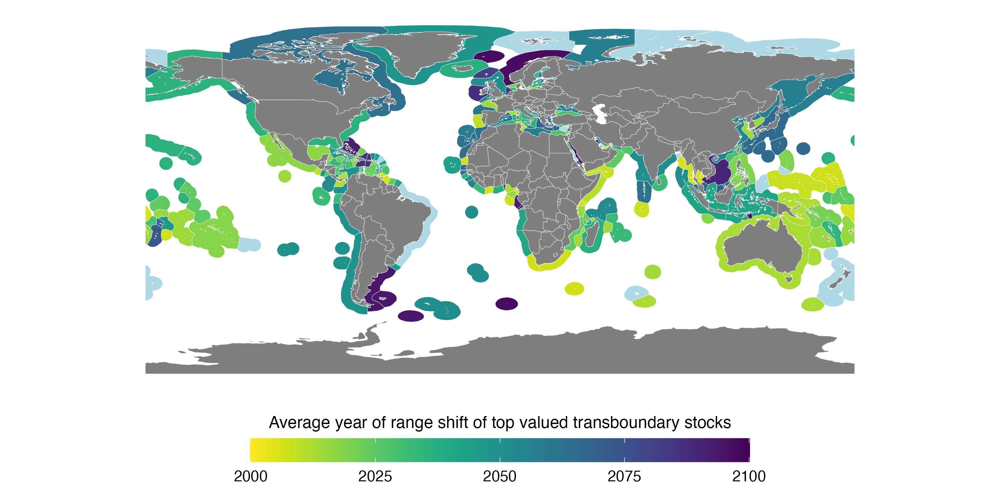

---
output:
  bookdown::pdf_book:
    toc : no
    keep_tex: no
    number_sections: yes
geometry: margin=1in
editor_options:
  chunk_output_type: inline
bibliography: ../References/ToE_Ref.bib
header-includes:
- \usepackage{amsmath}
- \usepackage{float} # Use the 'float' package
- \floatplacement{figure}{H} # Make every figure with caption = h
---

<!-- --- -->
<!-- title: Identifying Shifts in the Share Distribution of Transboundary Fish Stocks to Lead Time for Policy Response Under Climate Change -->
<!-- subtitle: Challenges to transboundary fisheries under climate change -->
<!-- author: 'Authors: Juliano Palacios-Abrantes*^1^, Thomas Frölicher^2^, Gabriel Reygondeau^13^, U. Rashid Sumaila^1^, Colette Wabnitz^14^, and William W.L. Cheung^1^' -->
<!-- date: 'Affiliations: ^1^Institute for the Oceans and Fisheries, University of British Columbia, Vancouver, Canada. ^2^Climate and Environmental Physics, Physics Institute, University of Bern.' -->
<!-- output: -->
<!--   # word_document:  -->
<!--     # reference_docx: ../References/template.docx -->
<!--   pdf_document: default -->
<!-- bibliography: ../References/ToE_Ref.bib -->
<!-- csl: ../References/science.csl -->
<!-- header-includes: -->
<!-- - \usepackage{amsmath} -->
<!-- - \usepackage{float} # Use the 'float' package -->
<!-- - \floatplacement{figure}{H} # Make every figure with caption = h -->
<!-- --- -->

<!-- # Instructions  -->

<!-- Research articles should present a major advance and can be short or long (maximum 15,000 words) format. Submissions must include an abstract (up to 150 words), an introduction, and sections with brief informative subheadings. You may include up to ten figures and/or tables and about 60 references. Supplementary materials should be limited to information that is not essential for the general understanding of the research presented in the main text and can include data sets, figures, tables, videos, or audio files.  You may include up to a total of ten figures and/or tables (combined) throughout the supplemental text.  -->

```{r setup, eval = T, echo = F, warning = F, message = F, results = 'hide'}

library(MyFunctions)

#### Project's Library
packages <- c(
  "tidyverse" ,
  "png",
  "grid"
  # "here", # for dbem_import `here()`
  # "data.table", #dbem_import `fread()`
  # "readxl", # for reading excell files
  # "janitor", # for clearing names
  # "geosphere", # estimate distances between points `distm()`
  # "ggrepel",
  # "zoo", # for average mean
  # "parallel", # for mclapply,
  # "sf", # for mapping
  # "st", # for mapping
  # "rgdal", #Spatial analysis
  # "tools", #Spatial analysis 
  # "zeallot", # for Juanito's map
  # "gmt", # for estimating distances between points
  # "viridis"
)

my_lib(packages)

```

<!-- * corresponding author: j.palacios@oceans.ubc.ca -->

<!-- # Abstract (150  words) -->

<!-- An opening sentence that states the question/problem addressed by the research AND Enough background content to give context to the study AND A brief statement of primary results AND A short concluding sentence. -->

<!-- Climate change shifts in marine species distributions is affecting the current frameworks emplaced to manage species shared fisheries. Here, we rely on a modeling framework with multiple ensemble members to identify the time frame by which shared stocks distribution will change from historical ranges, and the change in the proportion of the distrirbution that each EEZ has under climate change. Our results suggest that 60% of shared species have emerged since 2006 in 87% of the world EEZs. By 2075 all EEZs will have an emerging species and by 2097 and all species will have emerged in at least one EEZ. Average changes in the ratio of species-share between neighboring EEZs will fluctuate between 1 and 10% with some exceeding 25% by 2030 relative to today’s ratio. Our results suggest that most changes will happen before 2030 urging policy to be re-formulated to account for the possible implications of these changes.  -->

## Introduction

Over the last century, human activities have fundamentally changed the physico-chemical composition of the ocean, substantially warming the waters, decreasing the pH and reducing oxygen concentration [@IPCC:2019tn]. Throughout the ocean, marine species are distributed according to preferences in given environmental parameters (e.g., salinity, temperature, oxygen) [@Hutchinson:1957nt; @Nelson:2016kk]. As a result of climate change, many marine species have changed their distribution towards higher latitude, deeper water or following local environmental gradients [@Poloczanska:2016kk]. Biogeography of marine species is projected to continue to shift as ocean conditions continue to change in the 21st century under climate change [@Cheung:2010dt]. Climate change is expected to impact fisheries production, compromising our capacity to reach international sustainability goals such as Sustainable Development Goal 14 - life below water [@UnitedNations2018; @Barange:2014kr; @Singh:2017ds]. The projected risks of impacts can be reduced through improving the effectiveness of current fisheries management [@Gaines:2018sg; @Cheung:2018dh], including managing fisheries on species that cross international borders, i.e., shared stocks [@Gaines:2018sg; @Pinsky:2018cb].

The concept of shared stocks was developed following the ratification of  the United Nations Convention on the Law of the Sea (UNCLOS) and the claiming of Exclusive Economic Zones (EEZs) by States [@UnitedNations:1986tl]. As defined by the Food and Agriculture Organization (FAO), shared stocks can be classified into three non-exclusive categories: (*i*) transboundary, those that cross neighboring EEZs; (*ii*) straddling, that, in addition to neighboring EEZs, also visit the adjacent high seas; and (*iii*) highly migratory, mainly tunas and bill-fishes that cover vast oceanic regions [@Munro:2004th]. While countries are responsible for the management of stocks within their EEZs, under UNCLOS, States are encouraged to cooperate when stocks are shared [Article 63, @UnitedNations:1986tl]. A recent study estimates that, globally, there are 633 transboundary fish species, yielding an average 48.5 million tonnes of catch and USD 78 billion in fishing revenue, per year, between 2005 and 2010 [@PalaciosAbrantes:2020tv]. 

The effectiveness of managing fisheries targeting shared stocks is challenged by the shifts in marine species distribution under climate change [@Pinsky:2018cb; @Pinsky:2014by]. In many cases, catch or fishing effort quota on shared stocks are based on historical records, [@Baudron:2020dj] and do not necessarily consider the biogeography of the species [@FredstonHermann:2018kp], nor the effects of climate change in the fish stocks and fisheries [@PalaciosAbrantes:2020tv]. Misalignment between fisheries resources allocation and species’ distributional shifts have previously resulted in unsustainable harvest and international disputes [@Miller:2013iv; @Song:2017va; @Spijkers:2017ij], patterns that are expected to be exacerbated by worsening climate change [@Pinsky:2018cb]. With future shifts in species distributions under climate change, the challenges posed on shared stocks fisheries management will continue to increase in the $21^{st}$ century. Thus, there is a need to understand the time when climate change will affect the sharing distribution of these species as well as the intensity in order to prepare ocean governance to species on the move [@Pinsky:2018cb; @PalaciosAbrantes:2020tv; @Link:2010ei]. 

We propose that adapting the concepts of "Time of Emergence" (ToE) and “Thread Point” (TP) can help address some of the management challenges imposed by shifting species. Roughly, ToE is defined as the moment in time when an anthropogenic change signal (e.g., future trend) rises above the background noise of natural variability (e.g., historical variation) [@IPCC:2019tn]. This concept has been applied to investigate the emergence of multiple oceanic physical and biogeochemical variables [@Rodgers:2015jq; @Keller:2014jv; @Frolicher:2016dg; @Cheung:2020ja; @Schlunegger:2020gz; @Schlunegger:2019el; @Henson:2017ev]. The premise behind ToE is that we can only be confident that a significant change has been detected when the signal of anthropogenic climate change is larger than the background of natural climate variability [@Hawkins:2012hc]. The concept of thread point (TP) comes from game theory and is defined as the minimum payoff a player is willing to receive to cooperate in a game theoretic model [@Nash:1953vr]. Game theory has been widely used to investigate and manage shared stocks [@Sumaila:2013hv]. Specifically, Sumaila et al., *in press* applied this concept to understand the impacts of climate change to the economics of shared species between Canada and the United States. 

Here, we estimate the ToE and TP of the share distribution of transboundary stocks worldwide. We rely on a species distribution model driven by output from an Earth system model with ten ensemble members to project the distribution of the 663 selected shared species [@PalaciosAbrantes:2020tv] by 280 EEZs of 198 coastal countries under a high greenhouse gas emission scenario RCP8.5 (see Methods). We treated each species in an EEZ as a single stock due to the lack of more spatially resolved data [@PalaciosAbrantes:2020tv] and only considered shared stocks between neighboring EEZs (i.e., we did not include the high seas). Our results suggest that many shared stocks have already ‘emerged’ and overpassed their share TP in most neighboring EEZs posing a threat to the sustainability of shared stocks and the resilience of international treaties. 

## Materials and methods

### Databases and species selection

This analysis includes 633 marine exploited transboundary species previously identified to account for 80% of the catch taken from the world’s EEZs between 2005 and 2014 [@PalaciosAbrantes:2020tv]. Each time a species was shared by a pair of neighbouring EEZs it was considered a transboundary stock [@Teh:2015gd; @PalaciosAbrantes:2020tv] for a total of 9,132 transboundary stocks. We defined the boundaries of the world’s EEZs using the *Sea Around Us* spatial division (updated 1 July 2015, available from http://www.seaaroundus.org), noting that it subdivides the EEZs of 198 coastal states into 280 regions (e.g., Mexico’s EEZ is divided into Mexico Pacific and Mexico Atlantic; Figure \@ref(fig:FigureS1)) including island territories. We determined the intersections between polygons using the *R*-statistical software package *sf* [@PackagesfSimpleF:2018vp]. Each EEZ was categorized by the geopolitical regions according to the United Nations and by natural biome [@Reygondeau:2019uh]. The habitat preference of each species was determined based on information available from FishBase (http://www.fishbase.org). For each species and EEZ, we used the *Sea Around Us* data to estimate catch and fishing revenue from fishing activities within global EEZs. We report both average catch and revenue for the last decade (2005-2014) [@Zeller2016; @Tai2017; @Sumaila:2015uc]. The monthly average US Consumer Price Index (CPI) according to the U.S. Bureau of Labor Statistic (https://www.bls.gov/cpi/) was used to standardize all monetary values to 2019 real USD.


### Projecting species distributions under climate change

We projected the distribution of marine species using a dynamic bioclimatic envelope model (hereafter called DBEM) [@Cheung:2010dt; @Cheung:2016jd]. The DBEM  represents species’ physiology, habitat suitability, depth and latitudinal ranges, and spatial population dynamics as well as preferences to sea temperature, salinity, oxygen content, sea ice extent (for polar species) and bathymetry. For pelagic species, the model uses environmental variables at the surface (e.g., sea surface temperature) whereas demersal species distribution are driven by ocean bottom variables (e.g., bottom temperature). This way, the model estimates species abundance and maximum catch potential (a proxy of maximum sustainable yield) over a $0.5^{\circ}$ x $0.5^{\circ}$ grid of the world (see Cheung *et al.* [-@Cheung:2010dt; -@Cheung:2016jd] for model details). Recent work has demonstrated that, at the global scale, DBEM is able to reproduce catch changes similar in magnitude to those detected in observed catch time series in the
world’s EEZs (Cheung et al. in revision).

We forced the DBEM with environmental data from a ten ensemble member simulation of the Geophysical Fluid Dynamics Laboratory Earth system model (GFDL-ESM2M) to project the distributions of the 633 species from 1951 to 2100 [@Dunne:2012bo; @Dunne:2013db; @Rodgers:2015jq]. The GFDL-ESM2M is run under historical forcing until 2005 and follows the ‘high’ climate change emissions scenario, the Representative Concentration Pathway 8.5 (RCP 8.5) over the 2006-2100 period [@Riahi:2011dk]. In GFDL-ESM2M, atmospheric surface temperature is projected to increase by $3.2^{\circ}C$ by 2081-2100, relative to preindustrial levels. Because the main approach of this paper relies on understanding the spatial and temporal variation of a species’ distribution, we have to understand both the historical as well as the future climate-driven distribution variability, to infer differences between time frames. We do this by following an ensemble member approach where each member constitutes a different realization of the Earth system variability condition [@Rodgers:2015jq; @Frolicher:2009ge]. Thus, for our experiment, each of the ten GFDL-ESM2M-ensembles were started from infinitesimally small differences in Earth system initial conditions resulting in a unique atmosphere and ocean state at each point in time. This approach allows us to estimate the natural internal variability (e.g., background noise) and isolate the forced climate signal of a stock’s distribution by averaging the secular trend over all ten ensemble members.

### Calculating an index of transboundary range shift

We developed an index to evaluate range shifts in transboundary stocks under climate change (TI). This index is based on the shifts in the distribution centroid of a transboundary stock relative to the centroid of the neighboring EEZs that share this stock (Figure \@ref(fig:FigureS2)). The centroid of a transboundary stock was determined by the average latitude ($lat_{ts}$) and longitude ($lon_{ts}$) across the grid cells with the highest abundance within the neighboring EEZs sharing the stock e.g., sockeye salmon (*Oncorhynchus nerka*) that is transboundary between the United States and Canada. Therefore,

<!-- $lat_{ts} = \mu (lat_{per})$ -->

<!-- $lon_{ts} = \mu (lon_{per})$ -->

\begin{equation}
\begin{split}
\label{eq:one}
lat_{ts} = \mu (lat_{per}) \\
lon_{ts} = \mu (lon_{per})
\end{split}
\end{equation}

where $lat_{per}$ and $lon_{per}$ are the latitudes and longitudes of the grid cells holding the $per^{th}$ percentile of the projected transboundary stock abundance. To focus on areas where transboundary stocks are more abundant and fishing activities are more likely to take place, we included grid cells where the projected stock abundance within the neighbouring EEZs sharing the stock was above the top $10^{th}$ percentile (e.g., *per* = 10%). We ran a sensitivity analysis (e.g. *per* = 20, 50, 90) to relax this parameter (Figure \@ref{fig:FigureS2)). The centroid of a EEZ was estimated using the *st* package in *R* (version 3.2.1) (Figure \@ref{fig:FigureS1)). For each ensemble member, neighboring EEZs and transboundary stock, we computed the distance between centroids assuming the earth is a perfect sphere and ignoring geographic barriers using the geosphere package in *R*;


<!-- $$D_{ens} = acos(sin(lat_{eez})*sin(lat_{ts}) + cos(lat_{eez})*cos(lat_{ts})*cos(lon_{eez}-lon_{ts}))$$ -->

\begin{equation}
\label{eq:two}
D_{ens} = acos(sin(lat_{eez})*sin(lat_{ts}) + cos(lat_{eez})*cos(lat_{ts})*cos(lon_{eez}-lon_{ts}))
\end{equation}

where $lat_{eez}$ and $lat_{ts}$ are the latitudes of the EEZ and transboundary stock centroids, respectively and $lon_{eez}$ and $lon_{ts}$ are the respective longitudes.

Then, for each year we calculated the transboundary index as follows:

<!-- $$TI =(\frac{D_{A,t}}{sd(D_{A,th})} - \frac{D_{B,t}}{sd(D_{B,th)}})^2$$ -->

\begin{equation}
\label{eq:three}
TI =(\frac{D_{A,t}}{sd(D_{A,th})} - \frac{D_{B,t}}{sd(D_{B,th)}})^2
\end{equation}


where $D_A$ and $D_B$ represent the distance between the distribution centroids of a species and the centroid of the pair of neighbouring EEZs (A and B) sharing the species for each time step from 2006 to 2100 (*t*); and *sd* is the standard deviation of the historical (*th*, 1951 - 2005) centroid distribution for $D_A$ and $D_B$. Thus, a higher TI means that a shared species becomes more or less abundant relative to its neighbouring EEZs that is beyond what the fisheries experienced historically. From the perspective of a state’s fisheries, higher TI indicates an increase in the challenges to the effective management and sustainability of the shared species’ fisheries. In contrast, a smaller TI suggests that the sharing of the species between neighbouring EEZs is becoming relatively more stable; a condition that favors effective management and sustainability of the shared species’ fisheries. The index was smoothed to a 10 year average to reduce interannual variability. 

#### Calculating the Time-of-Emergence of the transboundary index

Knowing the point in time (e.g., year) at which the distribution of a shared stock will diverge from its natural internal variability is important in informing the lead-time to which climate adaptation in transboundary fisheries management needs to be implemented [@Link:2010ei]. Thus, we define ToE as the time when the stock shared between neighbouring EEZs will exceed the historical natural internal variability as follows:

<!-- $EmergenceTIndex = \frac{\mu_{TI[t]}}{SD_{TI_{th}}}$ -->
<!-- $ToE = t when Emergence index[t] > 1$ -->

\begin{equation}
\begin{split}
\label{eq:four}
EmergenceTIndex = \frac{\mu_{TI[t]}}{SD_{TI_{th}}} \\
ToE = t when Emergence index[t] > 1
\end{split}
\end{equation}

where $\mu_{TI}$ is the yearly mean TI ($\mu$) across all ten ensemble members in year *yr* and $SD_{TI}$ is the standard deviation of the smoothed (10-year moving average) TI across the ensemble members for the historical reference period (1951 - 2005). We set a threshold of TI above which we consider a shared stock to have emerged from the historical internal variability of the TI. The threshold was set as one standard deviation of the variability ($SD_{TI}$) (i.e., Equation \ref{eq:four}, representing a probability of 68% that the transboundary index has emerged from historical variability). We tested the sensitivity of the calculated emergence index to  a higher emergence threshold of two times the standard deviation (i.e., representing a probability of 95% that the index has emerged).


#### Computing a transboundary fisheries vulnerability index

We created a country-specific index to examine the risk of impacts of species’ range shifts on transboundary fisheries management. The index reflects both the rate of change of shared stocks’ distribution (indicated by the time-of-emergence of the transboundary index) and the importance of the shifting species to a country’s total catch and revenue from the species. The index is calculated from:

<!-- $$ index' = (P_c + P_v)/ToE $$ -->

\begin{equation}
\label{eq:five}
index' = \frac{(P_c + P_v)}{ToE}
\end{equation}

where $P_c$ and $P_v$ indicate the proportion accounted for by shared species in total catch and value generated from transboundary fisheries within a country’s EEZ, respectively. Here, the proportion of total catch and value are represented as the average of 2005 to 2014 within individual EEZs according to the *Sea Around Us*. The index was then normalized to a 0 (less vulnerable) to 1 (more vulnerable) scale.

### Estimating the threat point of transboundary stock share 

In game theory, cooperation over a shared resource will more likely result in a better overall outcome for the sharing parties than operating on a non-cooperative basis [@Munro:1979dg]. However, the benefits that each player gets from a cooperative strategy must be above a minimum payoff i.e., "Threat Point" (TP) [@Sumaila:2013hv]. Here, we define TP as the minimum proportion of a shared stock within an EEZ that a country will accept to engage in cooperative management with the country’s sharing neighbor [@PalaciosAbrantes:2020vt; @Sumaila:2020tp]. Any proportion below the defined threat point of a country would result in a deflection from the joint management of the shared stock. 

First we estimated the stock share ratio (SSR) of each transboundary stock shared by neighbouring nations between 1951 and 2100. We did this by aggregating the number of $0.5^{\circ}$ x $0.5^{\circ}$ grid cells in which the stock is present across neighboring EEZs, and then calculated the proportion of the stock held within each EEZ [@PalaciosAbrantes:2020tv]. Second, we average the calculated proportion of stock within an EEZ held into three time periods to reduce the effects of inter-annual climate variability. The first time period ($t_h$) spans 1951 to 2005 and matches the historical period in the GFDLESM-2M simulations, over which the model was forced with observation-based greenhouse gas, aerosol and natural external forcing [@Dunne:2012bo; @Dunne:2013db]. It is assumed as the historic baseline of shared distributions for each stock. We then selected two future periods; early $21^{st}$ century as the average of 2021 to 2040 (*te*), and mid $21^{st}$ century as the average of 2041 to 2060 (*tm*). We chose these time periods to match the challenges of achieving fisheries-related UN-SDGs [@UnitedNations2018] such as SDG 14.4 (end overfishing), SDG 2.4 (ensure sustainable food production systems) or SDG 1.2 (poverty reduction), to be achieved by 2030 [@Singh:2017ds]. The analysis was replicated for projected stocks distributions from each of the ten ensemble members and results were averaged across ensemble members. Third, we estimated the percentage change in the SSR ($\Delta{SSR}$) of each future time period ($SSR_f$) relative to the historic time period ($SSR_h$) following Palacios-Abrantes et al. (*in press*),

<!-- $$ \Delta{SSR_{e,m}} = \frac{(SSR_{f}-SSR_{th})}{SSR_{th}}* 100 $$ -->
<!-- $TP = \Delta{SSR}_{e,m} < \mu \pm \sigma$ -->


\begin{equation}
\begin{split}
\label{eq:six}
\Delta{SSR_{e,m}} = \frac{(SSR_{f}-SSR_{th})}{SSR_{th}}* 100 \\
TP = \Delta{SSR}_{e,m} < \mu \pm \sigma
\end{split}
\end{equation}

Finally, a substantial change in SSR of each EEZ was determined when $\Delta{SSR_{e,m}}$ was beyond one standard deviation of the historical distribution i.e., when $SSR_f \geq (SSR_f + \sigma)$ or $SSR_f \leq (SSR_f - \sigma)$. In other words, when the future SSR is below or above a neighbouring EEZ TP.

### Statistical analysis

We tested the results for normality (e.g. skewness = 1.02, kurtosis = 2.83) and performed a couple of non-parametric Kruskal–Wallis test by ranks [@Hollander:2013wz] to investigate geopolitical and ecological differences in the ToE of transboundary species. Specifically, we tested if the habitat association of transboundary species and the geographic location of EEZs would have any effect on the time of emergence of transboundary stocks. For both cases, our null hypothesis was that there were no significant differences in the time of emergence across habitat association nor EEZs.
<!-- Moreover, we implemented a multiple linear regression analysis to a series to explain the ToE of each species in each EEZ. Specifically, we looked at habitat preferences, catch trends, geopolitical and biome location and ToE of both bottom and sea surface temperature (See *Databases and species selection*). We hypothesize that all of these factors would have significant influence in the ToE of transboundary species. -->
All analyses were run using the statistical software R version 3.5.2 (2018-12-20; Eggshell Igloo) with the packages *data.table* [@Packagedatatable:2019uh], *janitor* [@PackagejanitorSim:2018ur], *rfishbase* [@PackagerfishbaseR:2019th], *sf* [@PackagesfSimpleF:2018vp], *sp* [@PackagespClasses:2019tn], *tidiverse* [@PackagetidyverseE:2017vq], *tidytext* [@PackagetidytextTe:2019vk], *gmt* [@PackagegmtInterfa:2017vh] and *zoo* [@PackagezooSInfr:2019tm], *ggrepel* [@PackageggrepelAut:2020to], *zeallot* [@PackagezeallotMul:2018wy], *viridis* [@PackageviridisDef:2018us], *cowplot* [@CowplotStreamlined:2019wt], *moments* [@PackagemomensMome:2015uh] and *pgirmess* [@PackagepgirmessSp:2018um]. All code is available at https://github.com/jepa/TransEmergence

## Results

```{r Load_Results, eval = TRUE,  echo = FALSE, include = FALSE}

prop_r <- read_csv("/Volumes/HALL2000/Data/TransEmergence/Results/proportion_change_2005.csv") %>% 
  gather("time_step","change",per_early,per_mid)

```

### Time of Emergence of transboundary species

The average ToE of the transboundary index across the emerging stocks in all EEZs analyzed is projected to be 2029 $\pm$ 26 years with the first stocks emerging in 2006 and until 2100 (Figure \@ref(fig:Figure1). In total, 5,745 stocks will emerge between 2006 and 2100, that is 63% of the total transboundary stocks considered in this study (9,132). About 55% (n = 3,154) of those stocks are projected to have their shifts in distributions emerged between 2006 and 2020. Also, 96% of the world’s EEZs saw at least one stock having their distribution shifts between 2006 and 2020 (e.g. *Engraulis ringens* shared by Chile and Peru emerged in 2010). Shifts in stocks’ distributions will continue to exceed historical limits steadily towards the end of the $21^{st}$ century and are not expected to stop there (Figure \@ref(fig:Figure1)). The number of EEZs with emerging stocks is projected to increase steeply from 87% to 96% during the period of 2006 to 2020. After the mid-2020s, the rate of increase in the number EEZs slow down to an average of 0.74% per year. By 2081, all of the EEZs analyzed here will have at least one emerging stock (Figure \@ref(fig:cumulative)).


```{r cumulative, eval = T,  echo = F, fig.width = 9, fig.height=4, fig.pos= "H", fig.cap =  "Cumulative increase in time of emergence by Exclusive Economic Zone and transboundary species in absolute numbers and percentage."}

img <- readPNG("../Figures/Fig1.png")
grid.raster(img)

```

<!--  -->

The median ToE of transboundary stocks varied significantly according to the geographic region of the neighboring EEZs (Kruskal-Wallis, X2 = 287.23, DF = 93, p < 0.001). Around one fifth (19%) of the EEZs have an average time of emergence across species prior to 2020 (Figure \@ref(fig:Figure2). Notable exceptions where the ToE is relative late include Honduras (2071), New Zealand (2055), Ireland (2067) and Pitcairn (2070). The EEZs in Eastern Asia, Latin America and the Caribbean as well as Polynesia differed significantly (*p* < 0.05) from (almost) all other regions (see Table S1 for full statistics). Tropical latitudes also hold the majority of countries with high vulnerability to shifts in transboundary stocks due to climate change (Figure \@ref(fig:Figure2). Only in very few cases like Brazil and Alaska’s and Russia’s polar EEZs, no stock will emerge between 2006 and 2100. From the top 10 more vulnerable countries, seven are located in tropical waters (Tokelau 100, the	Marshall Islands 92, Peru 88, Kiribati 80, Tuvalu 80, Papua New Guinea 78, and the Bahamas 74) while only three are outside the tropics (Estonia 86, Finland 82 and Sweden 78). We set an arbitrary threshold of  1 s.d. (67% confidence) to determine the ToE (see Methods). We tested the sensitivity of our results using a larger threshold (i.e.,  2 s.d for a 95% confidence). While the selected 1 s.d. threshold is less conservative than a 2 s.d., the distribution of results do not dramatically change between thresholds, with a difference in ToE of about 4 years (Figure \@ref(fig:FigureS2).


```{r Figure2, eval = T,  echo = F, fig.width  = 13,fig.pos= "H", fig.height =11, fig.cap =  "Average time of emergence of transboundary species. A) Land polygon shows the vulnerability index of individual country’s fisheries management to shifts in transboundary species. The warmer the colour the greater the vulnerability. Exclusive Economic Zone polygon represents the average time of emergence across all species, with the cooler the colour the later the average time of emergence. The Density plot on the right shows the latitudinal number of emerging species across EEZ centroids (10 degrees latitude running mean). Aqua color = no emerging stocks. B) Time of emergence according to the United Nations sub regions. Whiskers represent 1.5* interquartile range. Box represents interquartile range as distance between first and third quartiles. Line represents median, and black points represent points outside of 1.5*IQR."}

img <- readPNG("../Figures/Fig2.png")
grid.raster(img)

```

<!--  -->

Our analysis suggests that most countries responsible for 75% (n = 47) of the yearly revenue generated from transboundary species between 2005 and 2010 will see their stocks emerge in average before 2040 (Figure \@ref(fig:Figure3). In some cases like Indonesia, Thailand and the United States, stocks will emerge ass soon as 2030. These 47 countries are also among those with the largest number of emerging stocks. Notably, nine of the top ten countries earning the most revenue from transboundary species, share a border. 

```{r Figure3, eval = T,  echo = F, fig.width=5, fig.height=6,fig.pos= "H", fig.cap =  "Average time of emergence of transboundary species per fishing entity, aggregated by colour according to region. Fishing revenue on a logarithmic scale. Showing country names for the top 90th percentile. Countries marked with an asterisk have at least one neighboring border in the group."}

img <- readPNG("../Figures/Fig3.png")
grid.raster(img)

```

<!--  -->

We compared species ToE within EEZs by species habitat preference according to FishBase's classification (Figure \@ref(fig:Figure4). We found significant differences in ToE by habitat preference (Kruskal-Wallis, $X^2$ = 286.48, *DF* = 93, *p* < 0.001). Specifically, the ToE of species with preferences for pelagic-oceanic and reef habitats was significantly different than other habitat preferences (See Table @\ref(tab:TableS2). In average, species associated with pelagic oceanic such as tunas (*Thunnus sp.*) and bathy-pelagic habitats like blue whiting (*Micromesistius poutassou*) as well as species associated to corals (e.g., Bigeye snapper	*Lutjanus	lutjanus*) will have an earliest time of emergence (Figure \@ref(fig:Figure4)). Only species associated to bathydemersal habitats such as Alaska plaice	*Pleuronectes	quadrituberculatus* and other habitats will have an average ToE later than 2025 (Figure \@ref{fig:Figure4)). 


```{r Figure4, eval = T,  echo = F, fig.width=14, fig.height=14,fig.pos= "H", fig.cap =  "Regional time of emergence per habitat preference. Regions according to the United Nations and habitat preference to FishBase. Whiskers represent 1.5* interquartile range. Box represents interquartile range as distance between first and third quartiles. Line represents median, and black points represent outliers outside of 1.5*IQR."}

img <- readPNG("../Figures/Fig4.png")
grid.raster(img)

```

<!--  -->

<!-- We hypothesized that species environmental preferences (e.g. presence in certain biomes and habitats), climate change effects on water temperature (e.g. ToE of SST), human drivers (e.g. catch rate), and latitudinal gradient would have significant influence in the ToE of transboundary species (Table \ref{tab:TableS3)). Results from the multiple linear regression analysis show a significant relation between ToE of transboundary species and latitudinal gradient (*p* > 0.001), tropical (*p* = 0.013) and temperate (*p* = 0.002) biomes, EEZs in the Americas (*p* > 0.001), Asia (*p* > 0.001) and Oceania (*p* = 0.002), and some habitats (*p* > 0.001) (Table \ref{tab:Table1)). -->

```{r Table1, eval = F,  echo = F, message = F, warning  = F}

read_csv("../Tables/mlr_result.csv") %>% 
  knitr::kable(
    "latex",
    booktabs = T,
    captio= "Multiple regression results for time of emergence of transboundary species. Only showing significant variables. The model significantly predicts time of emergence (F[18,6155] = 20.68, p < 0.001, R2 = 0.05)"
  )

```

### Changes in the threat point of transboundary stocks

```{r analysis_results, eval = F,  echo = FALSE, include = FALSE}

# Early century
n_eez <- prop_r %>%
  filter(variable == "mean_eez" & 
           !is.na(change),
         time_step == "per_early"
         ) %>% 
  pull(eez_name) %>% 
  unique() %>% 
  length()

n_eez_per <- round(n_eez/275*100,2)


### Max values early
max_values <- prop_r %>% 
  filter(variable == "max_eez" & 
           !is.na(change),
         # time_step == "per_early"
         )

max_values$per_early

### Average
average_mid <- prop_r %>% 
  filter(variable == "mean_eez" & 
           !is.na(change)
         )
```


We estimated the changes in the SSR of transboundary stocks by the early (2020-2040) and the mid $21^{st}$ century (2040-2060), relative to present (1951-2005) highlighting changes below a neighbouring country's TP. Our results suggest that 87% (n = 238) of the world EEZs will see a change in SSR below the country's TP by 2030 (Figure \@ref{fig:Figure5}A). Globally, most EEZs will average a change lower than 25% by the early $21^{st}$ century which is expected to slightly increase in intensity towards the mid $21^{st}$ century (Figures \@ref{fig:FigureS4} and S5). However, this result masks larger changes in SSR for specific stocks and EEZs. For example, Guatemala’s SSR of *Panulirus gracilis* shared with Mexico is projected to go from a historical 12% to 26%, a change of over 50%. By early $21^{st}$ century, the percentage of transboundary stocks per EEZ that will see a change in SSR above the country's TP historical distribution (e.g., $\Delta{SSR} > \mu \pm \sigma$) will be relatively large (global mean of 69% of stocks in an EEZ). For 17 EEZs, 100% of their analyzed transboundary stocks will shift below the, while only six EEZs will have less than 25% stocks shifting below the TP (Figure \@ref{fig:Figure5}A-Polygons). In terms of direction of change, regions where EEZs are relatively small and have multiple borders (e.g. The Caribbean) will see a complex dynamic of changes in SSR with no clear patterns (Figure \@ref{fig:Figure1}B). Towards the mid $21^{st}$ century, changes in SSR per EEZ will not be substantial (Figure \@ref{fig:FigureS5)) relative to the early $21^{st}$ century but are expected to increase in intensity (Figure \@ref{fig:FigureS5)).


```{r Figure5, eval = T,  echo = F, fig.width=12, fig.height=10,fig.pos= "H", fig.cap =  "Changes in Specie Share Ratio by 2030 (2021-2040) relative to 1951-2005. Lines represent the average gain of transboundary stock share ratio with arrows going from the losing EEZ (point) to the winner (arrowhead). Polygons represent the percentage of initial stocks that will see a shift. Panel B zooms in to specific areas shown in grey boxes of A."}

img <- readPNG("../Figures/Fig5.png")
grid.raster(img)

```

<!--  -->

## Discussion

In this paper we endeavor to look at the timing and intensity of changes in the sharing of transboundary species. Our findings highlight the early emergence of transboundary distribution shifts from historical variations for most of the shared stocks in the world indicating climate change is already affecting international fisheries management (Figure \@ref{fig:Figure1)). Moreover, we identify regional patterns of high climate risk to important fish stocks and associated fisheries at the present-day that will require fast responses from transboundary fisheries management (Figure \@ref{fig:Figure2} and \@ref{fig:Figure3)). Finally, we show that in many instances around the world, the incoming years will see many transboundary stocks shifting their shared proportion below acceptable levels for sharing nations potentially becoming future sources of conflict (Figure \@ref{fig:Figure5))

#### High present-day climate risk of on transboundary fisheries management

Our results suggest that in most EEZs, more than half of transboundary species emerged in the early 2000s (Figure \@ref{fig:Figure1)). This is in alignment with previous research pointing to changes in marine catch  composition since the 1970s as evidence of climate change [@Cheung:2013gk, @Poloczanska:2016kk]. For example, in the early 2000s, Humboldt squid (*Dosidicus gigas*) substantially expanded its geographic range, reaching Washington state waters where a new fishery rapidly developed [@Pinsky:2014by; @Zeidberg:2007gs]. In the North East Atlantic, the emergence of Atlantic mackerel (*Scomber scombrus*) in Icelandic waters in 2010, led to years of unsettled international conflict between multiple fishing nations [@Spijkers:2017ij]. The large number of transboundary species emerging since early 2000s identified in this study can be partially attributed to the time of emergence of several environmental variables (e.g., temperature, oxygen) that influence the distribution of marine species [@Rodgers:2015jq; @Keller:2014jv; @Frolicher:2016dg; @Mahlstein:2011fy]. It has been estimated that since the early 2000s, SST and oxygen ($O_2$) have emerged in 79% and 23% of the global ocean, respectively, and by 2080 SST will have emerged in 90% of the global ocean while $O_2$ will have doubled under a high greenhouse gas emission scenario [@Rodgers:2015jq].

Regional differences in ToE are likely the result of environmental factors, species vulnerability, and the characteristics of political boundaries. For example, our findings underscore previous findings suggesting that tropical species are already on the move. The tropics are among the most species-rich biome [@Reygondeau:2019uh] and have potentially experienced some of the greatest levels of warming relative to natural internal variability [@IPCC:2019tn; @Roemmich:2015id]. In the tropics, marine species live close to their thermal tolerance, making them highly vulnerable to warming waters [@IPCC:2014bz]. Consequently, as a result of climate change, species have to move towards deeper or sub-tropical waters [@Poloczanska:2016kk] although recent studies suggest that in some regions species are shifting towards the equator and to shallow waters [@Clarke:2020ep]. The premise of a shift already happening is supported by observational evidence of tropical species appearing in sub-tropical biomes [@Fogarty:2017eo] and catch-data analysis showing a reduction in sub-tropical species catches in tropical waters between 1970 and 2006 [@Cheung:2013gk]. In addition to species natural traits and the environmental pressure from climate change, the tropics comprise areas with relatively small EEZs and many borders that match peaks of emerging stocks. Specifically, it seems like South East Asia, the Caribbean, and the Mediterranean harbour substantial increases in emerging stocks (Figure \@ref{fig:Figure2)).

### Hotspot of climate risk on transboundary fisheries management

We have identified hotspot regions of climate risk for transboundary fisheries management (Figure \@ref{fig:Figure2)). The premise of our vulnerability index is that, from a management perspective, countries whose shifting transboundary stocks provide larger societal benefits and have an early ToE will be more vulnerable to shifts in SSR than their counterpart. Thus, climate risk hotspots for transboundary management happen where EEZs will see an early ToE and where transboundary stocks are important in terms of fisheries catches and revenues (Figure \@ref{fig:Figure2)). For example, Polynesia and Micronesia are the only regions where the average ToE across all stocks and EEZs already happened; 2019 or is about too 2021, respectively (Figure \@ref{fig:Figure5)). Countries in these regions are highly dependent on pelagic-oceanic (e.g.,tunas and bill fishes; [@Johnson:2017ev]) and reef-associated transboundary stocks [@Cabral:2018hc] for both food security and profits [@CisnerosMontemayor:2016gq; @Hanich:2018dh]. For example, in the Marshall Islands 16 transboundary stocks responsible for 92% and 94% of the transboundary fisheries revenue and catch, respectively, have, on average, emerged since 2018 resulting in high vulnerability index (Figure \@ref{fig:Figure5)). In this case, policy has to work against the clock and under potentially high societal pressure to address an issue that could be impacting important fisheries [@Burden:2019ij]. Currently, these fisheries operate under the Vessel Day Scheme - which takes into account shifts in stocks and catches making it a good example where a management system has been set up that is somewhat anticipatory [@Aqorau:2018bh]. However, a low vulnerability index does not necessarily translate to no-risk of international conflict or threat to stocks sustainability. While it gives countries more time to prepare for substantial changes, stocks with relatively small overall participation on catches or revenue can still be a source of conflict as portrayed by the Atlantic mackerel case [@Spijkers:2017ij, Chapter 1].

### Changes in species-share ratio will be ubiquitous 

By 2030, changes in SSR will be seen across the globe, but with no clear pattern in the direction of change (Figure \@ref{fig:Figure5)). Poleward shifts in SSR are expected in regions of the world with relatively large EEZs and few boundaries, like the North East Pacific. However, despite observations and modelling work indicating that, generally, climate change is shifting species distributions poleward [@Cheung:2010dt; @Poloczanska:2016kk; @IPCC:2019tn; @Fogarty:2017eo], the Eastern Tropical Pacific will see EEZs from Mexico to Ecuador losing SSR to their southern neighbors. Such range shifts towards the equator reflect movements to cooler habitats characteristic of equatorial upwelling systems. They are consistent with regional modeling studies suggesting that by mid $21^{st}$ century, marine species will move between 50 and 100 km southward of Mexico’s EEZ towards Peru under a high emission climate change scenario [@Clarke:2020ep].  Moreover, regions characterized by multiple political boundaries, like the Caribbean and the North East Atlantic, will see a complex network of changes in SSR with no clear pattern (Figure \@ref{fig:Figure5}B). These regions are known for being highly connected by both fish adult migration [@Levin:2018in] and larvae dispersal [@Ramesh:2019va] supporting the implementation of joint management plans [@Baudron:2020dj] and the call for new implemented shared policies [@Levin:2018in]. However, game theory suggests that the greater the number of negotiating parties , the harder it is for parties to reach an agreement [@Sumaila:2013hv], thus, making it particularly challenging for countries in these regions to coordinate the management of shifting shared species.


## Caveats and uncertainties

There are two main sources of uncertainty in our analysis that can serve as a roadmap for future studies to provide additional information to inform policy towards sustainable and equitable international fisheries management under climate change. First, our analysis relies on the combination of a single Earth system model (GFDL-ESM2M) and climate change scenario (RCP 8.5). The use of multiple ESMs can capture the structural uncertainty of the models [@Frolicher:2016dg; @Lotze:2019ce], however, exercises looking at changes in fish biomass with multiple models show an overall agreement between models in terms of direction of change but variable magnitude. Using the GFDL-ESM2M results in conservative estimates as its projections, for example in sea surface temperature, are overall less extreme than in other CMIP5-type Earth system models [@Bopp:2013fg]. Addressing the uncertainty in future projections is key to advance marine governance for species on the move [@Pinsky:2018cb], thus, further research that includes multiple ESMs could provide more accurate results in terms of magnitude but will likely follow the same trend showed here [@Lotze:2019ce]. Secondly, here we present the result based on 633 species that were previously identified as shared by multiple neighboring nations (Chapter One). We consider that each species shared by a set of neighbouring EEZs is a shared stock for a total of 9,132 shared stocks. Thus, our analysis does not consider a more detailed organizational level such as biologically-meaningful sub-populations within an EEZ due to limited biological and spatial-specific data on stocks sub-populations. Moreover, in many EEZs of the world fisheries are often managed at the species level (Chapter One) and sub-populations are potentially interconnected [@Ramesh:2019va], thus, providing additional ecological ground for our analysis [@Popova:2019fs; @Dunn:2019ca]. However, reproducing our analysis regionally, where spatially-explicit stock data is available would allow to produce more certain results in changes in both ToE and SSR of transboundary stocks, and potentially identity different types of shared stock shifts within meta-populations level [@Link:2010ei; @Kaplan:2016hs; @Archambault:2016ie]. 

## Conclusion

Global society has set the ambitious goal to manage all fisheries sustainably (SDG 14 – Life below water) [@UnitedNations2018] by 2030; achieving this goal would have clear effects on multiple  others [@Singh:2017ds]. Preparing anticipatory policy to species on the move is key to achieve these sustainable development goals and effective governance of the world’s fisheries [@Pinsky:2018cb]. Here, we have addressed two fundamental steps to achieve sustainable international fisheries in a changing world [@Link:2010ei]. We have identified the transboundary species that will see a significant shift compared to their historical average in shared distribution, the year in which their distribution will undergo such a shift, as well as the degree of change. Our results have direct implications for ocean governance as the data provided  can inform and be used by regional management bodies and countries to anticipate the potential complications brought about by  climate change to international fisheries management. While future studies, specifically at more localized scale, will provide valuable nuance in designing effective policies, our  results provide an important baseline on which to build when preparing ocean governance for species on the move [@Pinsky:2018cb; [@Gaines:2018sg; @PalaciosAbrantes:2020tv]. To address the issues raised in this paper, international fisheries management will require coordination between nations to generate adaptive, collaborative and equitable management strategies to address the uncertainties of a changing world.

## Supplements


```{r FigureS1, eval = T,  echo = F, fig.width=9, fig.height=4, fig.cap =  "World Exclusive Economic Zones used in this study as devided by the Sea Around Us and their centroids (points)."}

img <- readPNG("../Figures/Supp1.png")
grid.raster(img)

```

```{r FigureS2, eval = T,  echo = F, fig.width=9, fig.height=4, fig.cap = "Graphical representation of the transboundary index (TI) to determine the time of emergence of transboundary stocks. The index is based on the distance between the distributional centroid of the transboundary stock and the geographic centroid of the neighbouring Exclusive Economic Zones sharing the stock (Top panel). Time of emergence is defined as the first year when the TI overpasses historical values (Bottom panel)."}

img <- readPNG("../Figures/Supp2.png")
grid.raster(img)

```


```{r FigureS3, eval = T,  echo = F, fig.width=4, fig.height=4, fig.cap =  "Average Time  of Emergence and standar dviation for a 64% confidence treshold  (purple) and a 98% confidence teshold (yellow)"}

img <- readPNG("../Figures/Supp3.png")
grid.raster(img)

```


```{r FigureS4, eval = T,  echo = F, fig.width=4, fig.height=4, fig.cap =  "Distribution of Stock Share Ratio percentage change by the early (2021-2040) and middle (2040-2060) $21^{st}$ centurury relative to today (1951-2005)"}

img <- readPNG("../Figures/Supp4.png")
grid.raster(img)

```

<!--  -->


```{r FigureS5, eval = T,  echo = F, fig.width=9, fig.height=12, fig.cap =  "Changes in Stock Share Ration by 2050 (2041-2060) relative to 1951-2005. Lines represent the average gain of transboundary stock share ratio with srrows going from the losing EEZ (point) to the winner (arrowhead). Polygons represent the percentage of initial species that will see a shift. Panel B zooms in to specific areas shown in grey boxes of A."}

img <- readPNG("../Figures/Supp5.png")
grid.raster(img)

```

<!-- # Recycled  text -->
<!-- All of these results have direct implications for managing shared fisheries under climate change that can be partially addressed by the early implementation of joint-management international policies. -->

<!-- The time and number of emerging species decreases as we move away from the equator and into temperate biomes where species live further away from their temperature tolerance and thus hare less vulnerable to warming [@IPCC] with a smaller peak aligned with the EEZ of the Baltic and North seas. -->


<!-- Changes in stock share ratio has contribute to past conflicts between nations with long history of collaboration including Canada and the United States over Pacific salmon and Norway and Iceland over spring spawning herring [@Miller:2013iv]. In both cases, rules were emplaced and agreed by all parties, however, treaties were not prepared to address shifts in species distributions [@Miller:2013iv; @Song:2017va] and when the benefits felt below the desired level (e.g. threat point) the affected country broke off relationships. In the case of Canada and the US, the agreement was re-stated when a conservation fund was implemented [@Miller:2013iv].  -->


<!-- In cases where the species is distributed in more than 2 neighboring EEZs (e.g. *xxx*), the index is as follows: -->

<!-- $$I =(\frac{D_{A,y}}{sd(D_{A,h))} - \frac{D_{B,y}}{sd(D_{B,h)))) |  \\  +(\frac{D_{A,y}}{sd(D_{A,h))} - \frac{D_{C,y}}{sd(D_{B,h)))) | \\  +(\frac{D_{A,y}}{sd(D_{A,h))} - \frac{D_{Cy}}{sd(D_{B,h))))/N$$ -->


<!-- In other words, for two neighboring EEZs sharing a stock, if the centroid shifts towards EEZ A ($D_A$ decreases) but away from EEZ A B ($D_B$ increases), EEZ A may catch a bigger share over B and the risk of dispute increases (see *TI* equation). Consequently, if the centroid shifts are within historical variability (*SNR* < 1), risk of dispute between EEZ A and B is lower, finally, if the centroid shifts are beyond historical variability (*SNR* > 1), the risk of dispute is higher. Thus, risk is positively related to the frequency of centroid shifts beyond historical variability. -->
