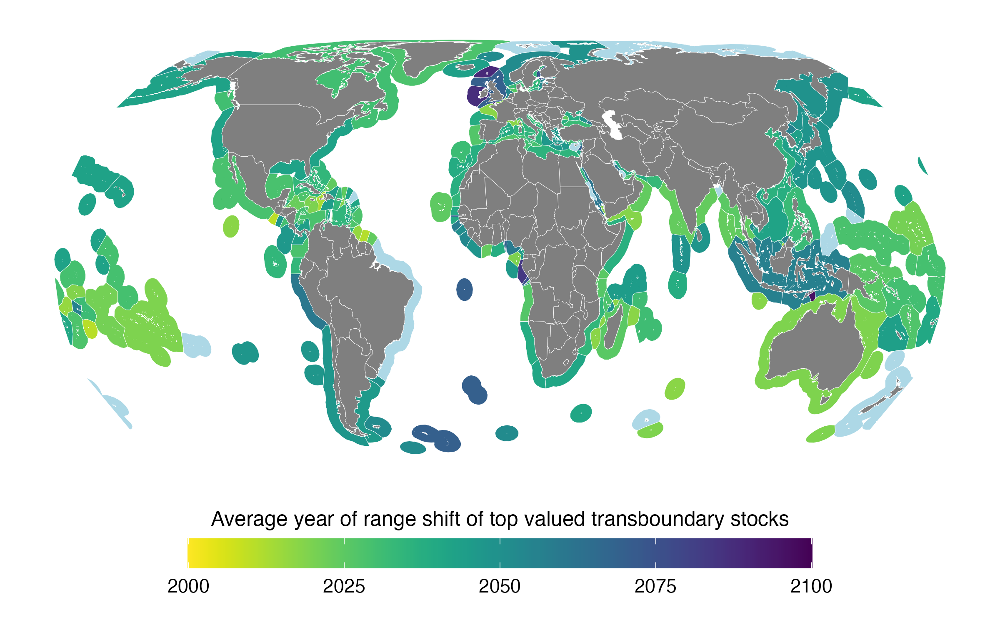

```{r setup, eval = T, echo = F, warning = F, message = F, results = 'hide'}

library(MyFunctions)

#### Project's Library
packages <- c(
  "tidyverse" 
  # "here", # for dbem_import `here()`
  # "data.table", #dbem_import `fread()`
  # "readxl", # for reading excell files
  # "janitor", # for clearing names
  # "geosphere", # estimate distances between points `distm()`
  # "ggrepel",
  # "zoo", # for average mean
  # "parallel", # for mclapply,
  # "sf", # for mapping
  # "st", # for mapping
  # "rgdal", #Spatial analysis
  # "tools", #Spatial analysis 
  # "zeallot", # for Juanito's map
  # "gmt", # for estimating distances between points
  # "viridis"
)

my_lib(packages)

```

<!-- * corresponding author: j.palacios@oceans.ubc.ca -->

# Abstract

<!-- The delineation of Economic Exclusive Zones (EEZs) by the United Nations Convention on the Law of the Seas (UNCLOS) in the early 80s, established political boundaries across the distribution of many fish species, creating shared species between nations. Despite not implicit, UNCLOS incentivizes nations to cooperate in the management of transboundary fisheries and most management plans emplaced are based on historical distribution of catches. Climate change represents a challenge for the joint management of fish stocks. For instance, climate-driven changes in species distributions have led to conflict between nations due to changes in the proportion of captures, quota allocation, and fishery newcomers. Recent events suggests that even changes in species that contribute a relatively small proportion of the overall catch can lead to important international conflict when no legal framework is available. Thus, it is fundamental to prepare for climate change-driven impacts such as identifying the stocks that are going to change historical proportions within neighboring EEZs, the degree by which they will change, and the time when such change is going to happen. Only by adapting management plans and policy that anticipates to these effects will international fisheries treaties be climate-ready. Here, we build on previous work to identify the transboundary stocks that will see changes in their stock-share-proportion (e.g. the proportion of the stock that each EEZ has) around the world. Moreover, we determine the time of emergence of each fish stock, defined as the year in which the stock-share-proportion will change from its historical range. Our results suggest that by the mid of the 21st century EEZs will see changes in stock-share ratio between 1 and 10% with some exceeding 25%. Most of these changes will happen before 2050 urging policy to be re-formulated to account for the possible implications of these changes. By the end of the 21st century virtually all EEZs and transboundary species will have experienced changes in stock-share-proportion relative to historical distributions. The results of this research has the potential to improve climate-ready fisheries if policy is modify to respond to the consequences presented here. -->

# Introduction

Over the last century human activities have fundamentally changed the physicochemical composition of the ocean, warming the waters, increasing the pH and reducing the oxygen concentration [@IPCC:2019to]. As a consequence, many marine species have changed their distribution [@Poloczanska:2016kk] and will continue to do so in the search of the appropriate environmental conditions needed for their subsistence [@Cheung:2010dt]. Climate change is expected to impact fisheries production at different latitudes compromising our capacity to reach international sustainability goals such as the SDG 14 - life below water [@SDG14; @Cheung:2010dt; @Barange:2014kr]. Such impacts can be offset with the proper reform of current fisheries management [@Gaines:2018sg; @CheungClimateReadyFish]. However, such reforms will require comprehensive plans and institutions to manage species that cross international borders, also known as shared stocks [@Gaines:2018sg;@Pinsky:2018cb;].

In the early 1980's the United Nations officialized the concept of Exclusive Economic Zone (EEZs) though the Law of the Sea (UCLOS) [@UnitedNations:1986tl] partitioning the distribution of several species, thus, creating what we known today as shared stocks. As defined by the Food and Agriculture Organization, shared stocks can be classified as transboundary, those that cross neighboring EEZs; straddling, that, in addition to neighboring EEZs, also visit the adjacent high seas; and highly migratory, mainly tunas and bill-fishes that cover vast oceanic regions [@FAO; @Munro]. While counties are responsible for the management of stocks within their EEZs, UNCLOS incentives actions to cooperate when stocks are shared [Article 63, @UnitedNations:1986tl]. Today, an estimate of 633 transboundary fished stocks are found in different continents and across multiple habitats averaging 48.5 million tones and representing USD 78 billion in fishing revenue between 2005 and 2010 [@FishorVisa].

The management, and thus sustainability, of fisheries that target shared stocks is jeopardized as marine species shift their known distribution to cope with a changing world [@Pinsky:2018cb]. There is evidence that such shifts have already complicated shared marine resources around the globe. In the North-eastern Atlantic, evidence shows that shared stocks managed within the European Union divisions have been shifting since the 1970's compromising the region's sustainability [@EuropeShift]. In the North-eastern Pacific, sockeye salmon (*Oncorhynchus nerka*) shifted in the 1980's towards Alaska, creating a ten years conflict between Canada and the United States [@Song]. Further south, the southern stock of Peruvean anchoveta (*Engraulis ringens*) shared by Chile and Peru has gradually shifted towards Chilean waters adding to the over-exploitation of the resource [@Cashion:2018cg]. Global shifts in the distribution of tunas [@ErauskinExtramiana:2019fw] have brought additional management challenges in both the Western Indian ocean and South-western Pacific [@Miller:2007kx]. Moreover, as species continue shifting with climate change, current policies might become obsolete, and thus, require new management strategies that create equitable systems across all dependent fishing nations [@Bell:2013ga; @Pinsky:2018cb]. The objective of the current paper is to explore two concepts that will be essential in addressing the challenges that climate change will bring to the management of transboundary fisheries [@Link:2010ei].

The first concept alludes to the game theory concept of thread point, known as the minimum payoff a player is willing to receive in order to cooperate with others. If a player's future payoff drops below the thread point, such player will likely break off any collaboration agreement and proceed to act solo [@Sumaila:E&S]. A thread point can be translated to the proportion of a species distribution that each neighboring nation has (or the quota allocation that each one gets) at the time of signing off an agreement [@PalaciosAbrantes:E&S]. Many shared fisheries operate this way [@EuropeShift; @GoMA; @NOAA]. If not addressed, future changes in the thread point (hereafter called Stock Share Ratio -SSR) of jointly managed fisheries can have adverse consequences for shared fisheries [@PalaciosAbrantes:E&S; @Sumaila:E&S]. The second concept refers to the Time of Emergence (ToE), defined as the moment when a future trend of a particular variable exceeds the historical variability [@IPCC:2019to]. Such concept has been used to look at the emergence of diverse oceanic variables [@Roggers:2015jq; @Keller:2014jv; @Frolicher:2016dg] and ecological consequences of marine heatwaves [@Cheung:2020ja]. Similarly, climate change is expected to drive species further away from their historic range limits [@Alexa?]. Assessing the ToE of shared stocks is as important as the change itself, as it could reduce potential international conflicts [@Spijkers:2017ij] and aid the strengthen of marine governance [@Pinsky:2018cb;  @Pinsky:2014by; @Link:2010ei; @Fogarty].

Here we estimate the changes in Stock Share Ratio and the Time of Emergence of 633 transboundary stocks shared by 280 EEZs of 198 coastal countries under climate change (See methods). We rely on a species distribution and Earth system model with ten ensemble members to project the distribution of the 663 selected fish stocks under a high greenhouse gas emission scenario. We treated each species in an EEZ as a single stock due to a lack of more detailed spatial data [@FishForVisa] and only considered shared species between neighboring EEZs, rather than the species’ extended distribution (e.g. we did not include the high seas). Our results suggest that virtually all EEZs will have a change in SSR by 2030 and that 87% of them already had at least one emerging species since 2006, with significant regional and environmental differences. Towards the end of the $21^{st}$ century, all of the 280 EEZs will have at least one emerging stock and all 633 stocks would have emerged at least once. Our results have direct implications for marine governance of shared marine resources under a changing world.

# Methods

## Databases and species selection

We included in this analysis 633 marine exploited transboundary species representing 80% of the catch taken from the world's EEZs between 2005 and 2014 [@Palacios-Abrantes:xxxx]. Each species in within an EEZ was considered a single stock unit due to a lack of more detailed spatial information [@Teh:2015gd; @Palacios-Abrantes:xxxx]. We defined the boundaries of the world EEZs (e.g., Mexico Pacific EEZ and Mexico Atlantic EEZ) using the *Sea Around Us* shapefile (updated 1 July 2015, available from http://www.seaaroundus.org) noting that it subdivides the EEZs of 198 coastal states into 280 regions (e.g., Mexico's EEZ is divided in Mexico Pacific and Mexico Atlantic) including islands territories, and determined the intersections between polygons using the R package *sf* (**Supplements Fig 1 (SuppM)**) [@PackagesfSimpleF:2018vp]. For each species and EEZ we used the Sea Around Us data to estimate the catch and fishing revenue (USD 2019 from fishing activities within the global EEZs reported as the average from the last decade (2005-2014) of available spatial data [@Zeller2016; @Tai2017; @Sumaila:2015uc]. Moreover, we classified catch trends as increasing, constant and decreasing, following Palacios-Abrantes *et al.* (*hopefully in press*). Finally, each EEZ was attributed to a geopolitical region [@UN] and biome [@Reygondeau:2019uh], and species were attributed a habitat preference [@FishBase].

## Projecting species distributions under climate change

We projected the distribution of marine species using a dynamic bioclimatic envelope model (hereafter called DBEM). The DBEM algorithm includes species physiology, habitat suitability, depth and latitudinal ranges, and spatial population dynamics as well as preferences to sea temperature, salinity, oxygen content, sea ice extent (for polar species) and bathymetry. For pelagic species, the model uses environmental variables at the surface (e.g. sea surface temperature) whereas demersal species distribution are driven by ocean-bottom variables (e.g. bottom temperature). This way, the model estimates species abundance and maximum catch potential (a proxy of maximum sustainable yield) over a $0.5^{\circ}$ x $0.5^{\circ}$ grid of the world (See [-@Cheung:2010dt; -@Cheung:2016jd] for model details).

We coupled the DBEM with the Geophysical Fluid Dynamics Laboratory Earth system model (GFDL-ESM2M) to project species distribution from 1951 to 2100 under climate change [@Dunne:2012bo; @Dunne:2013db]. We run the DBEM simulating biomass and MCP from 1950 to 2100 under a “worst-case” climate change scenario according to the Representative Concentration Pathway 8.5 (RCP 8.5) used by the Intergovernmental Panel on Climate Change (IPCC) [@IPCC:2014bz; Riahi:2011dk]. According to the GFDL-ESM2M, under the RCP 8.5 scenario atmospheric temperature will increase by $3.2^{\circ}C$ by 2081-2100, relative to preindustrial levels. Because the main approach of this paper relies on understanding the spatial and temporal variation of a species distribution, we have to understand both the historical as well as the future climate-driven distribution variability, in order to infer the differences. We do this by following an ensemble member approach where each member constitutes a different initial Earth system condition [@Rodggers:2015jq; @Frolicher:2009ge]. Thus, for our experiment, in each of the ten GFDL-ESM2M-ensembles the Earth system initial condition is infinitesimally different resulting in a unique atmosphere and ocean state at each point in time. This results in a different state of internal variability for each ensemble representing a plausible future under RCP 8.5 [@Rodggers:2015jq]. Following this approach allows us to estimate a secular trend for the natural variability (e.g. background noise). At the same time, by having multiple initial-condition ensemble simulations of the GFDL-ESM2M we were able to remove the natural variability of a stock's distribution by averaging the secular trend over all ensemble members (See Estimating the Time of Emergence). 

## Changes in Stocks Share Ratio

We adopted the concept of threat point as the minimum proportion of the stocks’ joint distribution between neighboring EEZs that each country will accept if they were to cooperate in the management of the stock [@Palacios-Abrantes:E&S]. For each stock and time step (1951-2100) we first aggregate the number of $0.5^{\circ}$ x $0.5^{\circ}$ grid cells where the species was present within neighboring EEZs, and then calculated the proportion that each EEZ had [@FishForVisa]. We then average the results in three time periods in order to reduce climate variability within the projections. The first time period ($t_h$) comprises (1951 - 2005) and is assumed as the historic distribution of each species, thus representing each neighboring nation's threat point. This time frame matches the historic climate data that the GFDL uses to project climate change [@Dunne:2012bo; @Dunne:2013db]. We then selected two future periods; early $21^{st}$ century as the average of 2021 to 2040 ($t_e$), and mid $21^{st}$ century as the average of 2041 to 2060 ($t_m$). We choose these time periods to match the challenges of achieving fisheries-related UN-SDGs [@UnitedNations2018] such as SDG 14.4 (end overfishing) and SDG 1.2 (poverty reduction), aimed to be achieved by 2020 and 2030, respectively [@Singh:2017ds]. The analysis was replicated for each of the ten ensemble members capturing the variation by averaging results among ensemble members ($\mu \pm \sigma$). We then estimate the percentage change in the SSR ($\Delta{SSR}$) of each future time period ($SSR_{f}$) relative to the historic time period ($SSR_h$) as follows,

$$ \Delta{SSR_{e,m}} = \frac{(SSR_{f}-SSR_{th})}{SSR_{th}}* 100 $$
To address the natural spatial variability of the stock we only considered $\Delta{SSR_{e,m}}$ to be true when $SSR_f \geq (SSR_f + \sigma)$ or $SSR_f \leq (SSR_f - \sigma)$.

## Estimating the Time of Emergence

Knowing the time (e.g. year) in which a shared stock is going to diverge from a historical variability is key for preparing to shifting stocks [@Link:2010ei]. We employed the DBEM and the ten GFDL ensemble members described above, and developed an index of transboundary range shift, fisheries and climate change (*TI*). The index is based on the variation of a species distribution centroid in relation to the centroid of the neighboring EEZs it occupy. Each species centroid was determined by the average latitude and longitude of the grid cells containing the top 10% abundance percentile of each year derived from the DBEM. The EEZ centroid was estimated using the *st* package of *R* statistical software (**Supplements Fig 1 (SuppM)**). For each ensemble member, neighboring EEZ and species, we computed the distance between centroids assuming a perfect sphere and ignoring elevation differences using the *geosphere* package of *R* statistical software;

$$D_{ens} = acos(sin(lat_{eez})*sin(lat_{spp}) + cos(lat_{eez})*cos(lat_{spp})*cos(lon_{eez}-lon_{spp}))$$
where $lat_{eez}$ and $lat_{spp}$ are the latitudes of the EEZ and specie centroid, respectively and $lon_{eez}$ and $lon_{spp}$ are the respectively longitudes.

Then, for each year we calculated the transboundary index as follows:

$$TI =(\frac{D_{A,t}}{sd(D_{A,th})} - \frac{D_{B,t}}{sd(D_{B,th)}})^2$$

where $D_A$ and $D_B$ represent the distance between EEZ and distribution centroids of a species in EEZs A and B, respectively for each future time step from 2006 to 2100 (*t*); *sd* is the standard deviation of the historical (*th*, 1951 - 2005) centroid distribution for $D_A$ and $D_B$. The index was then smoothed to a 10 years average. Finally, to determine the time of emergence we estimated a signal to noise ratio (SNR) and set an arbitrary threshold as follows [@Rodggers:2015jq]:

$$SNR = TREND/NOISE$$

where *TREND* is the yearly mean *TI* ($\mu$) of all ten ensemble members and *NOISE* is the standard deviation of the TREND ($\sigma$) between 1951 and 2005. Note that in some cases not all ensemble members show the presence of a species in a certain EEZ throughout the study's time frame. We presented the results only for those cases where all 10 ensemble members had results for each year between 1951 and 2100 (n = 150). We determine a $\mu \pm \sigma$ (confidence interval of 68%) to show the first year when the "signal" of the transboundary index overpasses the historic "noise". Since this was an arbitrary decision, we have included a more conservative estimation ($\mu \pm 2*\sigma$ for a 95% confidence interval). The SNR for both bottom and surface sea temperature was also estimated for statistical analysis following the SNR method.


<!-- In cases where the species is distributed in more than 2 neighboring EEZs (e.g. *xxx*), the index is as follows: -->

<!-- $$I =(\frac{D_{A,y}}{sd(D_{A,h})} - \frac{D_{B,y}}{sd(D_{B,h})}) |  \\  +(\frac{D_{A,y}}{sd(D_{A,h})} - \frac{D_{C,y}}{sd(D_{B,h})}) | \\  +(\frac{D_{A,y}}{sd(D_{A,h})} - \frac{D_{Cy}}{sd(D_{B,h})})/N$$ -->


<!-- In other words, for two neighboring EEZs sharing a stock, if the centroid shifts towards EEZ A ($D_A$ decreases) but away from EEZ A B ($D_B$ increases), EEZ A may catch a bigger share over B and the risk of dispute increases (see *TI* equation). Consequently, if the centroid shifts are within historical variability (*SNR* < 1), risk of dispute between EEZ A and B is lower, finally, if the centroid shifts are beyond historical variability (*SNR* > 1), the risk of dispute is higher. Thus, risk is positively related to the frequency of centroid shifts beyond historical variability. -->

## Statistical analysis

We tested the results for normality (e.g. skewness, kurtosis) and performed a couple of non-parametric Kruskal–Wallis test by ranks [@Hollander:2013wz] to investigate geopolitical and ecological differences in the ToE of transboundary stocks. Moreover, we implemented a multiple linear regression analysis to a series to explain the ToE of each species in each EEZ. Specifically, we looked at habitat preferences, catch trends, geopolitical and biome location and ToE of both bottom and sea surface temperature (See *Databases and species selection*). We hypothesize that all of these factors would have significant influence in the ToE of transboundary stocks. All analyses were run using the statistical software *R version 3.5.2 (2018-12-20; Eggshell Igloo)* with the packages *data.table* [@Packagedatatable:2019uh], *janitor* [@PackagejanitorSim:2018ur], *rfishbase* [@PackagerfishbaseR:2019th], *sf* [@PackagesfSimpleF:2018vp], *sp* [@PackagespClasses:2019tn], *tidiverse* [@PackagetidyverseE:2017vq], *tidytext* [@PackagetidytextTe:2019vk], *gmt* [@gmt] and *zoo* [@PackagezooSInfr:2019tm], *readxl* [@REF], *ggrepel* [@REF], *zeallot* [@REF], *viridis* [@], *cowplot* [@], *moments* [@REF] and *pgirmess* [@REF]. All code is available at https://github.com/jepa/TransEmergence

# Results

```{r Load_Results, eval = TRUE,  echo = FALSE, include = FALSE}

prop_r <- read_csv("/Volumes/HALL2000/Data/TransEmergence/Results/proportion_change_2005.csv") %>% 
  gather("time_step","change",per_early,per_mid)

```
  

## Changes in Stock Share Ratio (SSR)

```{r analysis_results, eval = T,  echo = FALSE, include = FALSE}

# Early century
n_eez <- prop_r %>%
  filter(variable == "mean_eez" & 
           !is.na(change),
         time_step == "per_early"
         ) %>% 
  pull(eez_name) %>% 
  unique() %>% 
  length()

n_eez_per <- round(n_eez/275*100,2)


### Max values early
max_values <- prop_r %>% 
  filter(variable == "max_eez" & 
           !is.na(change),
         # time_step == "per_early"
         )

max_values$per_early

### Average
average_mid <- prop_r %>% 
  filter(variable == "mean_eez" & 
           !is.na(change)
         )
```

We estimated the change in SSR (with a 63% of confidence) of transboundary species shared by neighboring EEZs by the early (2020-2040) and the mid $21^{st}$ century (2040-2060), relative to present (1951-2005) under a high emission climate change scenario. Our results suggest that `r n_eez_per`% (n = `r n_eez`) of the world EEZs will see a change in SSR by 2030 (Fig. 1A). Most EEZs will average a change lower than 25% which is expected to slightly increase in intensity towards the  mid $21^{st}$ century (**Supplements Fig 1 (histogram)**). However, this result masks larger changes in SSR for specific species. For example, Guatemala's SSR of *Panulirus gracilis* shared with Mexico is projected to go from 12% to 26%. By early $21^{st}$ century, the percentage of transboundary stocks per EEZ that will see a change in SSR >< 1 s.d. of historical distribution will be relatively large (global mean of 69% of species in an EEZ). For 17 EEZs, 100% of their analyzed transboundary stocks will shift, while and only six EEZs will have less than 25% shifting stocks (Fig. 1A-Polygons). Regions where EEZs are relatively small and have multiple borders (e.g. The Caribbean) will see a complex dynamic of changes in SSR with no clear patterns (Fig. 1B). Towards the mid $21^{st}$ century, changes in SSR per EEZ will no be substantial (**Supplements Fig 1 (map)**) relative to the early $21^{st}$ century but are expected to increase in intensity (**Supplements Fig 1 (histogram)**).


```{r SSR_gain_map, eval = F,  echo = F, fig.width=9, fig.height=12, fig.cap =  "Average gain of transboundary stock share ratio (lines) and number of shifting stocks (polygon) by 2030 (2021-2040) relative to 1951-2005. Arrows go from the losing EEZ (point) to the winner (arrowhead). Pannel B zooms in to specific areas"}

img <- readPNG("../Figures/Fig2.png")
grid.raster(img)

```


## Time of Emergence

We estimated the ToE between neighboring EEZs for 633 transboundary stocks, that is, the first year where the future stock's distribution (2006-2100) overpasses the historical variation (1951-2005). Since 2006, 87% of the world EEZs have already seen at least one emerging stock and 60% of the transboundary species analyzed have emerged in at least a set of neighboring EEZ (e.g. *Engraulis ringens* shared by Chile and Peru emerged in 2010). Stocks will continue to emerge steadily towards 2097 when all 633 stocks will have had emerged in at least one neighboring EEZ (Fig. 2). The number of EEZs with emerging stocks will increase steeply until 2020 when it seems to flatten approaching 2081 when all of the EEZs analyzed here will have at least one emerging stock (Fig. 2). 

```{r freq_map, eval = F,  echo = F, fig.width=9, fig.height=12, fig.cap =  "Cumulative increase in time of emergence by EEZ and stock"}

img <- readPNG("../Figures/Fig2.png")
grid.raster(img)

```


Most of the world EEZ’s will see an average ToE across transboundary stocks before 2040 (Fig. 3). In a few EEZs stocks will have a relative late average ToE (e.g. Honduras average ToE is 2071) while 54 of the 280 EEZs (19%) have already seen their stocks emerged (e.g. average ToE across all stocks <= 2020). A higher number of emerging stocks will happen between latitudes 0$^o$ and 50$^o$N corresponding to regions of relatively small EEZs with multiple borders (e.g. The Caribbean and the Mediterranean) (Fig 2). In most cases, the current participation of the emerging stocks in a country's total fishing revenue is less than 50% (Fig. 2 - Polygons). However, in some cases emerging stocks represent 85% of total fishing revenue (e.g. Peru) or more (e.g. Marshall Islands, 92%). Only in very few cases like Brazil and Alaska's polar EEZ, no stock will emerge between 2006 and 2100. 

```{r Toe_map, eval = F,  echo = F, fig.width=9, fig.height=12, fig.cap =  ""}

img <- readPNG("../Figures/Fig3.png")
grid.raster(img)

```


Twelve of the 47 countries responsible for 75% of the yearly revenue generated from transboundary stocks between 2005 and 2010 will see an average ToE before 2030 (Fig. 4). This includes the United States who occupies the $4^{th}$ place. These 47 countries are also among those with the largest number of emerging taxa. Regionally speaking, most of African, Asian and European EEZs will see a latter ToE, while the Americas and Oceania will see an early ToE (Fig. 4). From the top ten countries with more revenue from transboundary species, nine of them share a border. Most of these countries (e.g.China) will also have a large number of emerging stocks, while others like Peru and Norway will have a small number of emerging taxa but representing high revenue fisheries.

```{r bubble_plot, eval = F,  echo = F, fig.width=9, fig.height=12, fig.cap =  ""}

img <- readPNG("../Figures/Fig4.png")
grid.raster(img)

```



We compared species ToE within EEZs by geographic region and by species habitat preference (Fig. 5). The median ToE of transboundary species varied significantly according to the geographic region of the neighboring EEZs (Kruskal-Wallis, $X^2$ = 287.23, *DF* = 93, *p* < 0.001). Post-hoc tests revealed regional patterns. EEZs in Easter Asia which have the latest average ToE across all habitat types (2041), and Latin America and the Caribbean and Polynesia who have the earliest average ToE across all habitats (2021 and 2018, respectively), significantly differ from (almost) all other regions. Other regions also significantly differ from each other but in a less frequent manner (*See Table Sup X for full statistics*). When looking specifically at habitat association, we found significant differences in ToE by habitat preference (Kruskal-Wallis, $X^2$ = 286.48, *DF* = 93, *p* < 0.001). Specifically, the ToE of species with preferences for pelagic-oceanic and reef habitats was significantly different than other habitat preferences (*See Table Sup XX for full statistics*).

```{r Boxplot, eval = F,  echo = F, fig.width=9, fig.height=12, fig.cap =  ""}

img <- readPNG("../Figures/Fig5.png")
grid.raster(img)

```


We hypothesized that species environmental preferences (e.g. presence in certain biomes and habitats), climate change effects on water temperature (e.g. ToE of SST), human drivers (e.g. catch rate), and latitudinal gradient would have significant influence in the ToE of transboundary stocks (*Table Sup 3*). Results from the multiple linear regression analysis show a significant relation between ToE of transboundary stocks and latitudinal gradient (*p* > 0.001), tropical (*p* = 0.013) and temperate (*p* = 0.002) biomes, EEZs in the Americas (*p* > 0.001), Asia (*p* > 0.001) and Oceania (*p* = 0.002), and some habitats (*p* > 0.001) (Table 1).

Table 1. Multiple regression results for time of emergence of transboundary stocks. Only showing significant variables. The model significantly predicts time of emergence (F[18,6155] = 20.68, p < 0.001, R2 = 0.05).

```{r table1, eval = T,  echo = F}

read_csv("../Tables/mlr_result.csv") %>% 
  knitr::kable()

```


# Discussion

In this paper we endeavour to look at the changes in the sharing proportion of transboundary stocks and identify the year by witch future stocks' distribution whill emerge from historical variabillity. Our findings here are noteworthy in several ways. First, we identified that the historical share proportion of transboundary stocks will change by as soon as 2030 in most neighbouring EEZs (Fig. 1). Second, we show that the current distribution of most transboundary stocks have already emerged from the historical record and that virtually all EEZs have seen at least one emerging stock since 2006 (Fig. 2). Thirdly, we identify regional patterns of complex changes in SSR and potentially high vulnerabillity for transbounudary fisheries management under climate change. 

By 2030, changes in SSR will be seen across the globe, but with no clear pattern in the direction of change (Fig. 1). Poleward shifts in SSR will be seen in regions of the world with relative large EEZs and few boundaries like the North East Pacific. However, despite a general recognition that climate change is shifting species distributions poleward [@Cheung; @Poloczanska:2016kk; @IPCC], the Eastern Tropical Pacific will see an equatorial shift. Here, the EEZs from Mexico to Ecuador will loose SSR to their southern neighbors. This shift is consistent with regional modeling studies suggesting that by mid $21^{st}$ century marine species will displace between 50 and 100 km southward of Mexico's EEZ towards Peru under a high emission climate change scenario [@TayClarkeChp2]. Moreover, regions with presence of multiple frontiers like the Caribbean and the North East Atlantic will see a complex network of SSR change with no marked direction. These regions are known for beign highly connected by both fish adult migration [@REF] and larvae dispersal [@Ramesh:2019va] leading to joint management plans [@EUFisheries] and the call for new implemented shared policies [@McNananman]. However, game theory suggest that the more number of parties negotiating, the harder it is for parties to reach an agreement [@Sumaila:2013], thus, making it particularly challenging for countries in these regions to coordinate the management of shifting shared stocks.

We set out to evaluate the emergence characteristics of transboundary stocks across the global EEZs. Our results suggest that most of the EEZs of the world and more than half of the transboundary species already emerged since the early 2000s (Fig. 2). This is in alignment with previous research showing that the change in the composition of marine catches since 1970's is an evidence that climate change is already acting uppont marine fishes [@Cheung:2013gk]. Indeed an expansion in the distribution of multiple marine species has been documented in several regions of the world [@Poloczanska:2016kk]. For example, in the early 2000s Humboldt squid (*Dosidicus gigas*) substantially expanded its geographic range reaching Californian and latter Washington waters in the Eastern North Pacific [@Zeidberg:2007gs] where a new fishery rapidly developed [@Pinsky:2014by]. In the North East Atlantic, the emergence of Atlantic mackerel (*Scomber scombrus*) in Icelandic waters in 2010, lead to years of unsettled international conflict between fishing nations [@Spijkers:2017ij]. The large amount of transboundary species emerging since early 2000s identified in this study can be partially attributed to the time of emergence of several environmental variables (e.g. temperature, oxygen, $CO_2$) that influence the distribution of marine species [@Roggers:2015jq; @Keller:2014jv; @Frolicher:2016dg; @Mahlstein:2011fy]. It has been estimated that since the early 2000s, SST and oxygen ($O_2$) have emerged in 79% and 22.6% of the global ocean, respectively, and by 2080 SST will have emerged in 90% of the global ocean while $O_2$ will have doubled [@Rodggers:2015j].

Regional differences in ToE are likely the result of environmental factors, species vulnerabillity, and the characteristics of political boundaries. The tropics are the most species-rich biome of the global ocean [@Reygondeau:2019no] presenting a larger number of emerging species, specifically between latitudes $10^o$S and $25^o$N (Fig. 3). Equatorial regions have potentially experienced some of the largest declines in $O_2$ [@IPCC:2019tn] and historical trends suggest that both tropical Atlantic and Pacific oceans have experienced the greatest levels of warming since 2006 [@IPCC:2019tn; @Roemmich:2015id]. Here, marine species live close to the limits of their termal tolerance, making them highly vulnerable to warming waters [@IPCC] and consequently having to move towards deeper or sub-tropical colder waters [@Poloczanska:2016kk]. Thus, the high number of stocks emerging in the tropcis (e.g. between latitudes $10^o$S and $45^o$N) could be a consequence of tropical species expaning their distributions towards sup-tropical waters. This is supported by observational evidence showing that the majority of fish first sightings (e.g. the first time a fish was recorder outside its known distribution) were tropical and subtropical species in suptropical biomes [@Fogarty:2017eo]. Similarly, catch-data analysis suggests a reduction in subtropical species cathes in tropical waters between 1970 and 2006 evidencing a polweard shift in subtropical species [@Cheung:2013gk]. Moreover, the earlier emergece of tropical regions (e.g. Fig. 5 - Micronesia, Polynesia and South America and the Caribbean) supports the premise that such effect could be alredy happening [@Fogarty:2017eo; @Cheung:2013gk]. In addition to species natural traits and the environmental pressure from climate change, latitudes $10^o$S and $45^o$N comprise areas with a complex system of relative small EEZs with many borders that match peaks of emerging stocks. Specifically, it seems like South East Asia, The Caribbean, and the Mediterranean are responsable for substantial increases in emerging stocks (Fig. 3). The time and number of emerging stocks decreases as we move away from the equator and into temperate biomes where species live further away from their temperature tolerance and thus hare less vulnerable to warming [@IPCC] with a smaller peak aligned with the EEZ of the Baltic and North seas.


## Vulnerabillity index-nonIndex

The combination of the ToE and the participation of the emerged species to fishing revenue could be seen as a metric to measure the vulnerability of transboundary fisheries to climate change (Fig. 3). The mismatch between species distributional change across international jurisdictions and regulations emplaced [or lack of thereof] can contribute to future over-exploitation of transboundary species and initiate international conflict [@PalaciosAbrantesOC; @SumauilaOC; @Spijkers:2017ij]. Thus, the sooner a transboundary species emerge, the more vulnerable its fisheries will be as policy might not be prepare to respond to the change [@Pisnky2018] nor move fast enough to cope with the emerging species [@Pinsky:2012kq; @EuropeShift]. In European waters, quota is allocated following a fix historical share based on the distribution of the 1970's. However, as species change distributions, the quota system has become outdated, potentially generating economic losses to the continent. Moreover, if the species has a large participation on a country or region fisheries revenue or catch, the management complications could potentially lead to larger economic and food security impacts. Polynesia (2019) and Micronesia (2021) the regions with the earliest average time of emergence (Fig. 5) are a case of early ToE and highly important fisheries. Countries in these regions are highly dependent of pelagic-oceanic species (e.g. tunas) and reef-associated species (e.g. *Speceies*) for both food security [@Cabral:2018hc] and profits [@]. The prompt ToE of species with a high social value makes this region particularly vulnerable to the impacts of climate change to transbounudary species. 

## Implications for management 


The early detection of fish moving to new regions is key for fisheries management [@Fogarty]


## Potential solutions


# Caveats


<!-- Conclusion -->

<!-- Preparing policy to species on the move is key to achieve sustainable development goals and proper governance of the world fisheries [@Pinksy]. -->
