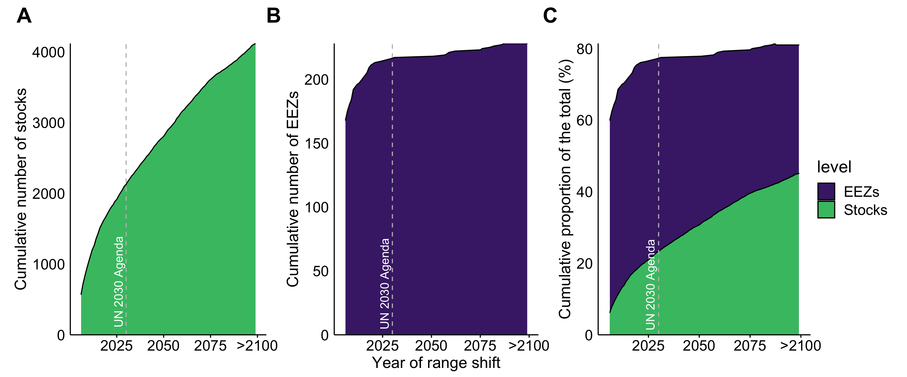

<!-- # Instructions  -->

<!-- Research articles should present a major advance and can be short or long (maximum 15,000 words) format. Submissions must include an abstract (up to 150 words), an introduction, and sections with brief informative subheadings. You may include up to ten figures and/or tables and about 60 references. Supplementary materials should be limited to information that is not essential for the general understanding of the research presented in the main text and can include data sets, figures, tables, videos, or audio files.  You may include up to a total of ten figures and/or tables (combined) throughout the supplemental text.  -->

```{r setup, eval = T, echo = F, warning = F, message = F, results = 'hide'}

library(MyFunctions)

#### Project's Library
packages <- c(
  "tidyverse" ,
  "png",
  "grid",
  "knitr",
 "kableExtra"
  # "here", # for dbem_import `here()`
  # "data.table", #dbem_import `fread()`
  # "readxl", # for reading excell files
  # "janitor", # for clearing names
  # "geosphere", # estimate distances between points `distm()`
  # "ggrepel",
  # "zoo", # for average mean
  # "parallel", # for mclapply,
  # "sf", # for mapping
  # "st", # for mapping
  # "rgdal", #Spatial analysis
  # "tools", #Spatial analysis 
  # "zeallot", # for Juanito's map
  # "gmt", # for estimating distances between points
  # "viridis"
)

my_lib(packages)

```

corresponding author: [j.palacios\@oceans.ubc.ca](mailto:j.palacios@oceans.ubc.ca){.email}

**Abstract**

<!-- An opening sentence that states the question/problem addressed by the research AND Enough background content to give context to the study AND A brief statement of primary results AND A short concluding sentence. -->

Climate change is shifting the distribution of transboundary fish stocks between neighbouring countries. The time-frame of such shifts determine the extent of climate change challenges to international fisheries governance. Using global climate-fisheries model simulations, we show that, within the next 15 years, 68% of the world’s transboundary fish stocks are projected to shift their distributions across international boundaries. By 2100, such shifts will occur in all countries under a ‘no mitigation’ scenario. Hotspots of transboundary shifts occur in countries that are highly dependent on fisheries for income and livelihood. The imminent onset of transboundary shifts highlight the urgency to re-formulate international fisheries policies to avoid disputes over fish stock.  Bi- and multi-lateral actions discussions should start now as lead-time for policy changes is long.

**One-Sentence Summary**

Rapid climate-induced shifts in transboundary fish stocks

**Main Text.**

In the past century, human activities have altered the physical and biogeochemical conditions of the ocean, resulting in warmer, more acidic and less oxygenated waters [@IPCC:2019tn]. Marine species' distributions reflect species' preferences for discrete environmental conditions [@Hutchinson:1957nt].As a result of these past changes, many marine species have shifted their distributions towards higher latitudes, deeper water or to follow local temperature gradients to remain within their optimal environmental "niche" [@Poloczanska:2016kk]. The biogeography of marine species is projected to continue to shift as ocean conditions change through the 21st century [@Cheung:2010dt], impacting fisheries production and economies [@Sumaila:2019ew], and compromising our capacity to reach international sustainability goals within the 2030 Agenda such as Sustainable Development Goal 14 - life below water [@UnitedNations2018; @Singh:2017ds; @Pecl:2017hu]. The projected risks of impacts can be reduced by improving the effectiveness of current fisheries management, including for species that cross international borders, which are known as ‘shared stocks’ [@Pinsky:2018cb].

The concept of shared stocks was developed following the ratification of the United Nations Convention on the Law of the Sea (UNCLOS) and the claiming of Exclusive Economic Zones (EEZs) by Coastal States [@UnitedNations:1986tl]. As defined by the United Nations' Food and Agriculture Organization, shared stocks can be classified into four non-exclusive categories: (*i*) transboundary stocks, which cross neighboring EEZs; (*ii*) straddling stocks that, in addition to neighboring EEZs, also visit the adjacent high seas; (*iii*) highly migratory stocks, mainly tunas and bill-fishes, that migrate across vast oceanic regions including both the high seas and EEZs; and (*iv*) discrete stocks that are only present in the high seas [@Munro:2004th]. This study focuses on transboundary stocks exploited by fisheries operating within EEZs. Countries are responsible for the management of stocks within their EEZs, under UNCLOS, and are encouraged to cooperate when stocks are shared [@UnitedNations:1986tl]. A recent study estimates that, globally, there are 633 transboundary fish species representing 67% of identified exploited taxa. These species yielded an annual average of 48 million tonnes of catch and USD 78 billion in fishing revenue between 2005 and 2010 [@PalaciosAbrantes:2020tv].

The effectiveness of fisheries management for transboundary species, and thus reaching the 2030 Agenda [@Pecl:2017hu], is challenged by shifts in stocks' distribution under climate change [@Pinsky:2018cb; @Pinsky:2014by; @Pinsky:2020jx; @Oremus:2020id]. In most cases, catch or fishing effort quotas for transboundary stocks are based on historical records and do not necessarily consider the full distribution range of the stock [@FredstonHermann:2018kp], nor the effects of climate change on fish stocks and associated fisheries [@PalaciosAbrantes:2020tv; @Sumby:2021gw]. While many transboundary stocks experience natural seasonal spatial variation (e.g., migration, reproductive cycle), misalignment between fisheries resources allocation and distributional shifts beyond such natural variation have previously resulted in unsustainable fishing levels and international disputes [@Miller:2013iv; @Spijkers:2017ij; @Crespo:2020cs]. Such patterns are expected to be exacerbated by continuing climate change [@Pinsky:2018cb; @Sumaila:2011bq]. The importance of transboundary stocks for both catch and fisheries revenue [@PalaciosAbrantes:2020tv] highlights their critical role in achieving the  Sustainable Development Goals (SDG) under the United Nations 2030 Agenda. Understanding when climate change will affect the sharing dynamics of transboundary stocks and the intensity of the resulting impacts is important for developing climate resilient international ocean governance and achieving the 2030 Agenda [@Pinsky:2018cb; @Link:2010ei; @Sumaila:2020tp].

Here, we employ a mechanistic population dynamic model driven by output from a comprehensive Earth System Model with ten ensemble members to project transboundary stocks’ distribution across the 280 EEZs of 198 coastal countries under a high greenhouse gas emissions scenario (RCP8.5; Methods). We then estimate the year in which the 663 transboundary species (9,132 stocks) are projected to shift their shared distribution beyond historical variation and the intensity of this shift (i.e., time of emergence; see Methods). We treat each species in an EEZ as a single stock due to the lack of more spatially resolved data to delineate the boundary of a population (15) and only consider shared stocks between neighboring EEZs (i.e., excluding the high seas).

**Identifying range shifts in the shared distribution of transboundary stocks**

Our results suggest that 4,119 transboundary stocks will experience a range shift beyond historical variability as early as 2006 and up to 2100 (Fig. \@ref(fig:toeFigure1)A). This corresponds to 68% of the studied stocks (Fig. \@ref(fig:toeFigure1)C).The average year of shift in the shared distribution of these stocks in all EEZs analyzed is projected to be 2036 (s.d. of all species, $\pm$ 28 years). Furthermore, 96% of the world’s EEZs will experience at least one transboundary stock shift between 2006 and 2100 with around 80% presenting a distributional shift across stocks by the time the UN 2030 Agenda is intended to be achieved (Fig. \@ref(fig:toeFigure1)C).

```{r toeFigure1, eval = T,  echo = F, fig.width = 9, fig.height=4, fig.pos= "H", fig.cap =  "Timeline of shifts in transboundary shared stock distribution. Dashed lines represent the year by which countries have committed to reach the full implementation of the 2030 Agenda, as well as a mid and late change in range shift, respectively."}

img <- readPNG("../Figures/Fig1.png")
grid.raster(img)

```

<!--  -->

The median year in which transboundary stocks experience a range shift varies significantly according to the geographic region of the neighboring EEZs (Kruskal-Wallis, $X^2$ = 242.11, DF = 93, *p* < 0.001; Figure \@ref(fig:toeFigure2)A). Overall, most tropical EEZs will see earlier shifts, with the EEZs of Latin America, the Caribbean and Polynesia being significantly earlier (*p* < 0.05; see Table S\@ref(tab:toeTableS2) for test statistics) than almost all other regions (Fig. \@ref(fig:toeFigure2)B). In contrast, EEZs located in temperate regions like northern Europe and eastern Asia are projected to experience much later range shifts (Table \@ref(tab:toeTableS2)).Stocks in countries such as Brazil and New Zealand are not projected to experience range shifts beyond natural variability (e.g., the transboundary index of a stock did not change beyond historical variability) (Fig. \@ref(fig:toeFigure2)A). On average, shifting transboundary stocks represented 23% (s.d. $\pm$ 22%) of yearly fishing revenue from fisheries targeting such stocks within global EEZs between 2004 and 2010 (Fig. \@ref(fig:toeFigure2)A). However, large variation exists, with shifting stocks representing less than 1% of fishing revenue in some countries (e.g., Ireland) and over 90% in others (e.g., Marshall Islands). Moreover, in some EEZs, while few transboundary stocks are projected to shift beyond historical variability, they still represent a large proportion of revenue derived from fisheries within that EEZ (e.g., Peru).

```{r toeFigure2, eval = T,  echo = F, fig.width  = 13,fig.pos= "H", fig.height =11, fig.cap =  "Year of change in the shared distribution of 4,119 transboundary stocks. A) Land polygon shows the contribution of shifting stocks to the country’s total fishing revenue from transboundary stocks. Exclusive Economic Zone polygons represent average range shifts within them. EEZs with no distributional shifts between 2006 and 2100 are represented in aqua color. B) Year of shared distribution shifts by region according to United Nations sub-regions. Points represent the median year of range shift. Horizontal dashed line represents the year 2030. N = North, S = South, W = West and E = East. Ltn. Ame. and the Car. = Latin America and the Caribbean. Aus and New Z. = Australia and New Zealand"}

img <- readPNG("../Figures/Fig2.png")
grid.raster(img)

```

<!-- ![toeFigure 2. Year of change in the shared distribution of 4,119 transboundary stocks. A) Land polygon shows the contribution of shifting stocks to the country’s total fishing revenue from transboundary stocks. Exclusive Economic Zone polygons represent average range shifts per EEZ. EEZs with no time of emergence between 2006 and 2100 are represented in aqua color. B) Year of shared distribution shifts by region according to United Nations sub-regions. Points represent the median year of range shift. Horizontal dashed line represents the 2030 Agenda. N = North, S = South, W = West and E = East. Ltn. Ame. and the Car. = Latin America and the Caribbean. Aus and New Z. = Australia and New Zealand](../Figures/Fig3.png) -->

We estimated the current (2005 and 2010) contribution of shifting stocks to yearly fishing revenue generated from fisheries targeting transboundary stocks within global EEZs. Within five years of the UN 2030 Agenda, 979 transboundary stocks responsible for 5.3 billion USD in fishing revenue are projected to shift within the EEZs of 76 countries (Fig. \@ref(fig:toeFigure3)); with 4.2 billion USDs accounted by 321 stocks shifting in just eleven countries (Fig. \@ref(fig:toeFigure3)). Most of the remaining countries in the top $75^{th}$ revenue percentile will see early shifts (e.g., before 2050) with the exception of Japan, Korea, Peru and Russia, who are projected to have later shifts (e.g., after 2050). In terms of the number of transboundary stocks shifting from historical variability, Spain (n = 122), France (n = 85), China and Portugal (both n = 73), and Senegal (n = 66), emerge as the top 5 countries (Fig. \@ref(fig:toeFigure3)).

```{r toeFigure3, eval = T,  echo = F, fig.width=10, fig.height=8,fig.pos= "H", fig.cap =  "Average range shift of transboundary stocks per country. Countries are coded according to different colored symbols representative of 5 distinct regions. Horizontal line separating the top 75th percentile of annual fishing revenue. Showing country names for those within the top 75th percentile projected to  have an average shift within 5 years of the 2030 Agenda."}

img <- readPNG("../Figures/Fig3.png")
grid.raster(img)

```

We based the transboundary index on a stock’s centroid defined as the average grid cells that contain the majority of a stock’s abundance (see Methods - Calculating an index of transboundary range shift). Results from the sensitivity analysis suggest that our method is robust to the abundance level (e.g., the top 95%) of the stock (Fig. \@ref(fig:toeFigureS3)). In addition, we set an arbitrary threshold of 2 s.d. (95% confidence) to determine the time of emergence of the transboundary index. Sensitivity tests to a lower threshold of 1 s.d. (for a 68% confidence) resulted in a global average shift in the shared distribution of transboundary stocks by 2029 $\pm$ 27, a difference of about 7 years (Fig. \@ref(fig:toeFigureS4)). In total, 5,745 transboundary stocks would shift their shared distributions between 2006 and 2100 considering a less conservative metric, that is, 33% (n = 1626) more shifting stocks.

**Changes in the stock share ratio of transboundary stocks**

We identified transboundary stocks that are projected to have changes in stock share ratio beyond an EEZ’s threat point by the early (2020-2040) and mid $21^{st}$ century (2040-2060), relative to the recent past (1951-2005). Findings show that by the early $21^{st}$ century, the global average catch proportion of transboundary stocks that are projected to change their stock share ratio beyond the EEZ’s threat point is 59% $\pm$ 17% (Fig. \@ref(fig:toeFigure5)A). By the early $21^{st}$, 85% (n = 239) of the world EEZs would have experienced such changes. Changes in stock share ratio are expected to increase slightly towards the mid 21st century at both the stock and EEZ level (Fig. \@ref(fig:toeFigure5)A and \@ref(fig:toeFigureS5)).

```{r toeFigure5, eval = T,  echo = F, fig.width=12, fig.height=10,fig.pos= "H", fig.cap =  "Changes in stock share ratio below each country’s threat point by 2030 (2021-2040) relative to 1951-2005. Lines represent the average change in transboundary stock share ratio with arrows going from EEZ with decreasing stock share (point) to those gaining shares (arrowhead). Land polygons represent the percentage of stocks that are projected to change their stock share ratio beyond the identified threat point with higher gains identified in warmer colors (green to yellow). Panel B zooms into specific areas shown within the grey dashed line boundaries in A."}

img <- readPNG("../Figures/Fig5.png")
grid.raster(img)

```

<!-- ![Figure 1. Changes in stock share ratio below each country’s threat point by 2030 (2021-2040) relative to 1951-2005. Lines represent the average change in transboundary stock share ratio with arrows going from EEZ with decreasing stock share (point) to those gaining shares (arrowhead). Land polygons represent the percentage of stocks that are projected to change their stock share ratio beyond the identified threat point with higher gains identified in warmer colors (green to yellow). Panel B zooms into specific areas shown within the grey dashed line boundaries in A.](../Figures/Fig1.png) -->

The direction and intensity of shafts in transboundary stocks are largely related to regional changes in biogeography and the geometry of the EEZs (Fig. \@ref(fig:toeFigure5)A). In some cases, like the Atlantic and Pacific coasts of Northern and Southern America and the Atlantic coast of Southern Africa, the stock share ratio is expected to follow a projected poleward shift. However, shifts along the coasts of Pacific Central America and West Africa  occur along an equatorial direction. Here, transboundary species follow local oceanographic processes like upwelling zones (e.g., Humboldt current) and patterns of oxygen availability, in addition to temperature gradients. Regions where EEZs are relatively small and have multiple borders (e.g., Caribbean or Northwestern Europe) are expected to have a particularly complex exchange of stock share ratio with no established pattern (Fig. \@ref(fig:toeFigure5)B).

<!-- ## Discussion -->

<!-- In this paper, we investigate the timing and intensity associated with changes in the share distribution of transboundary stocks between countries. Our findings highlight an early distributional shift from historical variations for most transboundary stocks in the world. Such early shifts point to the urgency of addressing the challenges that climate change presents for international fisheries management. Moreover, we identify regional patterns of high climate risk to important fish stocks and associated fisheries that would benefit from immediate policy responses to support sustainability into the future. Finally, we show that for many countries changes in the distribution of transboundary stocks are likely to undermine joint resource management between countries [@Bailey:2010ga; @Munro:1979dg; @PalaciosAbrantes:2020vt; @Bailey:2016eh]. Thus, our findings emphasize recent calls for the urgent adoption of adaptation measures in support of more adaptive, flexible fisheries management and governance to support resilient fisheries and durable management systems [@Pinsky:2018cb; @Pinsky:2020jx; @CisnerosMata:2019ks; @Oremus:2020id; @Free:2019jq]. -->

**High present-day climate risk of on transboundary fisheries management**

Early shifts in the shared distribution of transboundary stocks concur with previous studies that have detected and attributed changes in marine catch composition [e.g., @Cheung:2013gk; @Frainer:2017ji; @Last:2011fd]. For example, in the early 2000s, Humboldt squid (*Dosidicus gigas*) substantially expanded its geographic range poleward, reaching the coast of Washington state (US) as a response to climatic, oceanographic and ecological changes [@Zeidberg:2007gs]. A new fishery targeting Humboldt squid quickly developed on the heels of the species’ range expansion [@Pinsky:2014by]. In the northeast Atlantic, the Atlantic mackerel (*Scomber scombrus*) fisheries are multi-laterally managed by the EU, Norway, Iceland, Russia, and Denmark (on behalf of the Faroe Islands and Greenland) through the North-East Atlantic Fisheries Commission (NEAFC). However, a range expansion of Atlantic mackerel into Icelandic waters in 2007 resulted in Iceland capturing 6% of the fishery’s total allowable catch and a further 18% in 2008, without consultation with NEAFC, threatening the sustainability of the stock [@Spijkers:2017ij]. These changes resulted in disputes between Iceland and the Faroe Islands, as well as among NEAFC member states [@Spijkers:2017ij]. As transboundary stocks continue to shift, international disputes like that of Atlantic mackerel are likely to increase in frequency requiring a revision of management plans [@Pinsky:2018cb; @Engler:2020bg].

**Hotspot of climate risk on transboundary fisheries management**

Our results underscore regional "hotspots" of climate risk for transboundary fisheries management that will require the prompt adaptation of management plans (Figures \@ref(fig:toeFigure2)A and \@ref(fig:toeFigure5)A). Such regions, like the Caribbean, are characterized by high levels of warming relative to natural internal variability [@IPCC:2019tn; @Hawkins:2012hc] and high vulnerability of species to warming waters [@IPCC:2019tn]. Moreover, they represent relatively small EEZs that border multiple countries (e.g., the Caribbean). Game theory predicts that the greater the number of negotiating parties, the harder it is for parties to reach an agreement [@Gronbaek:2020ei], thus, making it particularly challenging for countries in these regions to coordinate the management of shifting transboundary stocks. 

Management plans that are not prepared to respond to range and abundance shifts will be less resilient to climate change [@Miller:2013iv; @Sumaila:2020tp]. Thus, focusing on these “hotspots'' is key to anticipate a potential increase in fisheries conflicts in the coming years. Identified strategies to cope with changes in the shared proportion of transboundary stocks include strengthening of current cooperative mechanisms and the consideration of side payments [@Tunca:2019if], increased international cooperation [@Miller:2013iv] and management rules that capture distributional shifts [@Pinsky:2018cb]. For example, countries that are Party to the Nauru Agreement (PNA) manage their fisheries under a  Vessel Day Scheme. Because this scheme takes into account shifts in stocks and catches, it is a good example of a management system that is somewhat anticipatory [@Aqorau:2018bh]. However, even strategies that take into consideration  species’ shift within the PNA area will likely also have to deal with the ‘newcomer issue’ that NEAFC is currently facing regarding Atlantic mackerel [@Spijkers:2017ij; @Pinsky:2018cb]. Quota allocation methods based on a stock’s current distribution and/or on fixed-historical proportion need to evolve to be more agile [@Sumaila:2020tp; @PalaciosAbrantes:2020vt]. Fisheries based on historic participation could move towards a dynamic method or a combination of both  [@PalaciosAbrantes:2020vt; @Sumaila:2020tp]. However, the transition from historic to dynamic allocations can find strong resistance from stakeholders “losing” benefits from the fishery. Side payments are mechanisms that can provide a solution to the inequality produced by shifts in a stock’s distribution [@Tunca:2019if]. These can, but do not have to, be monetary (e.g., the stock-“winning” state compensates the stock-“losing” state for the proportional shift, a conservation fund paid mainly by one Party) [@Miller:2013iv]. 

**Potential drivers of shift and associated uncertainties**

The early projected range shifts of a large number of transboundary stocks can be partially attributed to the parallel global emergence of several ocean variables from historical variability (e.g., SST which is projected to increase historical variability by 2030 in 70% of the global ocean under RCP 8.5 [@Rodgers:2015jq; @Frolicher:2016dg; @Mahlstein:2011fy]. Results from multiple marine ecosystem models show that SST and NPP are the main drivers of changes in species distributions across oceanic basins [@BryndumBuchholz:2019kh; @Lotze:2019ce]. Specifically for the DBEM, SST is the main environmental driver of biomass changes in polar, tropical and upwelling ecosystems while NPP drives temperate regions’ results. The combination of the SST emergence pattern and model characteristics could be partially responsible for the early distributional shift of transboundary stocks in the tropics where marine species live close to their thermal tolerance, making them highly vulnerable to warming waters [@IPCC:2019tn], while also explaining the later, and sometimes non-existent, shift at higher latitudes (Fig. \@ref(fig:toeFigure2)B).

Different levels of uncertainty exist in the projected emergence of environmental variables mainly related to *i*) climate change scenarios and  *ii*) model structure [@Frolicher:2016dg]. First, our analysis is based on a high emission scenario (RCP 8.5) representing an extreme case of shifts in the shared distribution of transboundary species. Thus, any climate change mitigation pathway (e.g., RCP 2.6) could result in a substantial delay in distribution shifts as environmental signals are sensitive to mitigation, at least after the middle of the $21^{st}$ century [@Frolicher:2016dg]. Second, a substantial source of uncertainty is related to model selection for both climate change and fisheries distribution. This is specifically important for early time periods (e.g., 2016-2035) where the uncertainty related to model selection, including the parameterization of poorly understood processes that regulate NPP changes, is larger than the uncertainty stemming from the climate change scenario [@Frolicher:2016dg]. While such uncertainty could potentially be reduced by incorporating ensemble simulations from a range of different ESMs, these are computationally expensive simulations [@Frolicher:2009ge; @Frolicher:2016dg; @Rodgers:2015jq] that are only just becoming available [@Deser:2020bj] and cannot address limitations of process level understanding. As a consequence, transboundary fisheries managers are facing changes in stocks’ shared distributions embedded in complex uncertainties, and will likely continue to do so in the coming decade. This is critical for the tropics, where the shared distribution of transboundary stocks is expected to shift the earliest, the response of the base of the food web to climate change is most uncertain [@Tagliabue:2020hd; @Kwiatkowski:2020cf] and where internal variability (e.g., El Niño Southern Oscillation - ENSO- for Pacific nations) is also important . These uncertainties also affect the projection of species distributions [@Lotze:2019ce; @BryndumBuchholz:2019kh]. Overall, changes in fish biomass with multiple upper trophic level models, including the DBEM, show overall agreement across models in terms of direction of change, but variability in the magnitude of that change [@BryndumBuchholz:2019kh]. Further research that reduces uncertainty in the response of the base of ocean food webs, alongside large ensemble simulations of multiple species distribution models could lead to a larger structural uncertainty of fish and fisheries models [@Lotze:2019ce]. Another important source of uncertainty in this study is the utilization of political boundaries (EEZ) to define stocks. While this method might define some stocks that do not necessarily align with biologically-defined sub-populations within an EEZ, in many EEZs, fisheries are often managed at the species level [@MAP:2017uf] and sub-populations are potentially interconnected [@Ramesh:2019va], thus, providing additional ecological ground for our analysis [@Dunn:2019ca]. Reproducing our analysis regionally, where spatially explicit stock data is available would allow to generate better constrained results in changes in both time of emergence and stock share ratio of transboundary stocks, and potentially identity different types of shared stock shifts at meta-population level [@Link:2010ei; @Archambault:2016ie]. Addressing these uncertainties systematically can serve as a roadmap for future studies to provide additional information to inform policy towards sustainable and equitable international fisheries management under climate change.

**Conclusion**

Th global community has set the ambitious goal of managing all fisheries sustainably (SDG 14 – Life below water) by 2030; achieving this goal would have clear benefits for a number of other societal goals [@UnitedNations2018; @Singh:2017ds]. Preparing anticipatory policies to deal with shifting transboundary stocks is key to achieving the SDGs and ensuring effective governance of the world’s fisheries [@Pinsky:2018cb; @Oremus:2020id; @Pecl:2017hu]. In this contribution, we implemented two steps to demonstrate how to achieve sustainable transboundary fisheries in a changing world [@Link:2010ei]. First, we identified the transboundary stocks that would likely see shifts in their shared distribution compared to their historical average and the year in which such shifts are predicted to occur. Second, we estimated the intensity of such change. Our results have direct implications for ocean governance as the data provided can inform regional management bodies and member countries to anticipate the likely climate-driven challenges to transboundary fisheries management. While future studies, specifically at more localized scale, will provide valuable nuance in designing effective policies, our results provide an important baseline on which to build when preparing ocean governance for shifting transboundary stocks [@Pinsky:2018cb; @PalaciosAbrantes:2020tv]. Our findings emphasize recent calls for the urgent adoption of measures in support of more adaptive, flexible fisheries management and governance to support resilient fisheries and durable management systems [@Pinsky:2018cb; @Pinsky:2020jx; @Oremus:2020id].

<!-- ## Supplements -->

<!-- Set Figure, table and equations numbering according to the chapter -->
\renewcommand{\thefigure}{S.\arabic{figure}}
\setcounter{figure}{0}
\renewcommand{\thetable}{S.\arabic{table}}
\setcounter{table}{0}


```{r supplements, child = '../Scripts/Supplements.Rmd', eval = T}

```

