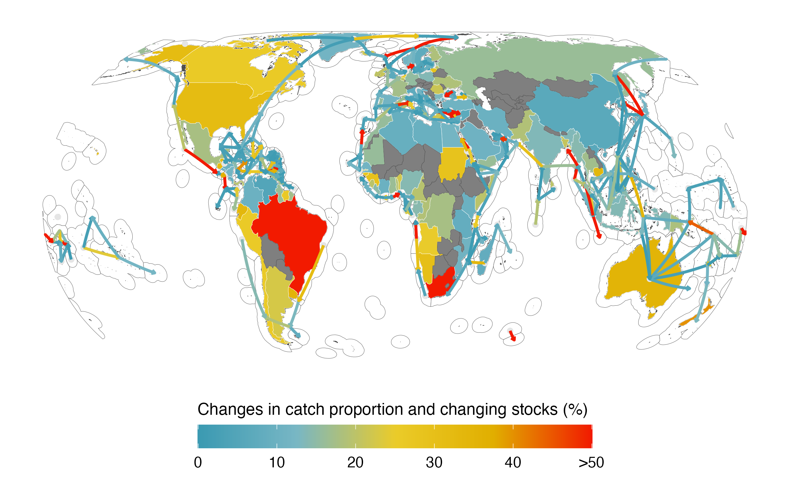

# Editor

Overall, the two reviewers agree that this work tackles an important, but collectively have raised a considerable number of points that will need to be addressed. Of most concern, is that it is not currently clear how this current MS differs from other recent papers that have established methods used on this paper and implications of climate change in the context of transboundary fisheries - including the authors' one works (Sumaila et al. 2020 Ecology and Society, Palacios-Abrantes et al. 2020 Ecology and Society, Pinsky et al. 2018 Science, and Palacios-Abrantes et al. 2020 Scientific Reports). It is important that GCB papers deliver the step change in knowledge that has not been realised elsewhere; therefore' we ask the authors to ensure the paper wholly demonstrates and articulates the transformation achieved in order to progress with the submission.

- **Response: PLEASE PAY SPECIAL ATTENTION TO THIS POINT. LOOKS LIKE WE REALLY NEED TO CONVINCE THE EDITOR OUR RESEARCH IS NOVEL** Below you will find the response to both Reviewers 1 and 2. In addition, we would like to offer here an explanation of how our paper differs from recent published papers, including those authored by some of us.

  In their 2018 paper, Pinsky *et al.* look at how many *new* transboundary species each EEZ of the world will have towards the end of the century under climate change (i.e., national stocks that become transboundary stocks). Indeed, the authors find that “many of the world’s EEZs are likely to receive one to 12 new, climate-driven transboundary stocks by the end of the century.” On the other hand, Oremus *et al.* (2020) “estimates the number of species *exiting* national jurisdictions under climate change up to 2100” concluding that tropical nations stand to lose the most species under these scenarios. However, both studies fail to identify changes in *current* transboundary stocks including the intensity of such shift, gap that we look to fill in this paper. Here, we build from Palacios-Abrantes *et al.* (2020) and use the transboundary species (n = 633) identified in such paper. This means that, unlike Pinsky *et al.* (2018) and Oremus *et al.* (2020) who look at national stocks shifting towards new or away from EEZs, our paper focuses on transboundary stocks shifting within EEZs. Moreover, as far as we are concerned no other study, including the research done by us, identifies the actual timeline of shifts in shared stocks, nor the intensity of such shifts.

  To identify the timeline we adopt the concept of *Time of Emergence* commonly used in oceanic physical and chemical studies (See Rodgers *et al.* 2015, Keller *et al.* 2014 and has just recently been used in ecological studies by Cheung *et al.* 2020 looking at ecological responses to marine heatwaves. As far as we are concerned, no other study has adopted this methodology to look at the timing of shifts in transboundary fisheries. On the other hand, to identify the intensity of the shift, we (partially) used methods developed by Palacios *et al.* and Sumaila *et al* (2020), published in *Ecology and society*. These papers adopt the concept of threat point to evaluate the resilience of specific treaties celebrated by Canada-US transboundary to manage four transboundary stocks. Here, we take this idea of threat point and expand the analysis globally to estimate the intensity that the shifts in transboundary stocks will have. 

  In short, our manuscript builds upon Palacios-Abrantes *et al.* 2020 *Scientific Reports* combining methods developed in Sumaila *et al.* 2020 and Palacios-Abrantes *et al.* 2020 *Ecology and Society* to address a question that neither Pinsky *et al.* 2018 *Science* nor Oremus *et al.* (2020) *Nature Sust.* addressed. We hope to have clarified the novelty of our research and how it differs from previous studies. The new information that we present here can be critical for fisheries management to adapt to shifts in the distribution of transboundary stocks under climate change as highlighted by both reviewers.

# Reviewer 1

Comments to the Author
In this work, the authors analyze potential shifts in harvested marine species under climate change, in relation to their distribution across neighboring exclusive economic zones. They find that many countries will experience shifting species, and investigate how the number and intensity of transboundary shifts will vary by species type. Overall, I find the authors take an interesting approach to the analysis of transboundary fish populations under climate change, and the Discussion of potential management implications is strong, in my opinion. However, I think the manuscript needs some significant clarifications and edits before it can be published. In the space below, I outline my major comments, followed by more specific and/or minor comments, accompanied by line numbers from the draft pdf.

- **Response:** We are glad that the reviewer found our manuscript to be interesting. We have revised the manuscript paying special attention to clarifying the parts the reviewer flagged. We thank the reviewer for his/her comments as they have strengthened our paper. Please find below direct responses to the reviewer's comments. 

## Major comments:
I am concerned about the lack of a clear definition of “fish stock” in this manuscript, since it is absolutely central to the analysis. I cannot find where in the manuscript the definition of stocks is laid out. In most literature (and especially in fisheries science), stocks have a specific (if flexible) definition as populations of a species with some degree of demographic isolation from other stocks, such that the population dynamics of separate stocks may be considered independent. In this manuscript, it seems that instead, a transboundary stock is simply defined as any pair of EEZs that share a species distribution. I would recommend that the authors define the precise definition of fish stock explicitly within the manuscript, including how their definition is different from the definition in other, related literature.

- **Response:** Thank you for this comment. We acknowledge that we did not clearly define our concept of stock in the previous version of the manuscript. The definition of stock has now been included in the revised manuscript in both the introduction and the methods as follows;

  - Introduction Line XX, *We define a ‘stock’ unit as a species shared by neighboring EEZs.*

  - Methods Line XX, *We define a (transboundary) "stock" unit when a species was shared by a pair of neighboring EEZs [@PalaciosAbrantes:2020tv; @Teh:2015gd], resulting in a total of 9,132 transboundary stocks*

I have a number of questions and concerns about this approach to stock definition, including: how are neighboring stocks of the same species considered? If, for example, a species’ distribution exists within British Columbia, the United States, and Mexico, is this considered one stock for the purpose of the analyses in the paper (e.g. TI, ToE, SSR), or is this two stocks (one between Canada and the US and one between the US and Mexico)? How does the choice of stock definition influence the calculation of SSR? Given the same sample as above, can the US lose SSR of one stock of a species to Canada, while gaining SSR of the same species from Mexico?

- **Response:** Please see below direct responses to each sub-part of the question.

  How are neighboring stocks of the same species considered? If, for example, a species’ distribution exists within British Columbia, the United States, and Mexico, is this considered one stock for the purpose of the analyses in the paper (e.g. TI, ToE, SSR), or is this two stocks (one between Canada and the US and one between the US and Mexico)?

- **Response:** We acknowledged that this was not fully clear in the previous version of the manuscript and have work towards improving clarity in the revise manuscript. For example, pacific sardine is a species present along the coast of Mexico, the United States (US) and, sometimes, British Columbia (BC) [@cisneros-montemayor_ecosystem-based_2020]. For the purpose of our study, we define two stocks: One that is shared by Mexico and the US and one shared by the US and BC. We have made this explicit in the following section of the methods, hopefully clarifying our definition;

  - Methods Line XX, *Let us consider the transboundary species Atlantic cod (Gadus morhua) as an example. Atlantic cod's distribution in the Northwest Atlantic ranges from the United States to Greenland. Based on the previous definition of a transboundary stock, the United States and Canada share a stock of Atlantic cod, and Canada and Greenland share a separate stock of Atlantic cod, but the United States and Greenland do not share a stock as they do not have juxtaposing EEZs.*
    
    How does the choice of stock definition influence the calculation of SSR? Given the same sample as above, can the US lose SSR of one stock of a species to Canada, while gaining SSR of the same species from Mexico?
    
- **Response:** Our definition will influence the calculation of SSR *between* neighboring EEZs (i.e., Mexico and the US SSR for sardine and US and BC SSR for sardine, independently one of another). As the reviewer suggests, in this scenario Mexico could be loosing sardine SSR to the US contiguous states (this can also be seen as the US gaining SSR from Mexico), while the US contiguous states looses sardine SSR to BC (again, this could also be seen as Canada winning SSR from the US contiguous states). This effect is appreciable in the average SSR gains of Figure 5 where Mexico losses to the US contiguous states, who in turn looses to BC, who actually gains from both US continuous states and Alaska. This is now explained on the methods as follows **NOT SURE WE NEED THIS**;

    - Line XX, *While this means that a shift in the stocks could happened from the US to Canada and from Canada to Greenland, such shift could not (analytically) go directly from the US to Greenland*

  How does the choice of stock definition influence the calculation of SSR?
    
- **Response:** The definition of "stock" will likely influence the results as it is a fundamental part of the analysis. Replicating this analysis at the species level will undoubtedly result in multiple countries sharing each species. For example, in the case of Atlantic Cod, this would be shared by US, Canada and Greenland (and maybe even northern Europe). Choosing this approach invariably comes with the assumption that fishing Cod in, e.g., the Gulf of Maine, will have direct impact on e.g., Greenland fisheries. While this might be true for some few highly migratory species (e.g., tunas) we believe is a stretch for all other species in this analysis. 
  
  However, even when a stock of non highly-migratory species does span along the coast of more than two countries, our results seem to be similar (this relates to the part regarding Mexico US and Canada). For example, Pacific halibut (*Hippoglossus stenolepis*) is considered to be one single stock that extends along the Pacific coast of the US contiguous states, Canada, and Alaska [@iphc_iphc_2016_report_2016]. Palacios-Abrantes *et al.* (2020) analyzed the shift in SSR between the three parties and found that the US contiguous states will likely loose SSR to Canada while Canada will loose to Alaska. A similar patter shown in the present study.
  
    Ideally, one could define a stock as a biologically-defined population. This could be the case of Peruvian anchoveta *(Engraulis ringens)* off the coast of Chile and Peru. There are two identified stocks of anchoveta; one in the central/norther part of the Peruvian EEZ and one in the south, shared with Chile. This differentiation will likely impact both the ToE and SSR results. However, as far as we are concern, such analysis is challenged by a lack of stock-level data around the world. 

The above are just example situations. I do not mean to be nitpicky about definitions, but I am concerned that the definition of stocks used in this manuscript fundamentally determine the top-line results (e.g., number and proportion of shifting stocks, calculation of the transboundary index and time of emergence, loss or gain of SSR, etc. etc.).

  - **Response:** We understand the reviewer's concern and hope that our responses have clarified this issue. However, it is almost certain that our definition of stock is influencing the results of our paper, just by that nature of the analysis. While a more fine scale definition (e.g., biologically-defined populations of stock will probably arose other results, not limiting the species to, at least, an EEZ could result in an overestimation of our results (See Ovando *et al.* https://www.pnas.org/content/118/23/e2025958118). This is a main caveat of our study and have made an effort to be very clear and upfront about it in line XX of the revised manuscript:
  
  - - **Another important source of uncertainty in this study is the utilization of political boundaries (EEZ) to define stocks, rather than biologically-defined populations. While this method might define some stocks that do not necessarily align with biologically-defined sub-populations within an EEZ, in many EEZs, fisheries are often managed at the species level [@MAP:2017uf] and sub-populations are potentially interconnected [@Ramesh:2019va], thus, providing additional ecological ground for our analysis [@Dunn:2019ca]. Moreover, not limiting the species to, at least, an EEZ could result in an overestimation of our results (**NOTE:** See Ovando *et al.* https://www.pnas.org/content/118/23/e2025958118).**
  
Further, I am concerned about the averaging and weighting of species that is done across species in this analysis. As one example, why is the geographic centroid (used in the calculation of TI) not weighted by probability of occurrence? Fish stocks are not evenly distributed across their entire range, and un-weighted centroids can severely skew the actual distribution of the species. 

- **Response:** We agree with the reviewer that an un-weighted centroid can severely skew the actual distribution of the species and influence our results. We have revised the manuscript to clarify that we did account for the heterogeneous distribution of fish stocks across their entire range. Specifically, the geographic centroid of each stock is indeed weighted by the abundance of the stock. The DBEM uses the species probability of occurrence to estimate the biomass of the species at each 0.5 x 0.5 gridcell as indicated from lines XX to XX of the methods. The centroid of a transboundary stock was determined by the average latitude and longitude ($lon_{ts}$) of the grid cells holding the specified percentile ($per^{th}$) of the projected transboundary stock abundance (see below). This is, we determined the centroid of the stock using only those regions where abundance was higher (i.e., using the probability of occurrence of the DBEM). Moreover, we estimated the sensitivity of our results to the (arbitrarily) $per^{th} = 95^{th}$ percentile threshold as described in lines XX and shown in Figure S6 of the supplements. It reads as follows in line XX:

  - Line XX, *Fish stocks are not evenly distributed across their entire range, thus we focus on areas where transboundary stocks are more abundant and fishing activities are more likely to take place. Thus, we estimated the centroid of a stock only including grid cells where the projected stock abundance within the neighboring EEZs sharing the stock was above the $95^{th}$ percentile.*

Weighting comes up again in the analyses that result in Figures 3, 4, and 5. Having one major, valuable species shift rapidly is a much bigger concern for many countries than having many small or low-value stocks shift slowly. These sorts of dynamics, while interesting, are difficult if not impossible to parse from the current Figures. For example, would the arrows look different in Figure 5 if the averages were weighted by each fish stock’s value?

- **Response:** This is a very good observation and we believe it has increased the impact of our manuscript. We have included two new figures (**Figure 4** and **Figure SXX**) showing the average range shift of the top 5 most valuable transboundary stocks per country (Please note that the old figure 4 has been removed from the revised manuscript, see response to the Fig. 4 comment, below).

  - Range shift, line XX: *Having high-valuable stocks shifting sooner could be a much bigger concern than having many low-value stocks shifting. On average, countries will see a range shift of the top 5 most valuable stocks by 2038 $\pm$ 16 years (Figure SXX). Moreover, our projections suggest that these high value stocks are already shifting in 66% of coastal nations, with the regions of Polynesia (n = 22), Sub-Saharan Africa (n = 36) and Latin America and the Caribbean (n = 62) presenting the larger number of shifting stocks (20% of total high value stocks).*

## Specific comments:

### Abstract:
Line 10: what does this line mean: “showing early, and sometimes past shifts”?

- **Response:** We have modify this sentence to now read:

  - Abstract Line XX; *Many countries that are highly dependent on fisheries for income, food and nutrition security, as well as livelihoods emerge as hotspots for transboundary shifts. These hotspots are characterized for showing early shifts in the distribution of important transboundary stocks.*

### Introduction:
Be careful of verb tense. The Introduction mixes past with present tense. For example, the first two sentences starting at Line 57.

- **Response: (INCOMPLETE)** Many thanks for this observation. We have revised the whole manuscript to be sure verb tense is maintained through the document. 
### Methods:

Line 78-79: Is this the definition of a stock? What if a species spans more than two EEZs? What if it is a straddling stock? Please be more explicit about what kinds of stocks are included (and not) in your analysis.

- **Response:** This is indeed the definition of our stock. We do not differentiate between transboundary, straddling nor highly-migratory stocks as per defined in Palacios-Abanes *et al.* (2020). Please refer to our responses to the main comment. Moreover, all of the catch and value data used represent fishing activities within countries’ EEZs.

Line 79: where is “this study's definition of a transboundary stock?”

- **Response:** The definition is now clearly stated in the revised manuscript as follows;

  - Methods Line XX, *We define a (transboundary) "stock" unit when a species was shared by a pair of neighboring EEZs [@PalaciosAbrantes:2020tv; @Teh:2015gd], resulting in a total of 9,132 transboundary stocks*

Lines 220-226: How does the threat point analysis align with my concerns about the definition of stocks described above? Can an EEZ both lose and gain SSR that exceeds a threshold, but of the same species? If so, this seems misleading.

- **Response:** Thank you for your concern. In short the answer is yes, an EEZ *could* both lose and gain SSR of the same *species* but not of the same *stock.* This is because, according to our definition of stock, a species who spans multiple EEZs has multiple stocks (see response to the previous question and the main comment). Please refer above to our response to the question *How does the choice of stock definition influence the calculation of SSR?*

### Results:

Lines 244 and 246- check your math here. The percentages seem off. For example, if 4119 stock is 45% of the total, how is 5745 stocks 33% more stocks? If, as stated in the Methods, there are 9132 stocks, then 5745 is ~63% (not 67%) of all stocks, and it is <20% more than 4119 stocks. Please check these numbers and clarify

- **Response:** Thank you for pointing this out. In the original manuscript we were showing the percentage difference between the two numbers (i.e., $x = \frac{|45-63|}{|\frac{45+63}{2}|}*100$), hence the 33.3% difference. However, now we realize this can be misleading and have adopted a more straightforward computation that aligns with the reviewer's math. We also corrected the 63% typo (not 67%). It now reads:

  - Line XX; *Using a less conservative threshold (i.e., one s.d. representing a probability of 67% that the stock has shifted) results in 18% (n = 5,745) more shifting stocks, that is, 63% of all studied stocks*

Fig. 3 - While I like the idea of Figure 3, I feel that there is too much conveyed in this figure. It is confusing to have two different scales (for land polygons and EEZs, respectively) on the same color ramp, even though they show completely different things. Moreover, see my comments on averaging above. Why is average year used for coloring EEZs, but median year used in Fig 3B?

- **Response:** Thank you for your comments on our figure 3 and see below the responses to each point you make. 

  While I like the idea of Figure 3, I feel that there is too much conveyed in this figure. It is confusing to have two different scales (for land polygons and EEZs, respectively) on the same color ramp, even though they show completely different things.

  - **Response:** We understand the reviewer’s concern with the complexity of our figure. However, after some tryouts, we concluded that having different color scales does not make it any less complex. Thus, We have made an extra effort to describe it as clearly as possible in the figure legend (see below). In addition, we have split up the land and polygons into two maps and include them in the supplemental figures (See supplement FX).

Moreover, see my comments on averaging above. 

- **Response:** Please see our response to the comment above.

  Why is average year used for coloring EEZs, but median year used in Fig 3B?

- **Response:** In the case of Fig.3B we used the median because this figure talks directly to the statistical non-parametric analysis (Kruskal-Wallis) looking at differences in the time of emergence by geographic region . **NOTE: Shall we change Fig.3A to show the median instead of the mean, for the sake of consistency or the inverse? (and make the reviewer happy)?**

Year of range shift- is this the median emergence year for all stocks that experience a shift? A shift beyond the threat point? Does it include stocks that are transboundary but don’t shift? Please clarify how this median is calculated.

- **Response:** Yes, this refers to the median emergence year for all shifting stocks in each region. This is now included in the figure legend. 

  - Fig. 3 legend, - *Year of change in the shared distribution of 4,119 transboundary stocks. A) Land polygons show the contribution of shifting stocks to a country or territory's total fishing revenue from transboundary stocks. Exclusive Economic Zone polygons display average year of range shifts within them (Note that the year scale goes from end of the century to recently). Warm colors are indicative of an early shift and high fishing revenue contribution from transboundary stocks while cold colors represent a later shift and low fishing revenue. EEZs with no distributional shift between 2006 and 2100 are represented in pale blue. See Figure SXX for a detached version. B) Year of shared distribution shifts by UN sub-regions. Points color coded by the median year for all shifting stocks in the region reflecting the Kruskal-Wallis test. Horizontal dashed line represents the year by which countries have committed to reach full implementation of the 2030 Agenda. N = North, S = South, W = West and E = East. Ltn. Ame. and the Car. = Latin America and the Caribbean. Aus and New Z. = Australia and New Zealand.*

Lines 261-266: I think this is an interesting result, and is lost in the averaging of the range shifts. It would be interesting to see a figure or Table with some of the biggest “winners and losers” in terms of high-value species that are shifting out of or into particular EEZs. Or, could there be a figure displaying the 10-20 biggest/highest-value stocks that are expected to shift? Which countries are expected to lose/gain these species?

- **Response:** We agree with the reviewer that showing the biggest “winners and losers” in terms of high-value species would be interesting. Thus, we have included a new figure and text in this section showing the year of range shift of the 5 most valuable stocks per country (see response to main comments). 

Fig. 4- This figure is a bit messy, and seems to be relating two dubiously-related statistics (that is, the projected average year of range shift with the current value of transboundary fisheries) by world region. I am just not sure what the main message of this figure is. If the point is to show the value of species that may shift over time, I would suggest a time series (by country and/or region), simply showing the total (present) value of transboundary stocks over time.

- **Response:NOTE THINKING ON CHANGING FIGURES** Our original intention was to show the importance in terms of value, of shifting stocks. However, we agree that this figure is confusing and it's message was ambiguous. Moreover, we think that the reviewer's suggestion of the most valuable species brings home a more important message and have decided to remove this figure from the revised manuscript and include the "top 5 most valuable stocks" figure instead. 

Fig. 5- this figure is hard to read, and is another figure that may be misleading if not weighted by abundance or value. It is strange to “average” across a unitless ratio (SSR). For example, a country could “gain” a small share of an extremely high-value species, perhaps enough to offset economically a number of losses of smaller or less valuable stocks. However, in the figure, the “average” SSR for that country would be negative (arrow going out). The authors should distinguish (in the text and in this figure) different possible situations like this.

- **Response:**  Thank you for your comment. See below responses to both parts of the question. 

Fig. 5- this figure is hard to read, 

- **Response:** We agree with the reviewer that this figure is quite busy and have divided the figure in two. Figure 5 is now just panel A while the regional zooms were sent to the supplemental material. We believe that the arrows are now easier to appreciate. 

and is another figure that may be misleading if not weighted by abundance or value. It is strange to “average” across a unitless ratio (SSR). 

- **Response:** We would like to clarify here that that the Stock Share Ratio (SSR) is not unit less. It represents the percentage of the shared distribution of a stock that each EEZ has. So for example, Canada and the US share Pacific halibut the SSR for Canada is 20% and that of the US is 80%, meaning that Canada holds 20% of the distribution of the stock within its waters and the US the other 80%. We have modified the methods to make sure this is clearer now:

  - *This way, if, Canada and the US share a specific stock the SSR for Canada could be 20% and that of the US 80%, meaning that Canada holds 20% of the distribution of the stock within its waters and the US the other 80%.*

For example, a country could “gain” a small share of an extremely high-value species, perhaps enough to offset economically a number of losses of smaller or less valuable stocks. However, in the figure, the “average” SSR for that country would be negative (arrow going out). The authors should distinguish (in the text and in this figure) different possible situations like this.

- **Response:** Yes, we agree with the reviewer and just like for Fig. 3, believe including a figure of high-value stocks will increased the impact of our manuscript. We have included such figure in the supplements and the following text in the results section:

- line XX: *Shifts in the SSR of the top 5 most valuable transboundary stocks of each country are projected to be 65 $\pm$ 21% by 2030 and 78 $\pm$ 18% by 2050 in 77% of the world's EEZs (Figure SX). In some cases, the SSR of one EEZ is projected to increase more than double relative to their neighbors (e.g., from 10% to 30% SSR). Some of these EEZs include Guatemala gaining from Mexico in the Pacific, Mozambique from Madagascar, and Russia from Norway and Japan in the Barents Sea*

Can you determine from your analyses where the biggest positive or negative changes might be in stock distributions, by nation/EEZ? In other words, are there nations with a greater number of stocks entering than exiting, and if so, where are they? This would be an interesting addition to the manuscript

- **Response:** We show that result in Figure 5 in the land polygon as the percentage of stocks that are changing but realize we did not include an in-text description of the result. It now reads on line XX: 

  - *Most EEZs are expected to see a relatively small number of stocks shifting their SSR (Fig. \@ref(fig:toeFigure4)A). On average, EEZs are expected to see changes in SSR on 16% $\pm$ 10 of transboundary stocks increasing to 20% $\pm$ 11 by mid of the $21^{st}$ century. However, this result masks large variation in changes across EEZs. By early century, the EEZs of French Guiana (54%), South Africa (59%), Falkland Island (61%), Brazil (75%) and Kerguelen Island, and Pitcairn (both 100%) are projected to see changes in SSR of over 50% in their transboundary stocks. On the other hand, some island territories such as Anguilla are projected to see changes in as low as 2% of their transboundary stocks.*

### Discussion 

The Discussion is well-organized and lays out the major implications of the work. I particularly commend the authors on their discussion of specific fisheries and cases where the transboundary issue is already a concern, as well as the description of examples of management approaches to deal with transboundary species. I do not have any major comments.

- **Response:** Many thanks for your kind words. 

# Reviewer 2

This MS estimates both the extent and expected timing of range shifts of transboundary species due to climate change. Overall, the MS is well-written and methods are clearly explained (except Fig. 1 could be slightly modified- see comments below). The authors provided good examples and appropriately place their results into both a global sustainability framework as well as detail the potential application in regional management. From my perspective, this is a great contribution to the field of adaptation planning, and my comments below are to strengthen the connection to adaptation planning.

- **Response:** Thank you so much for taking the time to revise our manuscript and for your words of encouragement. 

## Comments:

Line 12. Typo: considere>consider

- **Response:** Changed in the revised manuscript, thank you.

Line 22: After reading the paper—it’s clear that results are also relevant to the SDG 17: https://sdgs.un.org/goals/goal17

- **Response:** We agree with the reviewer and have included the SDG 17 in the instrucution and discussion of the paper.

For example: Your results are the type of evidence that would be used by nations to develop adaptation plans, in hotspots, . See 17.16 Enhance the global partnership for sustainable development, complemented by multi-stakeholder partnerships that mobilize and share knowledge, expertise, technology and financial resources, to support the achievement of the sustainable development goals in all countries, in particular developing countries

- **Response: (NOTE: Help from COLETE here)** We have included the following in the discussion as a response to this comment:

  -- Line xx **The SDG target 17.16 (Enhance the global partnership for sustainable development) calls for collaborations between stakeholders to support the achievement of the SDGs in all countries, in particular developing countries [@SDGREF]. Such collaborations will be critical if we are to sustainably manage transboundary fisheries under climate change [@Pinsky:2018cb; @Oremus:2020id].** 

Line 60: I suggest re-naming this Transboundary Shift and Emergence Index or Transboundary Shift Index. Something a little more descriptive. TI is so vague.

- **Response:** Thank you for this comment. We have now changed the term to *Transboundary Shift Index (TSI)*

Fig. 1: This is a wonderful schematic, my concerns: 1) stocks that do not occur as ovals but occur in patches or blobs instead-- the centroid may be too crude to detect movement of non-centric distributions- I don;t think your approach should change but re-cast as a proof of concept, researchers interested in applying the technique would be able to apply it at a regional level, and perhaps adapt it to patch distributions (separate centroids).

- **Response: (NOTE: Is the reviewer referring to multiple stocks within an EEZ??)** We agree with the reviewer that the distribution of fish stocks in the ocean is not necessarily oval. In fact, the distribution of some of our stocks does not follow this pattern. Nevertheless, we believe our method responds well to other patterns (as long as they are considered one single stock unit) since the centroid of the stock's distribution is based on the "high biomass-level" grid cells. We have included a clarification regarding the stocks distribution in the figure legend of the revised manuscript. 

  - - *Hypothetical distribution range and shape of a shared stock.*

2) I don;t know what the empty red circle means in bottom panel, I can’t find it. do you mean the white area since the red dot?

- **Response:** Red circles represent the years the TI is larger than the historical variation. They are all located in the graph along the black line. 

3) what is diff btwn distributional and geographic centroid? (suggest using one term or other).

- **Response:** The distributional centroid represents the stocks centroid while "geographical" centroid is the EEZs centroid. We notice that this could be confusing and have changed the second term as suggested by the reviewer, it is now called simply "EEZ centroid".
 
4) WHat if EEZ Ca moves at the same rate in the same direction as EEZ Cb. Is the TI only useful if one (more northerly) stock is static? What about adding and index of each Ca and EEZb distance to border? Given how great this MS is, I imagine a lot of thought went through what constitutes a “shift”, so If I have misunderstood index. OH! Now I think I get it, after reading equations 5 and 6, is it possible to include more details in Fig 1?

- **Response:** Ca and Cb represent the centroid of the EEZs, and thus, they do not move. What moves is the centroid of the stock (the smaller blue circle) along the whole distribution of the stock that spans both EEZs. We realize this was not clear in the legend and have now change it.

  - - : *say EEZ $C_A$: Centroid of the Exclusive Economic Zone A and EEZ $C_B$: Centroid of the Exclusive Economic Zone B*

Line 109- type- an habitat> a habitat

- **Response:** Changed in the revised manuscript, thank you.

Line 140- Nice real-world application of the DBEM and ensemble ocean models.

- **Response:** Thank you!

Line 180- Time of emergence is excellent -- will allow nations to triage which species have to be jointly managed. Bi-lateral adaptation plans and governance will be a priority for those stocks with earlier times of emergence – really useful information.

- **Response:** Thank you!

Line 185: Re ToE and noise. In my mind, there is no right answer, you may reduce the uncertainty but the natural variability contributing to that uncertainty is inherent in these projections. Instead, the various ToE estimates, produced using different assumptions, can be considered by decision-makers as risk in a risk assessment process. For example, assuming historically high natural variability, the ToE would be n years. Assuming lower natural variability, the ToE would be n years. In other words, having the array of options, some decision-makers may choose to adopt that risk while in other instances, they could choose to be precautionary and act sooner. This information could be used in scenario-management planning. See the following link for ideas.. https://www.fisheries.noaa.gov/resource/document/scenario-planning- introduction-fishery-managers

- **Response: (NOTE: I AM UNSURE HOW TO RESPOND TO THIS COMMENT, ARE WE ASKED TO LINK THE UNCERTAINTY TO THE DECISION MAKING PROCESS?)**: Indeed uncertainty will be an inherit aspect of climate change and decision making. We have included a couple of limes in the discussion making a more evident linkage between the historical variability and the decision making process:

  - Line XX, *Therefore, decision-makers are facing the challenge of taking action under an uncertain future. One strategy for that is adapting scenario planning into fisheries management [@NOAA_scen_plan_2020]. This will allow for managers to integrate the uncertainty into planning for managing fisheries. For example, if stocks are expected to shift their distribution by 2036 $\pm$ 28 years (Fig. 2), managers could prepare for a scenario where stocks are currently changing and another where they will shift in 20 years.*

Line 249- From an adaptation planning perspective, the sds mean that the average year of shifts are the same regardless of threshold== happening now or soon—again, information that could be used in risk assessment or scenario management planning.

- **Response:** Please see response to the previous comment

Line 256: See previous comment on SDG 17

- **Response:** See our previous response on SDG 17

~Line 274 To re-iterate previous statement, this information can be used in a risk assessment framework/scenario planning to estimate risk/loss of revenue if adaptation is not developed cooperatively.

- **Response:** Please see response to the Scenario planning comment. 

Fig.5, can you make the vectors a different color? Currently they seem to be the same color as the low end of the changes in catch proportion scale

- **Response: (NOTE: Don't understand, what vectors?)** 

Line 341- This last sentence will be of most interest to decision-makers. As Sumaila is a co-author, add a sentence to expand on the "how-to".

- **Response:**

Line 401-I really like this closing sentence and following paragraphs. Your work provides context and a starting point for regional application. The global scale study provides information to identify global hotspots, and this para discusses how estimates could be "down-scaled", so it is the approach or framework that is a useful starting point.

- **Response:** Thank you very much for your kind words

